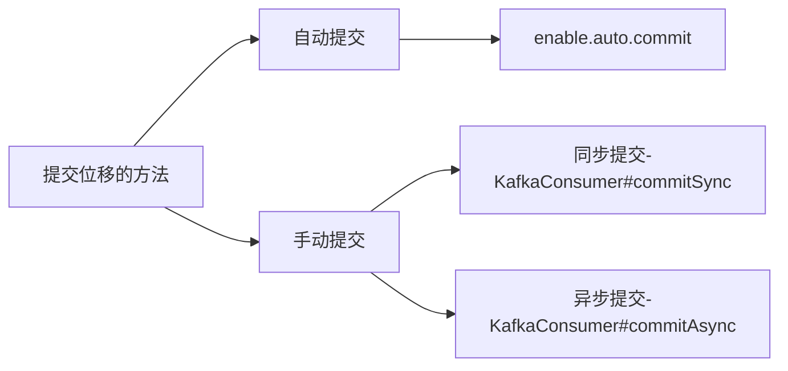

# Kafka术语

## 副本（如何实现高可用的？）

虽然多个 Broker 进程能够运行在同一台机器上，但更常见的做法是将不同的 Broker 分散运行在不同的机器上，这样如果集群中某一台机器宕机，即使在它上面运行的所有 Broker 进程都挂掉了，其他机器上的 Broker 也依然能够对外提供服务。这其实就是 Kafka 提供高可用的手段之一。

实现高可用的另一个手段就是备份机制（Replication）。备份的思想很简单，就是把相同的数据拷贝到多台机器上，而这些相同的数据拷贝在 Kafka 中被称为副本（Replica）。

Kafka 定义了两类副本：领导者副本（Leader Replica）和追随者副本（Follower Replica）。前者对外提供服务，这里的对外指的是与客户端程序进行交互；而后者只是被动地追随领导者副本而已，不能与外界进行交互。你可能知道在很多其他系统中追随者副本是可以对外提供服务的，比如 MySQL/Redis 的从库是可以处理读操作的，但是在 Kafka 中追随者副本不会对外提供服务。

## 分区（伸缩性）

伸缩性即所谓的 Scalability，是分布式系统中非常重要且必须要谨慎对待的问题。什么是伸缩性呢？我们拿副本来说，虽然现在有了领导者副本和追随者副本，但倘若领导者副本积累了太多的数据以至于单台 Broker 机器都无法容纳了，此时应该怎么办呢？一个很自然的想法就是，能否把数据分割成多份保存在不同的 Broker 上？如果你就是这么想的，那么恭喜你，Kafka 就是这么设计的。

Kafka 中的分区机制指的是将每个主题划分成多个分区（Partition），每个分区是一组有序的消息日志。

刚才提到的副本如何与这里的分区联系在一起呢？实际上，副本是在分区这个层级定义的。每个分区下可以配置若干个副本，其中只能有 1 个领导者副本和 N-1 个追随者副本。生产者向分区写入消息，每条消息在分区中的位置信息由一个叫位移（Offset）的数据来表征。分区位移总是从 0 开始，假设一个生产者向一个空分区写入了 10 条消息，那么这 10 条消息的位移依次是 0、1、2、…、9。

至此我们能够完整地串联起 Kafka 的三层消息架构：

​	第一层是主题层，每个主题可以配置 M 个分区，而每个分区又可以配置 N 个副本。

​	第二层是分区层，每个分区的 N 个副本中只能有一个充当领导者角色，对外提供服务；其他 N-1 个副本是追随者副本，只是提供数据冗余之用。

​	第三层是消息层，分区中包含若干条消息，每条消息的位移从 0 开始，依次递增。

最后，客户端程序只能与分区的领导者副本进行交互。

## 持久化

总的来说，Kafka 使用消息日志（Log）来保存数据，一个日志就是磁盘上一个只能追加写（Append-only）消息的物理文件。因为只能追加写入，故避免了缓慢的随机 I/O 操作，改为性能较好的顺序I/O 写操作，这也是实现 Kafka 高吞吐量特性的一个重要手段。不过如果你不停地向一个日志写入消息，最终也会耗尽所有的磁盘空间，因此 Kafka 必然要定期地删除消息以回收磁盘。怎么删除呢？简单来说就是通过日志段（Log Segment）机制。在 Kafka 底层，一个日志又近一步细分成多个日志段，消息被追加写到当前最新的日志段中，当写满了一个日志段后，Kafka 会自动切分出一个新的日志段，并将老的日志段封存起来。Kafka 在后台还有定时任务会定期地检查老的日志段是否能够被删除，从而实现回收磁盘空间的目的。

## 消费者组

指的是多个消费者实例共同组成一个组来消费一组主题。这组主题中的每个分区都只会被组内的一个消费者实例消费，其他消费者实例不能消费它。为什么要引入消费者组呢？主要是为了提升消费者端的吞吐量。多个消费者实例同时消费，加速整个消费端的吞吐量（TPS）。

另外这里的消费者实例可以是运行消费者应用的进程，也可以是一个线程，它们都称为一个消费者实例（Consumer Instance）。

消费者组里面的所有消费者实例不仅“瓜分”订阅主题的数据，而且更酷的是它们还能彼此协助。假设组内某个实例挂掉了，Kafka 能够自动检测到，然后把这个 Failed 实例之前负责的分区转移给其他活着的消费者。这个过程就是 Kafka 中大名鼎鼎的“重平衡”（Rebalance）。

每个消费者在消费消息的过程中必然需要有个字段记录它当前消费到了分区的哪个位置上，这个字段就是**消费者位移**（Consumer Offset）。注意，这和上面所说的位移完全不是一个概念。上面的“位移”表征的是分区内的消息位置，它是不变的，即一旦消息被成功写入到一个分区上，它的位移值就是固定的了。而消费者位移则不同，它可能是随时变化的，毕竟它是消费者消费进度的指示器嘛。另外每个消费者有着自己的消费者位移，因此一定要区分这两类位移的区别。我个人把消息在分区中的位移称为**分区位移**，而把消费者端的位移称为消费者位移。


# 集群参数配置

## Broker 端参数

### 针对存储信息的

log.dirs：这是非常重要的参数，指定了 Broker 需要使用的若干个文件目录路径。要知道这个参数是没有默认值的，这说明什么？这说明它必须由你亲自指定。

log.dir：注意这是 dir，结尾没有 s，说明它只能表示单个路径，它是补充上一个参数用的。

你只要设置log.dirs，即第一个参数就好了，不要设置log.dir。而且更重要的是，在线上生产环境中一定要为log.dirs配置多个路径，具体格式是一个 CSV 格式，也就是用逗号分隔的多个路径，比如/home/kafka1,/home/kafka2,/home/kafka3这样。如果有条件的话你**最好保证这些目录挂载到不同的物理磁盘**上。这样做有两个好处：

- 提升读写性能：比起单块磁盘，多块物理磁盘同时读写数据有更高的吞吐量。
- 能够实现故障转移：即 Failover。这是 Kafka 1.1 版本新引入的强大功能。**要知道在以前，只要 Kafka Broker 使用的任何一块磁盘挂掉了，整个 Broker 进程都会关闭。但是自 1.1 开始，这种情况被修正了，坏掉的磁盘上的数据会自动地转移到其他正常的磁盘上，而且 Broker 还能正常工作**。还记得上一期我们关于 Kafka 是否需要使用RAID 的讨论吗？这个改进正是我们舍弃 RAID 方案的基础：没有这种 Failover 的话，我们只能依靠 RAID 来提供保障。 Broker自动在好的路径上重建副本，然后从leader同步，另一方面， Kafka支持工具能够将某个路径上的数据拷贝到其他路径上。

### 与 ZooKeeper 相关的设置

ZooKeeper 是做什么的呢？它是一个分布式协调框架，负责协调管理并保存 Kafka 集群的所有元数据信息，比如集群都有哪些Broker 在运行、创建了哪些 Topic，每个 Topic 都有多少分区以及这些分区的 Leader 副本都在哪些机器上等信息。

zookeeper.connect。这也是一个 CSV 格式的参数，比如我可以指定它的值为zk1:2181,zk2:2181,zk3:2181。2181 是 ZooKeeper的默认端口。

如果你有两套 Kafka 集群，假设分别叫它们 kafka1 和 kafka2，那么两套集群的zookeeper.connect参数可以这样指定： zk1:2181,zk2:2181,zk3:2181/kafka1 和 zk1:2181,zk2:2181,zk3:2181/kafka2 。切记 chroot只需要写一次，而且是加到最后的。我经常碰到有人这样指定：zk1:2181/kafka1,zk2:2181/kafka2,zk3:2181/kafka3，这样的格式是不对的。

### 与 Broker 连接相关的

客户端程序或其他Broker 如何与该 Broker 进行通信的设置。有以下三个参数：

- listeners：学名叫**监听器**，其实就是告诉**外部连接者要通过什么协议访问指定主机名和端口开放的 Kafka 服务**。
- advertised.listeners：和 listeners 相比多了个advertised。Advertised 的含义表示宣称的、公布的，就是说**这组监听器是 Broker 用于对外发布的**。**advertised.listeners主要是为外网访问用的**。如果clients在内网环境访问Kafka不需要配置这个参数。常见的玩法是：你的Kafka Broker机器上**配置了双网卡**，**一块网卡用于内网访问（即我们常说的内网IP）；另一个块用于外网访问**。那么你可以配置listeners为内网IP，advertised.listeners为外网IP。
- host.name/port：列出这两个参数就是想说你把它们忘掉吧，压根不要为它们指定值，毕竟都是**过期的参数**了。

我们具体说说监听器的概念，从构成上来说，它是若干个逗号分隔的三元组，每个三元组的格式为<**协议名称，主机名，端口号**>。这里的协议名称可能是标准的名字，比如**PLAINTEXT 表示明文传输、SSL 表示使用 SSL 或 TLS 加密传输**等；也可能是你**自己定义的协议名字，比如CONTROLLER: //localhost:9092**。

一旦你自己定义了协议名称，你必须还要指定**listener.security.protocol.map**参数告诉这个协议底层使用了哪种安全协议，比如指定

**listener.security.protocol.map=CONTROLLER:PLAINTEXT表示CONTROLLER这个自定义协议底层使用明文不加密传输数据**。

### 关于 Topic 管理的

- auto.create.topics.enable：是否允许自动创建Topic。我建议最好设置成false，即不允许自动创建 Topic。

- unclean.leader.election.enable：是否允许Unclean Leader 选举。如果**设置成 false**，坚决不能让那些落后太多的副本竞选 Leader。这样做的**后果是这个分区就不可用了**，因为没有 Leader 了。反之**如果是 true**，那么Kafka 允许你从那些“跑得慢”的副本中选一个出来当Leader。这样做的**后果是数据有可能就丢失了**，因为这些副本保存的数据本来就不全，当了 Leader 之后它本人就变得

  膨胀了，认为自己的数据才是权威的。

- auto.leader.rebalance.enable：是否允许定期进行 Leader 选举。**设置它的值为 true** 表示允许 **Kafka 定期地对一些 Topic 分区进行Leader 重选举**，当然这个重选举不是无脑进行的，它要满足一定的条件才会发生。严格来说它与上一个参数中Leader 选举的最大不同在于，**它不是选 Leader，而是换Leader**！比如 Leader A 一直表现得很好，但若auto.leader.rebalance.enable=true，那么有可能一段时间后 Leader A 就要被强行卸任换成 Leader B。你要知道**换一次 Leader 代价很高的**，原本向 A 发送请求的所有客户端都要切换成向 B 发送请求，而且这种换 Leader本质上**没有任何性能收益**，因此我建议你在生产环境中把这个参数设置成 false。

### 数据留存方面的

- log.retention.{hour|minutes|ms}：这是个“三兄弟”，都是**控制一条消息数据被保存多长时间。从优先级上来说 ms 设置最高**、minutes 次之、hour 最低。**log.retention.hour=168表示默认保存 7 天的数据，自动删除 7 天前的数据**。很多公司把 Kafka 当做存储来使用，那么这个值就要相应地调大。
- log.retention.bytes：这是**指定 Broker 为消息保存的总磁盘容量大小**。**值默认是 -1**，表明你想在这台 Broker 上保存多少数据都可以
- message.max.bytes：控制 **Broker 能够接收的最大消息大小**。**默认的 1000012 太少了**，900多KB，还不到 1MB。实际场景中突破 1MB 的消息都是屡见不鲜的，因此在线上环境中设置一个比较大的值还是比较保险的做法。


# Topic参数配置

Topic 级别参数会覆盖全局Broker 参数的值，而每个 Topic 都能设置自己的参数值，这就是所谓的 Topic 级别参数。

- retention.ms：规定了该 Topic 消息被保存的时长。默认是 7 天，即该 Topic 只保存最近 7 天的消息。一旦设置了这个值，它会覆盖掉 Broker 端的全局参数值。
- retention.bytes：规定了要为该 Topic 预留多大的磁盘空间。和全局参数作用相似，这个值通常在多租户的Kafka 集群中会有用武之地。当前默认值是 -1，表示可以无限使用磁盘空间。
- max.message.bytes。它决定了 Kafka Broker 能够正常接收该 Topic 的最大消息大小。我知道目前在很多公司都把Kafka 作为一个基础架构组件来运行，上面跑了很多的业务数据。如果在全局层面上，我们不好给出一个合适的最大消息值，那么不同业务部门能够自行设定这个 Topic 级别参数就显得非常必要了。在实际场景中，这种用法也确实是非常常见的。


# JVM 参数

- KAFKA_HEAP_OPTS：指定堆大小。
- KAFKA_JVM_PERFORMANCE_OPTS：指定 GC 参数。

比如你可以这样启动 Kafka Broker，即在启动 Kafka Broker 之前，先设置上这两个环境变量：

```shell
$> export KAFKA_HEAP_OPTS=--Xms6g  --Xmx6g
$> export KAFKA_JVM_PERFORMANCE_OPTS= -server -XX:+UseG1GC -XX:MaxGCPauseMillis=20 -XX:InitiatingHeapOccupancyPercent=35 -XX:+ExplicitGCInvokesConcurrent -Djava.awt.headless=true
$> bin/kafka-server-start.sh config/server.properties
```


# 操作系统参数

- 文件描述符限制：文件描述符系统资源并不像我们想象的那样昂贵，你不用太担心调大此值会有什么不利的影响。通常情况下将它设置成一个超大的值是合理的做法，**比如ulimit -n 1000000**。
- 文件系统类型：文件系统指的是如ext3、ext4 或 XFS 这样的日志型文件系统。根据官网的测试报告，XFS 的性能要强于 ext4，所以生产环境**最好还是使用 XFS**。
- Swappiness：是不要设置成 0 比较好，我们可以设置成一个较小的值。为什么呢？因为一旦设置成 0，当物理内存耗尽时，操作系统会触发 OOM killer 这个组件，它会随机挑选一个进程然后 kill 掉，即根本不给用户任何的预警。但如果设置成一个比较小的值，当开始使用 swap 空间时，你至少能够观测到 Broker 性能开始出现急剧下降，从而给你进一步调优和诊断问题的时间。基于这个考虑，我个人建议**将swappniess 配置成一个接近 0 但不为 0 的值，比如 1**。
- 提交时间：提交时间或者说是 Flush 落盘时间。向 Kafka 发送数据并不是真要等数据被写入磁盘才会认为成功，而是只要数据被写入到操作系统的页缓存（Page Cache）上就可以了，随后操作系统根据 LRU 算法会定期将页缓存上的“脏”数据落盘到物理磁盘上。这个定期就是由提交时间来确定的，**默认是 5 秒**。一般情况下我们会认为这个时间太频繁了，可以**适当地增加提交间隔来降低物理磁盘的写操作**。当然你可能会有这样的疑问：如果在页缓存中的数据在写入到磁盘前机器宕机了，那岂不是数据就丢失了。的确，这种情况数据确实就丢失了，但鉴于 Kafka 在软件层面已经提供了多副本的冗余机制，因此这里稍微拉大提交间隔去换取性能还是一个合理的做法。


# 生产者消息分区机制原理

分区的作用就是**提供负载均衡的能力**，或者说对数据进行分区的主要原因，就是为了**实现系统的高伸缩性**（Scalability）。不同的分区能够被放置到不同节点的机器上，而数据的读写操作也都是针对分区这个粒度而进行的，这样每个节点的机器都能独立地执行各自分区的读写请求处理。并且，我们还可以通过添加新的节点机器来增加整体系统的吞吐量。

## 都有哪些分区策略？

### 轮询策略

也称 Round-robin 策略，即顺序分配。比如一个主题下有 3 个分区，那么第一条消息被发送到分区 0，第二条被发送到分区 1，第三条被发送到分区 2，以此类推。当生产第 4 条消息时又会重新开始，即将其分配到分区 0，就像下面这张图展示的那样。


这就是所谓的轮询策略。轮询策略是 Kafka Java 生产者 API **默认提供的分区策略**。如果你未指定partitioner.class参数，那么你的生产者程序会按照轮询的方式在主题的所有分区间均匀地“码放”消息。

**轮询策略有非常优秀的负载均衡表现，它总是能保证消息最大限度地被平均分配到所有分区上，故默认情况下它是最合理的分区策略，也是我们最常用的分区策略之一。**

### 随机策略

也称 Randomness 策略。所谓随机就是我们随意地将消息放置到任意一个分区上，如下面这张图所示。


如果要实现随机策略版的 partition 方法，很简单，只需要两行代码即可：

```java
List<PartitionInfo> partitions = cluster.partitionsForTopic(topic);
return ThreadLocalRandom.current().nextInt(partitions.size());
```

先计算出该主题总的分区数，然后随机地返回一个小于它的正整数。

本质上看随机策略也是力求将数据均匀地打散到各个分区，但从实际表现来看，它要逊于轮询策略，所以**如果追求数据的均匀分布，还是使用轮询策略比较好**。事实上，随机策略是老版本生产者使用的分区策略，在新版本中已经改为轮询了。

### 按消息键保序策略

Kafka 允许为每条消息定义消息键，简称为 Key。这个 Key 的作用非常大，它可以是一个有着明确业务含义的字符串，比如客户代码、部门编号或是业务 ID 等；也可以用来表征消息元数据。特别是在 Kafka 不支持时间戳的年代，在一些场景中，工程师们都是直接将消息创建时间封装进 Key 里面的。**一旦消息被定义了 Key，那么你就可以保证同一个 Key 的所有消息都进入到相同的分区里面，由于每个分区下的消息处理都是有顺序的，故这个策略被称为按消息键保序策略**，如下图所示。


实现这个策略的 partition 方法同样简单，只需要下面两行代码即可：

```java
List<PartitionInfo> partitions = cluster.partitionsForTopic(topic);
return Math.abs(key.hashCode()) % partitions.size();
```

前面提到的 Kafka 默认分区策略实际上同时实现了两种策略：**如果指定了 Key，那么默认实现按消息键保序策略；如果没有指定 Key，则使用轮询策略**。

### 其他分区策略

其实还有一种比较常见的，即所谓的基于地理位置的分区策略。当然这种策略一般只针对那些大规模的 Kafka 集群，特别是跨城市、跨国家甚至是跨大洲的集群。

此时我们就可以根据 Broker 所在的 IP 地址实现定制化的分区策略。比如下面这段代码：

```java
List<PartitionInfo> partitions = cluster.partitionsForTopic(topic);
return partitions.stream().filter(p -> isSouth(p.leader().host())).map(PartitionInfo::partition).findAny().get();
```

我们可以从所有分区中找出那些 Leader 副本在南方的所有分区，然后随机挑选一个进行消息发送。


# 生产者压缩算法

说起压缩（compression），我相信你一定不会感到陌生。它秉承了用时间去换空间的经典 trade-off 思想，具体来说就是用 CPU 时间去换磁盘空间或网络 I/O 传输量，希望以较小的 CPU 开销带来更少的磁盘占用或更少的网络 I/O 传输。

## 怎么压缩？

目前 Kafka 共有两大类消息格式，社区分别称之为 V1 版本和 V2 版本。V2 版本是 Kafka 0.11.0.0 中正式引入的。

不论是哪个版本，Kafka 的**消息层次都分为两层：消息集合（message set）以及消息（message）**。**一个消息集合中包含若干条日志项（record item），而日志项才是真正封装消息的地方。Kafka 底层的消息日志由一系列消息集合日志项组成。Kafka 通常不会直接操作具体的一条条消息，它总是在消息集合这个层面上进行写入操作**。

那么社区引入 V2 版本的目的是什么呢？V2 版本主要是针对 V1 版本的一些弊端做了修正，和我们今天讨论的主题相关的修正有哪些呢？先介绍一个，就是**把消息的公共部分抽取出来放到外层消息集合里面，这样就不用每条消息都保存这些信息了**。

V2 版本还有一个和压缩息息相关的改进，就是保存压缩消息的方法发生了变化。之前 V1版本中保存压缩消息的方法是把多条消息进行压缩然后保存到外层消息的消息体字段中；而**V2 版本的做法是对整个消息集合进行压缩**。显然后者应该比前者有更好的压缩效果。

在 Kafka 中，压缩可能发生在两个地方：**生产者端和 Broker 端**。

生产者程序中配置 **compression.type** 参数即表示启用指定类型的压缩算法。

大部分情况下 Broker 从 Producer 端接收到消息后仅仅是原封不动地保存而不会对其进行任何修改，但这里的“大部分情况”也是要满足一定条件的。有两种例外情况就可能让Broker 重新压缩消息。

情况一：Broker 端指定了和 Producer 端不同的压缩算法。

Broker 端也有一个参数叫 compression.type，和上面那个例子中的同名。但是这个参数的默认值是 producer，这表示 Broker 端会“尊重”Producer 端使用的压缩算法。可一旦你在 Broker 端设置了不同的 compression.type 值，就一定要小心了，因为可能会发生预料之外的压缩 / 解压缩操作，通常表现为 **Broker 端 CPU 使用率飙升**。

情况二：Broker 端发生了消息格式转换。

消息格式转换主要是**为了兼容老版本的消费者程序**。还记得之前说过的 V1、V2 版本吧？在一个生产环境中，Kafka 集群中同时保存多种版本的消息格式非常常见。**为了兼容老版本的格式，Broker 端会对新版本消息执行向老版本格式的转换**。这个过程中会涉及消息的解压缩和重新压缩。一般情况下这种消息格式转换对性能是有很大影响的，除了这里的压缩之外，它还让 Kafka 丧失了引以为豪的 Zero Copy 特性。

所谓“Zero Copy”就是“零拷贝”，说的是当数据在磁盘和网络进行传输时**避免昂贵的内核态数据拷贝**，从而实现快速的数据传输。因此如果 Kafka 享受不到这个特性的话，性能必然有所损失，所以**尽量保证消息格式的统一**吧，这样不仅可以避免不必要的解压缩 / 重新压缩，对提升其他方面的性能也大有裨益。

## 何时解压缩？

 Producer 发送压缩消息到 Broker 后，Broker 照单全收并原样保存起来。当 Consumer 程序请求这部分消息时，Broker 依然原样发送出去，当消息到达 Consumer 端后，由 Consumer 自行解压缩还原成之前的消息。

Kafka 会将启用了哪种压缩算法封装进消息集合中，这样当 Consumer 读取到消息集合时，它自然就知道了这些消息使用的是哪种压缩算法。如果用一句话总结一下压缩和解压缩，那么我希望你记住这句话：**Producer 端压缩、Broker 端保持、Consumer端解压缩**。

除了在 Consumer 端解压缩，Broker 端也会进行解压缩。注意了，这和前面提到消息格式转换时发生的解压缩是不同的场景。**每个压缩过的消息集合在 Broker 端写入时都要发生解压缩操作，目的就是为了对消息执行各种验证**。我们必须承认这种解压缩对 Broker 端性能是有一定影响的，特别是对 CPU 的使用率而言。

## 各种压缩算法对比

在 Kafka 2.1.0 版本之前，Kafka 支持 3 种压缩算法：GZIP、Snappy 和 LZ4。从 2.1.0 开始，Kafka 正式支持 Zstandard 算法（简写为 zstd）。它是 Facebook 开源的一个压缩算法，能够提供超高的压缩比（compression ratio）。

## 最佳实践

何时启用压缩是比较合适的时机呢？

启用压缩的一个条件就是 Producer 程序运行机器上的 CPU 资源要很充足。如果 Producer 运行机器本身 CPU 已经消耗殆尽了，那么启用消息压缩无疑是雪上加霜，只会适得其反。

除了 CPU 资源充足这一条件，**如果你的环境中带宽资源有限，那么我也建议你开启压缩**。毕竟万兆网络还不是普通公司的标配，因此千兆网络中 Kafka 集群带宽资源耗尽这件事情就特别容易出现。如果你的客户端机器 CPU 资源有很多富余，我强烈**建议你开启 zstd 压缩**，这样能极大地节省网络资源消耗。

这里只想强调一点：我们对不可抗拒的解压缩无能为力，但至少能规避掉那些意料之外的解压缩。就像我前面说的，因为要兼容老版本而引入的解压缩操作就属于这类。有条件的话尽量保证不要出现消息格式转换的情况。


# 如何配置 Kafka 不丢失消息

 Kafka 到底在什么情况下才能保证消息不丢失呢？

**一句话概括，Kafka 只对“已提交”的消息（committed message）做有限度的持久化保证。**


目前 Kafka Producer 是异步发送消息的，也就是说如果你调用的是 producer.send(msg) 这个 API，那么它通常会立即返回，但此时你不能认为消息发送已成功完成。

可能会有哪些因素导致消息没有发送成功呢？其实原因有很多，例如网络抖动，导致消息压根就没有发送到 Broker 端；或者消息本身不合格导致 Broker 拒绝接收（比如消息太大了，超过了 Broker 的承受能力）等。

解决此问题的方法非常简单：**Producer 永远要使用带有回调通知的发送 API，也就是说不要使用 producer.send(msg)，而要使用 producer.send(msg, callback)**。

如果是因为那些瞬时错误，那么仅仅让 Producer 重试就可以了；如果是消息不合格造成的，那么可以调整消息格式后再次发送。总之，处理发送失败的责任在 Producer 端而非 Broker 端。


“位移”类似于我们看书时使用的书签，它会标记我们当前阅读了多少页，下次翻书的时候我们能直接跳到书签页继续阅读。

正确使用书签有两个步骤：第一步是读书，第二步是更新书签页。如果这两步的顺序颠倒了，就可能出现这样的场景：当前的书签页是第 90 页，我先将书签放到第 100 页上，之后开始读书。当阅读到第 95 页时，我临时有事中止了阅读。那么问题来了，当我下次直接跳到书签页阅读时，我就丢失了第 96～99 页的内容，即这些消息就丢失了。

同理，Kafka 中 Consumer 端的消息丢失就是这么一回事。要对抗这种消息丢失，办法很简单：**维持先消费消息（阅读），再更新位移（书签）的顺序**即可。这样就能最大限度地保证消息不丢失。


Consumer 程序从 Kafka 获取到消息后开启了多个线程异步处理消息，而 Consumer 程序自动地向前更新位移。假如其中某个线程运行失败了，它负责的消息没有被成功处理，但位移已经被更新了，因此这条消息对于 Consumer 而言实际上是丢失了。


## 最佳实践

1. **不要使用 producer.send(msg)，而要使用 producer.send(msg, callback)**。记住，一定要使用带有回调通知的 send 方法。
2. **设置 acks = all**。acks 是 Producer 的一个参数，代表了你对“已提交”消息的定义。如果设置成 all，则表明所有副本 Broker 都要接收到消息，该消息才算是“已提交”。这是最高等级的“已提交”定义。
3. **设置 retries 为一个较大的值**。这里的 retries 同样是 Producer 的参数，对应前面提到的 Producer 自动重试。当出现网络的瞬时抖动时，消息发送可能会失败，此时**配置了 retries > 0 的 Producer 能够自动重试消息发送，避免消息丢失**。
4. 设置 unclean.leader.election.enable = false。这是 Broker 端的参数，它控制的是哪些 Broker 有资格竞选分区的 Leader。如果一个 Broker 落后原先的 Leader 太多，那么它一旦成为新的 Leader，必然会造成消息的丢失。故一般都要将该参数设置成 false，即不允许这种情况的发生。
5. 设置 **replication.factor >= 3**。这也是 Broker 端的参数。其实这里想表述的是，最好将消息多保存几份，毕竟目前防止消息丢失的主要机制就是冗余。
6. 设置 **min.insync.replicas > 1**。这依然是 Broker 端参数，控制的是消息至少要被写入到多少个副本才算是“已提交”。设置成大于 1 可以提升消息持久性。在实际环境中千万不要使用默认值 1。
7. 确保 replication.factor > min.insync.replicas。如果两者相等，那么只要有一个副本挂机，整个分区就无法正常工作了。我们不仅要改善消息的持久性，防止数据丢失，还要在不降低可用性的基础上完成。推荐设置成 replication.factor = min.insync.replicas + 1。
8. 确保消息消费完成再提交。**Consumer 端有个参数 enable.auto.commit，最好把它设置成 false，并采用手动提交位移的方式**。就像前面说的，这对于单 Consumer 多线程处理的场景而言是至关重要的。


# 生产者是如何管理TCP连接的？

## 何时创建 TCP 连接？

**在创建 KafkaProducer 实例时，生产者应用会在后台创建并启动一个名为 Sender 的线程，该 Sender 线程开始运行时首先会创建与 Broker 的连接。**

```javascript
[2018-12-09 09:35:45,620] DEBUG [Producer clientId=producer-1] Initialize connection to node localhost:9093 (id: -2 rack: null) for sending metadata request (org.apache.kafka.clients.NetworkClient:1084)
[2018-12-09 09:35:45,622] DEBUG [Producer clientId=producer-1] Initiating connection to node localhost:9093 (id: -2 rack: null) using address localhost/127.0.0.1 (org.apache.kafka.clients.NetworkClient:914)
[2018-12-09 09:35:45,814] DEBUG [Producer clientId=producer-1] Initialize connection to node localhost:9092 (id: -1 rack: null) for sending metadata request (org.apache.kafka.clients.NetworkClient:1084)
[2018-12-09 09:35:45,815] DEBUG [Producer clientId=producer-1] Initiating connection to node localhost:9092 (id: -1 rack: null) using address localhost/127.0.0.1 (org.apache.kafka.clients.NetworkClient:914)
[2018-12-09 09:35:45,828] DEBUG [Producer clientId=producer-1] Sending metadata request (type=MetadataRequest, topics=) to node localhost:9093 (id: -2 rack: null) (org.apache.kafka.clients.NetworkClient:1068)
```

 bootstrap.servers 参数。它是 Producer 的核心参数之一，指定了这个 Producer 启动时要连接的 Broker 地址。请注意，这里的“启动时”，代表的是 Producer 启动时会发起与这些 Broker 的连接。因此，如果你为这个参数指定了 1000 个 Broker 连接信息，那么很遗憾，你的 Producer 启动时会首先创建与这 1000 个 Broker 的 TCP 连接。因为 Producer 一旦连接到集群中的任一台 Broker，就能拿到整个集群的 Broker 信息，故没必要为 bootstrap.servers 指定所有的 Broker。

**在 KafkaProducer 实例被创建后以及消息被发送前，Producer 应用就开始创建与两台 Broker 的 TCP 连接了**。当然了，在我的测试环境中，我为 bootstrap.servers 配置了 localhost:9092、localhost:9093 来模拟不同的 Broker。另外，日志输出中的最后一行也很关键：它表明 **Producer 向某一台 Broker 发送了 METADATA 请求，尝试获取集群的元数据信息**——这就是前面提到的 Producer 能够获取集群所有信息的方法。

 KafkaProducer 类是线程安全的，复用KafkaProducer实例是没有问题的。只是要**监控内存缓冲区的使用情况**。毕竟如果多个线程都使用一个KafkaProducer实例，缓冲器被填满的速度会变快。

目前我们的结论是这样的：**TCP 连接是在创建 KafkaProducer 实例时建立的。**

**TCP 连接还可能在两个地方被创建：一个是在更新元数据后，另一个是在消息发送时。**

因为这两个地方并非总是创建 TCP 连接。当 Producer 更新了集群的元数据信息之后，如果发现与某些 Broker 当前没有连接，那么它就会创建一个 TCP 连接。同样地，当要发送消息时，Producer 发现尚不存在与目标 Broker 的连接，也会创建一个。

场景一：当 Producer 尝试给一个不存在的主题发送消息时，Broker 会告诉 Producer 说这个主题不存在。此时 Producer 会发送 METADATA 请求给 Kafka 集群，去尝试获取最新的元数据信息。

场景二：Producer 通过 metadata.max.age.ms 参数定期地去更新元数据信息。该参数的默认值是 300000，即 5 分钟，也就是说**不管集群那边是否有变化，Producer 每 5 分钟都会强制刷新一次元数据以保证它是最及时的数据**。

## 何时关闭 TCP 连接？

Producer 端关闭 TCP 连接的方式有两种：**一种是用户主动关闭；一种是 Kafka 自动关闭**。

我们先说第一种。这里的主动关闭实际上是广义的主动关闭，甚至包括用户调用 kill -9 主动“杀掉”Producer 应用。当然最推荐的方式还是调用 producer.close() 方法来关闭。

第二种是 Kafka 帮你关闭，这与 Producer 端参数 **connections.max.idle.ms** 的值有关。**默认情况下该参数值是 9 分钟，即如果在 9 分钟内没有任何请求“流过”某个 TCP 连接，那么 Kafka 会主动帮你把该 TCP 连接关闭**。用户可以在 Producer 端设置 connections.max.idle.ms=-1 禁掉这种机制。一旦被设置成 -1，TCP 连接将成为永久长连接。当然这只是软件层面的“长连接”机制，由于 Kafka 创建的这些 Socket 连接都开启了 keepalive，因此 keepalive 探活机制还是会遵守的。在第二种方式中，**TCP 连接是在 Broker 端被关闭的（CLOSE_WAIT），但其实这个 TCP 连接的发起方是客户端**（FIN_WAIT_1），因此在 TCP 看来，这属于被动关闭的场景，即 passive close。被动关闭的后果就是会产生大量的 CLOSE_WAIT 连接，因此 Producer 端或 Client 端没有机会显式地观测到此连接已被中断。

## 小结

1. KafkaProducer 实例创建时启动 **Sender 线程**，从而创建与 **bootstrap.servers 中所有 Broker** 的 TCP 连接。
2. KafkaProducer 实例**首次更新元数据信息之后，还会再次创建与集群中所有 Broker 的 TCP 连接**。
3. 如果 **Producer 端发送消息到某台 Broker 时发现没有与该 Broker 的 TCP 连接，那么也会立即创建连接**。
4. 如果设置 Producer 端 connections.max.idle.ms 参数大于 0，则步骤 1 中创建的 TCP 连接会被自动关闭；如果设置该参数 =-1，那么步骤 1 中创建的 TCP 连接将无法被关闭，从而成为“僵尸”连接。


有个疑问，当 Producer 更新了集群的元数据信息之后，如果发现与某些broker没有连接，就去创建，为什么会去创建跟producer无关的连接？

答案：有可能也会连接这些Broker的。Clients获取到集群元数据后知道了集群所有Broker的连接信息。下**次再次获取元数据时，它会选择一个负载最少的Broker进行连接**。如果发现没有连接也会创建Socket，但其实它并不需要向这个Broker发送任何消息。


# 消费者是如何管理TCP连接的?

## 何时创建 TCP 连接？

我们先从消费者创建 TCP 连接开始讨论。消费者端主要的程序入口是 KafkaConsumer 类。**和生产者不同的是，构建 KafkaConsumer 实例时是不会创建任何 TCP 连接的**，也就是说，当你执行完 new KafkaConsumer(properties) 语句后，你会发现，没有 Socket 连接被创建出来。这一点和 Java 生产者是有区别的，主要原因就是生产者入口类 KafkaProducer 在构建实例的时候，会在后台默默地启动一个 Sender 线程，这个 Sender 线程负责 Socket 连接的创建。

**TCP 连接是在调用 KafkaConsumer.poll 方法时被创建的**。再细粒度地说，在 poll 方法内部有 3 个时机可以创建 TCP 连接。

1.**发起 FindCoordinator 请求时**。

协调者（Coordinator）组件驻留在 Broker 端的内存中，负责消费者组的组成员管理和各个消费者的位移提交管理。当消费者程序首次启动调用 poll 方法时，它需要向 Kafka 集群发送一个名为 FindCoordinator 的请求，希望 Kafka 集群告诉它哪个 Broker 是管理它的协调者。

不过，消费者应该向哪个 Broker 发送这类请求呢？理论上任何一个 Broker 都能回答这个问题，也就是说消费者可以发送 FindCoordinator 请求给集群中的任意服务器。在这个问题上，社区做了一点点优化：**消费者程序会向集群中当前负载最小的那台 Broker 发送请求**。负载是如何评估的呢？其实很简单，就是看消费者连接的所有 Broker 中，谁的待发送请求最少。当然了，这种评估显然是消费者端的单向评估，并非是站在全局角度，因此有的时候也不一定是最优解。不过这不并影响我们的讨论。总之，在这一步，消费者会创建一个 Socket 连接。

2.**连接协调者时。**

Broker 处理完上一步发送的 FindCoordinator 请求之后，会返还对应的响应结果（Response），**显式地告诉消费者哪个 Broker 是真正的协调者**，因此在这一步，**消费者知晓了真正的协调者后，会创建连向该 Broker 的 Socket 连接**。只有成功连入协调者，协调者才能开启正常的组协调操作，比如**加入组、等待组分配方案、心跳请求处理、位移获取、位移提交等**。

3.**消费数据时。**

消费者会为**每个要消费的分区创建与该分区领导者副本所在 Broker 连接的 TCP**。举个例子，假设消费者要消费 5 个分区的数据，这 5 个分区各自的领导者副本分布在 4 台 Broker 上，那么该消费者在消费时会创建与这 4 台 Broker 的 Socket 连接。

## 创建多少个 TCP 连接？

> [2019-05-27 10:00:54,142] DEBUG [Consumer clientId=consumer-1, groupId=test] **Initiating connection** to node **localhost:9092** (**id: -1** rack: null) using address localhost/127.0.0.1 (org.apache.kafka.clients.NetworkClient:944)

日志的第一行是消费者程序创建的第一个 TCP 连接，就像我们前面说的，这个 Socket **用于发送 FindCoordinator 请求**。由于这是消费者程序创建的第一个连接，此时消费者对于要连接的 Kafka 集群一无所知，因此它连接的 Broker 节点的 ID 是 -1，表示消费者根本不知道要连接的 Kafka Broker 的任何信息。

> ......

> [2019-05-27 10:00:54,188] DEBUG [Consumer clientId=consumer-1, groupId=test] **Sending metadata request** MetadataRequestData(topics=[MetadataRequestTopic(name=‘t4’)], allowAutoTopicCreation=true, includeClusterAuthorizedOperations=false, includeTopicAuthorizedOperations=false) to node **localhost:9092** (**id: -1** rack: null) (org.apache.kafka.clients.NetworkClient:1097)

值得注意的是日志的第二行，消费者**复用了刚才创建的那个 Socket 连接**，向 Kafka 集群发送**元数据请求**以获取整个集群的信息。

> ......

> [2019-05-27 10:00:54,188] TRACE [Consumer clientId=consumer-1, groupId=test] **Sending FIND_COORDINATOR** {key=test,key_type=0} with correlation id 0 to **node -1** (org.apache.kafka.clients.NetworkClient:496)

日志的第三行表明，消费者程序开始发送 FindCoordinator 请求给第一步中连接的 Broker，即 localhost:9092，也就是 nodeId 等于 -1 的那个。

> [2019-05-27 10:00:54,203] TRACE [Consumer clientId=consumer-1, groupId=test] **Completed receive from node -1 for FIND_COORDINATOR** with correlation id 0, received {throttle_time_ms=0,error_code=0,error_message=null, **node_id=2,host=localhost,port=9094**} (org.apache.kafka.clients.NetworkClient:837)

在十几毫秒之后，消费者程序**成功地获悉协调者所在的 Broker 信息**，也就是第四行标为橙色的“node_id = 2”

> ......

> [2019-05-27 10:00:54,204] DEBUG [Consumer clientId=consumer-1, groupId=test] **Initiating connection** to node **localhost:9094** (id: 2147483645 rack: null) using address localhost/127.0.0.1 (org.apache.kafka.clients.NetworkClient:944)

完成这些之后，消费者就已经知道协调者 Broker 的连接信息了，因此在日志的第五行发起了第二个 Socket 连接，**创建了连向 localhost:9094 的 TCP**。只有**连接了协调者**，消费者进程才能正常地开启消费者组的各种功能以及后续的消息消费。

> ......

> [2019-05-27 10:00:54,237] DEBUG [Consumer clientId=consumer-1, groupId=test] Initiating connection to node **localhost:9094** (id: 2 rack: null) using address localhost/127.0.0.1 (org.apache.kafka.clients.NetworkClient:944)

> [2019-05-27 10:00:54,237] DEBUG [Consumer clientId=consumer-1, groupId=test] Initiating connection to node **localhost:9092** (id: 0 rack: null) using address localhost/127.0.0.1 (org.apache.kafka.clients.NetworkClient:944)

> [2019-05-27 10:00:54,238] DEBUG [Consumer clientId=consumer-1, groupId=test] Initiating connection to node **localhost:9093** (id: 1 rack: null) using address localhost/127.0.0.1 (org.apache.kafka.clients.NetworkClient:944)

在日志的最后三行中，消费者又分别创建了新的 TCP 连接，主要**用于实际的消息获取**。要消费的分区的领导者副本在哪台 Broker 上，消费者就要创建连向哪台 Broker 的 TCP。在我举的这个例子中，localhost:9092，localhost:9093 和 localhost:9094 这 3 台 Broker 上都有要消费的分区，因此消费者创建了 3 个 TCP 连接。


日志中的这些 Broker 节点的 ID 在不断变化。有时候是 -1，有时候是 2147483645，只有在最后的时候才回归正常值 0、1 和 2。这又是怎么回事呢？

前面我们说过了 -1 的来由，即消费者程序（其实也不光是消费者，生产者也是这样的机制）首次启动时，对 Kafka 集群一无所知，因此用 -1 来表示尚未获取到 Broker 数据。

那么 2147483645 是怎么来的呢？它是**由 Integer.MAX_VALUE 减去协调者所在 Broker 的真实 ID 计算得来的**。看第四行标为橙色的内容，我们可以知道协调者 ID 是 2，因此这个 Socket 连接的节点 ID 就是 Integer.MAX_VALUE 减去 2，即 2147483647 减去 2，也就是 2147483645。这种节点 ID 的标记方式是 Kafka 社区特意为之的结果，目的就是要让**组协调请求（第五行日志）和真正的数据获取请求（消费数据请求，后3行日志）使用不同的 Socket 连接**。

至于后面的 0、1、2，那就很好解释了。它们表征了真实的 Broker ID，也就是我们在 server.properties 中配置的 broker.id 值。

通常来说，消费者程序会创建 3 类 TCP 连接：

1. 确定协调者和获取集群元数据。
2. 连接协调者，令其执行组成员管理操作。
3. 执行实际的消息获取。

## 何时关闭 TCP 连接？

和生产者类似，消费者关闭 Socket 也分为**主动关闭和 Kafka 自动关闭**。主动关闭是指你显式地调用消费者 API 的方法去关闭消费者，具体方式就是**手动调用 KafkaConsumer.close() 方法，或者是执行 Kill 命令**，不论是 Kill -2 还是 Kill -9；而 Kafka 自动关闭是由**消费者端参数 connection.max.idle.ms**控制的，该参数现在的**默认值是 9 分钟**，即如果某个 Socket 连接上连续 9 分钟都没有任何请求“过境”的话，那么消费者会强行“杀掉”这个 Socket 连接。

不过，和生产者有些不同的是，如果在编写消费者程序时，你使用了循环的方式来调用 poll 方法消费消息，那么上面提到的所有请求都会被定期发送到 Broker，因此这些 Socket 连接上总是能保证有请求在发送，从而也就实现了“长连接”的效果。

针对上面提到的三类 TCP 连接，你需要注意的是，**当第三类 TCP 连接成功创建后，消费者程序就会废弃第一类 TCP 连接**（确定协调者和获取集群元数据的），之后在**定期请求元数据时，它会改为使用第三类 TCP 连**接。也就是说，**最终你会发现，第一类 TCP 连接会在后台被默默地关闭掉。对一个运行了一段时间的消费者程序来说，只会有后面两类 TCP 连接存在**。

## 可能的问题

我们刚刚讲过，第一类 TCP 连接仅仅是为了首次获取元数据而创建的，后面就会被废弃掉。最根本的原因是，消费者在启动时还不知道 Kafka 集群的信息，只能使用一个“假”的 ID 去注册，即使消费者获取了真实的 Broker ID，它依旧无法区分这个“假”ID 对应的是哪台 Broker，因此也就无法重用这个 Socket 连接，只能再重新创建一个新的连接。

为什么会出现这种情况呢？主要是因为目前 Kafka 仅仅使用 ID 这一个维度的数据来表征 Socket 连接信息。这点信息明显不足以确定连接的是哪台 Broker，也许在未来，社区应该考虑使用**< 主机名、端口、ID>**三元组的方式来定位 Socket 资源，这样或许能够让消费者程序少创建一些 TCP 连接。

也许你会问，反正 Kafka 有定时关闭机制，这算多大点事呢？其实，在实际场景中，我见过很多将 connection.max.idle.ms 设置成 -1，即禁用定时关闭的案例，如果是这样的话，这些 TCP 连接将不会被定期清除，只会成为永久的**“僵尸”连接**。


# 消息交付可靠性保障以及精确处理一次语义的实现

消息交付可靠性保障，是指 Kafka 对 Producer 和 Consumer 要处理的消息提供什么样的承诺。常见的承诺有以下三种：

- 最多一次（at most once）：消息可能会丢失，但绝不会被重复发送。
- 至少一次（at least once）：消息不会丢失，但有可能被重复发送。
- 精确一次（exactly once）：消息不会丢失，也不会被重复发送。

 目前，Kafka 默认提供的交付可靠性保障是第二种，即至少一次。只有 Broker 成功“提交”消息且 Producer 接到 Broker 的应答才会认为该消息成功发送。不过倘若消息成功“提交”，但 Broker 的应答没有成功发送回 Producer 端（比如网络出现瞬时抖动），那么 Producer 就无法确定消息是否真的提交成功了。因此，它只能选择重试，也就是再次发送相同的消息。这就是 Kafka 默认提供至少一次可靠性保障的原因，不过这会导致消息重复发送。

Kafka 也可以提供最多一次交付保障，只需要**让 Producer 禁止重试**即可。这样一来，消息要么写入成功，要么写入失败，但绝不会重复发送。我们通常不会希望出现消息丢失的情况，但一些场景里偶发的消息丢失其实是被允许的，相反，消息重复是绝对要避免的。此时，使用最多一次交付保障就是最恰当的。

Kafka 是怎么做到精确一次的呢？简单来说，这是通过两种机制：幂等性（Idempotence）和事务（Transaction）。

## 什么是幂等性（Idempotence）？

幂等性有很多好处，其**最大的优势在于我们可以安全地重试任何幂等性操作，反正它们也不会破坏我们的系统状态。**如果是非幂等性操作，我们还需要担心某些操作执行多次对状态的影响，但对于幂等性操作而言，我们根本无需担心此事。

## 幂等性 Producer

在 Kafka 中，Producer 默认不是幂等性的，但我们可以创建幂等性 Producer。在 0.11 之后，指定 Producer 幂等性的方法很简单，仅需要设置一个参数即可，即 props.put(“enable.idempotence”, ture)。

enable.idempotence 被设置成 true 后，Producer 自动升级成幂等性 Producer，其他所有的代码逻辑都不需要改变。**Kafka 自动帮你做消息的重复去重**。底层具体的原理很简单，就是经典的用空间去换时间的优化思路，即在 Broker 端多保存一些字段。当 Producer 发送了具有相同字段值的消息后，Broker 能够自动知晓这些消息已经重复了，于是可以在后台默默地把它们“丢弃”掉。

首先，**它只能保证单分区上的幂等性**，即一个幂等性 Producer 能够保证某个主题的一个分区上不出现重复消息，它无法实现多个分区的幂等性。其次，**它只能实现单会话上的幂等性**，**不能实现跨会话的幂等性**。这里的会话，你可以理解为 Producer 进程的一次运行。当你重启了 Producer 进程之后，这种幂等性保证就丧失了。

如果我想实现**多分区以及多会话上的消息无重复**，应该怎么做呢？答案就是事务（transaction）或者依赖事务型 Producer。这也是幂等性 Producer 和事务型 Producer 的最大区别！

## 事务

Kafka 自 0.11 版本开始也提供了对事务的支持，目前主要是**在 read committed 隔离级别上做事情**。它能**保证多条消息原子性地写入到目标分区，同时也能保证 Consumer 只能看到事务成功提交的消息**。

## 事务型 Producer

事务型 Producer **能够保证将消息原子性地写入到多个分区中。这批消息要么全部写入成功，要么全部失败**。另外，事务型 Producer 也不惧进程的重启。Producer 重启回来后，**Kafka 依然保证它们发送消息的精确一次处理**。

设置事务型 Producer 的方法也很简单，满足两个要求即可

- 和幂等性 Producer 一样，开启 enable.idempotence = true。
- 设置 Producer 端参数 transctional. id。最好为其设置一个有意义的名字。

```java
producer.initTransactions();
try {
    producer.beginTransaction();
    producer.send(record1);
    producer.send(record2);
    producer.commitTransaction();
} catch (KafkaException e) {
    producer.abortTransaction();
}
```

事务型 Producer 的显著特点是调用了一些事务 API，如 initTransaction、beginTransaction、commitTransaction 和 abortTransaction，它们分别对应事务的初始化、事务开始、事务提交以及事务终止。

这段代码能够保证 Record1 和 Record2 被当作一个事务统一提交到 Kafka，要么它们全部提交成功，要么全部写入失败。实际上即使写入失败，Kafka 也会把它们写入到底层的日志中，也就是说 Consumer 还是会看到这些消息。因此在 Consumer 端，读取事务型 Producer 发送的消息也是需要一些变更的。修改起来也很简单，设置 isolation.level 参数的值即可。当前这个参数有两个取值：

1. **read_uncommitted**：这是默认值，表明 **Consumer 能够读取到 Kafka 写入的任何消息**，不论事务型 Producer 提交事务还是终止事务，其写入的消息都可以读取。很显然，如果你用了事务型 Producer，那么对应的 Consumer 就不要使用这个值。
2. read_committed：表明 Consumer **只会读取事务型 Producer 成功提交事务写入的消息**。当然了，它也能看到非事务型 Producer 写入的所有消息。

## 小结

简单来说，幂等性 Producer 和事务型 Producer 都是 Kafka 社区力图为 Kafka 实现精确一次处理语义所提供的工具，只是它们的作用范围是不同的。幂等性 Producer 只能保证单分区、单会话上的消息幂等性；而事务能够保证跨分区、跨会话间的幂等性。从交付语义上来看，自然是事务型 Producer 能做的更多。

比起幂等性 Producer，事务型 Producer 的性能要更差，在实际使用过程中，我们需要仔细评估引入事务的开销，切不可无脑地启用事务。


# 消费者组到底是什么？

用一句话概括就是：Consumer Group 是 Kafka 提供的可扩展且具有容错性的消费者机制。

1. Consumer Group 下可以有一个或多个 Consumer 实例。这里的实例可以是一个单独的进程，也可以是同一进程下的线程。在实际场景中，使用进程更为常见一些。
2. Group ID 是一个字符串，在一个 Kafka 集群中，它标识唯一的一个 Consumer Group。
3. Consumer Group 下所有实例订阅的主题的单个分区，只能分配给组内的某个 Consumer 实例消费。这个分区当然也可以被其他的 Group 消费。

一个 Group 下该有多少个 Consumer 实例呢？理想情况下，**Consumer 实例的数量应该等于该 Group 订阅主题的分区总数。**

## 消费者位移

消费者在消费的过程中需要记录自己消费了多少数据，即消费位置信息。在 Kafka 中，这个位置信息有个专门的术语：位移（Offset）。

看上去该 Offset 就是一个数值而已，其实对于 Consumer Group 而言，它是一组 KV 对，Key 是分区，V 对应 Consumer 消费该分区的最新位移。如果用 Java 来表示的话，你大致可以认为是这样的数据结构，即 Map<TopicPartition, Long>，其中 TopicPartition 表示一个分区，而 Long 表示位移的类型。新版本的 Consumer Group 将位移保存在 Broker 端的内部主题 __consumer_offsets中。

老版本 Consumer 的位移管理是依托于 Apache ZooKeeper 的，它会自动或手动地将位移数据提交到 ZooKeeper 中保存。当Consumer 重启后，它能自动从 ZooKeeper 中读取位移数据，从而在上次消费截止的地方继续消费。这种设计使得Kafka Broker 不需要保存位移数据，减少了 Broker 端需要持有的状态空间，因而有利于实现高伸缩性。

但是，ZooKeeper 其实并不适用于这种高频的写操作，因此，Kafka 社区自 0.8.2.x 版本开始，就在酝酿修改这种设计，并最终在新版本 Consumer 中正式推出了全新的位移管理机制，自然也包括这个新的位移主题。

新版本 Consumer 的位移管理机制其实也很简单，就是**将 Consumer 的位移数据作为一条条普通的 Kafka 消息，提交__consumer_offsets 中。可以这么说，consumer_offsets 的主要作用是保存 Kafka 消费者的位移信息**。

**当Kafka 集群中的第一个 Consumer 程序启动时，Kafka 会自动创建位移主题。如果位移主题是 Kafka 自动创建的，那么该主题的分区数是 50，副本数是 3。**目前 KafkaConsumer 提交位移的方式有两种：**自动提交位移和手动提交位移**。

Consumer 端有个参数叫 enable.auto.commit，如果值是 true，则 Consumer 在后台默默地为你定期提交位移，提交间隔由一个专属的参数 auto.commit.interval.ms（默认值5000ms） 来控制。自动提交位移有一个显著的优点，就是省事，你不用操心位移提交的事情，就能保证消息消费不会丢失。但这一点同时也是缺点。因为它太省事了，以至于丧失了很大的灵活性和可控性，你完全没法把控 Consumer 端的位移管理。

**手动提交位移**，即设置 enable.auto.commit = false。一旦设置了 false，作为 Consumer 应用开发的你就要承担起位移提交的责任。

Kafka 使用**Compact 策略**来删除位移主题中的过期消息，避免该主题无限期膨胀。那么应该如何定义 Compact 策略中的过期呢？对于同一个 Key 的两条消息 M1和 M2，如果 M1 的发送时间早于 M2，那么 M1 就是过期消息。Compact 的过程就是扫描日志的所有消息，剔除那些过期的消息，然后把剩下的消息整理在一起。我在这里贴一张来自官网的图片，来说明 Compact 过程。


图中位移为 0、2 和 3 的消息的 Key 都是 K1。Compact 之后，分区只需要保存位移为 3的消息，因为它是最新发送的。
**Kafka 提供了专门的后台线程定期地巡检待 Compact 的主题，看看是否存在满足条件的可删除数据**。这个后台线程叫 Log Cleaner。很多实际生产环境中都出现过位移主题无限膨胀占用过多磁盘空间的问题，如果你的环境中也有这个问题，我建议你去检查一下 Log
Cleaner 线程的状态，通常都是这个线程挂掉了导致的。


## 重平衡

**Rebalance 本质上是一种协议，规定了一个 Consumer Group 下的所有 Consumer 如何达成一致，来分配订阅 Topic 的每个分区**。在 Rebalance 过程中，所有 Consumer 实例共同参与，在**协调者组件的帮助**下，完成订阅主题分区的分配。比如某个 Group 下有 20 个 Consumer 实例，它订阅了一个具有 100 个分区的 Topic。正常情况下，Kafka 平均会为每个 Consumer 分配 5 个分区。这个分配的过程就叫 Rebalance。

所谓协调者，在 Kafka 中对应的术语是 Coordinator，它专门为 Consumer Group 服务，负责为 Group **执行Rebalance** 以及**提供位移管理**和**组成员管理**等。

具体来讲，Consumer 端应用程序在提交位移时，其实是**向 Coordinator 所在的 Broker 提交位移**。同样地，当 Consumer 应用启动时，也是向 Coordinator 所在的 Broker 发送各种请求，然后由 Coordinator 负责**执行消费者组的注册、成员管理记录等元数据管理**操

作。


所有 Broker 在启动时，都会创建和开启相应的 Coordinator 组件。也就是说，**所有 Broker 都有各自的 Coordinator 组件**。那么，Consumer Group 如何确定为它服务的 Coordinator 在哪台 Broker 上呢？答案就在我们之前说过的 Kafka 内部位移主题
__consumer_offsets 身上。

Kafka 为某个 Consumer Group 确定 Coordinator 所在的 Broker 的算法有 2 个步骤。

1. 确定由**位移主题**的哪个分区来保存该 Group 数据：partitionId=Math.abs(groupId.hashCode() % offsetsTopicPartitionCount)。
2. 找出该分区 Leader 副本所在的 Broker，该 Broker 即为对应的 Coordinator。

首先，Kafka 会计算该 Group 的 group.id 参数的哈希值。比如你有个 Group 的 group.id 设置成了“test-group”，那么它的 hashCode 值就应该是627841412。其次，Kafka 会计算 __consumer_offsets 的分区数，通常是 50 个分区，之后将刚才那个哈希值对分区数进行取模加求绝对值计算，即 abs(627841412 % 50) =12。此时，我们就知道了位移主题的分区 12 负责保存这个 Group 的数据。有了分区号，算法的第 2 步就变得很简单了，我们只需要找出位移主题分区 12 的 Leader 副本在哪个 Broker 上就可以了。这个 Broker，就是我们要找的 Coordinator。（**一个 Consumer Group 有一个对应的 Coordinator**，不同的 group id 会被哈希到不同的分区上，从而不同的 broker 能充当不同 group 的 Coordinator）

在实际使用过程中，Consumer 应用程序，特别是 Java Consumer API，能够自动发现并连接正确的 Coordinator，我们不用操心这个问题。知晓这个算法的最大意义在于，它能够帮助我们解决**定位问题**。当 Consumer Group 出现问题，需要快速排查 Broker 端日志时，我们能够根据这个算法准确定位 Coordinator 对应的 Broker，不必一台 Broker 一台Broker 地盲查。


那么 Consumer Group 何时进行 Rebalance 呢？Rebalance 的触发条件有 3 个。

1. **组成员数发生变更**。比如有新的 Consumer 实例加入组或者离开组，抑或是有 Consumer 实例崩溃被“踢出”组。 网络断了，心跳中断，consumer被踢出组，也属于第一种情况。
2. **订阅主题数发生变更**。Consumer Group 可以使用正则表达式的方式订阅主题，比如 consumer.subscribe(Pattern.compile(“t.*c”)) 就表明该 Group 订阅所有以字母 t 开头、字母 c 结尾的主题。在 Consumer Group 的运行过程中，你新创建了一个满足这样条件的主题，那么该 Group 就会发生 Rebalance。
3. **订阅主题的分区数发生变更**。Kafka 当前只能允许增加一个主题的分区数。当分区数增加时，就会触发订阅该主题的所有 Group 开启 Rebalance。


**重平衡过程是如何通知到其他消费者实例的？答案就是，靠消费者端的心跳线程（Heartbeat Thread）**。

Kafka Java 消费者需要定期地发送心跳请求（Heartbeat Request）到 Broker 端的协调者，以表明它还存活着。在 Kafka 0.10.1.0 版本之前，发送心跳请求是在**消费者主线程**完成的，也就是你写代码调用 KafkaConsumer.poll 方法的那个线程。

这样做有诸多弊病，最大的问题在于，**消息处理逻辑也是在这个线程中完成的**。因此，一旦消息处理消耗了过长的时间，心跳请求将无法及时发到协调者那里，导致协调者“错误地”认为该消费者已“死”。自 0.10.1.0 版本开始，社区引入了一个单独的心跳线程来专门执行心跳请求发送，避免了这个问题。

**重平衡的通知机制正是通过心跳线程来完成的**。当协调者决定开启新一轮重平衡后，它会将“**REBALANCE_IN_PROGRESS**”封装进心跳请求的响应中，发还给消费者实例。当消费者实例发现心跳响应中包含了“REBALANCE_IN_PROGRESS”，就能立马知道重平衡又开始了，这就是重平衡的通知机制。

对了，很多人还搞不清楚消费者端参数 heartbeat.interval.ms 的真实用途，我来解释一下。从字面上看，它就是设置了心跳的间隔时间，但这个参数的真正作用是**控制重平衡通知的频率**。如果你想要消费者实例更迅速地得到通知，那么就可以给这个参数设置一个非常小的值，这样消费者就能更快地感知到重平衡已经开启了。


目前，Kafka 为消费者组定义了 5 种状态，它们分别是：Empty、Dead、PreparingRebalance、CompletingRebalance 和 Stable。

| 状态                | 含义                                                         |
| ------------------- | ------------------------------------------------------------ |
| Empty               | 组内没有任何成员，但消费者组可能存在已提交的位移数据，而且这些位移尚未过期。 |
| Dead                | 同样是组内没有任何成员，但组的元数据信息已经在协调者端被移除。协调者组件保存着当前向它注册过的所有组信息，所谓的元数据信息就类似于这个注册信息。 |
| PreparingRebalance  | 消费者组准备开启重平衡，此时所有成员都要重新请求加入消费者组。 |
| CompletingRebalance | 消费者组下所有成员已经加入，各个成员正在等待分配方案。该状态在老一点的版本中被称为AwaitingSync，它和CompletingRebalance是等价的。 |
| Stable              | 消费者组的稳定状态。该状态表明重平衡已经完成，组内各成员能够正常消费数据了。 |

一个消费者组最开始是 Empty 状态，当重平衡过程开启后，它会被置于 PreparingRebalance 状态等待成员加入，之后变更到 CompletingRebalance 状态等待分配方案，最后流转到 Stable 状态完成重平衡。

当有新成员加入或已有成员退出时，消费者组的状态从 Stable 直接跳到 PreparingRebalance 状态，此时，所有现存成员就必须重新申请加入组。当所有成员都退出组后，消费者组状态变更为 Empty。**Kafka 定期自动删除过期位移的条件就是，组要处于 Empty 状态**。因此，如果你的消费者组停掉了很长时间（超过 7 天），那么 Kafka 很可能就把该组的位移数据删除了。我相信，你在 Kafka 的日志中一定经常看到下面这个输出：

> Removed ✘✘✘ expired offsets in ✘✘✘ milliseconds.

这就是 Kafka 在尝试定期删除过期位移。现在你知道了，只有 Empty 状态下的组，才会执行过期位移删除的操作。


在消费者端，重平衡分为两个步骤：分别是加入组和等待领导者消费者（Leader Consumer）分配方案。这两个步骤分别对应两类特定的请求：**JoinGroup 请求和 SyncGroup 请求**。

当组内成员加入组时，它会向协调者发送 JoinGroup 请求。在该请求中，**每个成员都要将自己订阅的主题上报**，这样协调者就能收集到所有成员的订阅信息。一旦收集了全部成员的 JoinGroup 请求后，协调者会从这些成员中选择一个担任这个消费者组的领导者。

通常情况下，第一个发送 JoinGroup 请求的成员自动成为领导者。你一定要注意区分这里的领导者和之前我们介绍的领导者副本，它们不是一个概念。这里的领导者是具体的消费者实例，它既不是副本，也不是协调者。**领导者消费者的任务是收集所有成员的订阅信息，然后根据这些信息，制定具体的分区消费分配方案。**

选出领导者之后，协调者会把消费者组订阅信息封装进 JoinGroup 请求的响应体中，然后发给领导者，由领导者消费者统一做出分配方案后，进入到下一步：发送 SyncGroup 请求。

在这一步中，领导者消费者向协调者发送 SyncGroup 请求，将刚刚做出的分配方案发给协调者。值得注意的是，其他成员也会向协调者发送 SyncGroup 请求，只不过请求体中并没有实际的内容。这一步的主要目的是让**协调者接收分配方案，然后统一以 SyncGroup 响应的方式分发给所有成员**，这样组内所有成员就都知道自己该消费哪些分区了。

接下来，我用一张图来形象地说明一下 JoinGroup 请求的处理过程。


就像前面说的，**JoinGroup 请求的主要作用是将组成员订阅信息发送给领导者消费者**，待领导者制定好分配方案后，重平衡流程进入到 SyncGroup 请求阶段。

下面这张图描述的是 SyncGroup 请求的处理流程。


**SyncGroup 请求的主要目的，就是让协调者把领导者制定的分配方案下发给各个组内成员**。当所有成员都成功接收到分配方案后，消费者组进入到 Stable 状态，即开始正常的消费工作。

讲完这里，**消费者端**的重平衡流程我已经介绍完了。接下来，我们从**协调者端**来看一下重平衡是怎么执行的。

要剖析协调者端处理重平衡的全流程，我们必须要分几个场景来讨论。这几个场景分别是新成员加入组、组成员主动离组、组成员崩溃离组、组成员提交位移。接下来，我们一个一个来讨论。

**场景一：新成员入组。**

新成员入组是指组处于 Stable 状态后，有新成员加入。如果是全新启动一个消费者组，Kafka 是有一些自己的小优化的，流程上会有些许的不同。我们这里讨论的是，组稳定了之后有新成员加入的情形。

当协调者收到新的 JoinGroup 请求后，它会通过心跳请求响应的方式通知组内现有的所有成员，强制它们开启新一轮的重平衡。具体的过程和之前的客户端重平衡流程是一样的。现在，我用一张时序图来说明协调者一端是如何处理新成员入组的。


**场景二：组成员主动离组。**

何谓主动离组？就是指消费者实例所在线程或进程调用 close() 方法主动通知协调者它要退出。这个场景就涉及到了第三类请求：**LeaveGroup 请求**。协调者收到 LeaveGroup 请求后，依然会以心跳响应的方式通知其他成员。


**场景三：组成员崩溃离组。**

**崩溃离组是指消费者实例出现严重故障，突然宕机导致的离组**。它和主动离组是有区别的，因为后者是主动发起的离组，协调者能马上感知并处理。但崩溃离组是被动的，协调者通常需要等待一段时间才能感知到，这段时间一般是由**消费者端参数 session.timeout.ms 控制的**。也就是说，Kafka 一般不会超过 session.timeout.ms 就能感知到这个崩溃。当然，后面处理崩溃离组的流程与之前是一样的。


**场景四：重平衡时协调者对组内成员提交位移的处理。**

正常情况下，每个组内成员都会定期汇报位移给协调者。当重平衡开启时，协调者会给予成员一段缓冲时间，要求每个成员必须在这段时间内快速地上报自己的位移信息，然后再开启正常的 JoinGroup/SyncGroup 请求发送。还是老办法，我们使用一张图来说明。


每个 Consumer 实例怎么知道应该消费订阅主题的哪些分区呢？这就需要分配策略的协助了。

当前 Kafka 默认提供了 3 种分配策略，每种策略都有一定的优势和劣势，

讲完了 Rebalance，现在我来说说它“遭人恨”的地方。

首先，Rebalance 过程对 Consumer Group 消费过程有极大的影响，影响 Consumer 端 TPS。**在 Rebalance 过程中，所有 Consumer 实例都会停止消费**，等待 Rebalance 完成。这是 Rebalance 为人诟病的一个方面。

其次，目前 Rebalance 的设计是所有 Consumer 实例共同参与，Rebalance 效率不高，**全部重新分配所有分区。其实更高效的做法是尽量减少分配方案的变动**。例如实例 A 之前负责消费分区 1、2、3，那么 Rebalance 之后，如果可能的话，最好还是让实例 A 继续消费分区 1、2、3，而不是被重新分配其他的分区。这样的话，实例 A 连接这些分区所在 Broker 的 TCP 连接就可以继续用，不用重新创建连接其他 Broker 的 Socket 资源。

最后，Rebalance 实在是太慢了。曾经，有个国外用户的 Group 内有几百个 Consumer 实例，成功 Rebalance 一次要几个小时！这完全是不能忍受的。

特别是针对 Rebalance 慢和影响 TPS 这两个弊端，社区有解决办法吗？针对这两点，我可以很负责任地告诉你：“无解！”。既然我们没办法解决 Rebalance 过程中的各种问题，干脆就避免 Rebalance 吧，特别是那些不必要的 Rebalance。


如果 Consumer Group 下的 Consumer 实例数量发生变化，就一定会引发 Rebalance。这是 Rebalance 发生的最常见的原因。我碰到的 99% 的 Rebalance，都是这个原因导致的。

当 Consumer Group 完成 Rebalance 之后，每个 Consumer 实例都会**定期地向 Coordinator 发送心跳请求**，表明它还存活着。如果某个 Consumer 实例**不能及时地发送这些心跳请求，Coordinator 就会认为该 Consumer 已经“死”了，从而将其从 Group 中移除**，然后开启新一轮 Rebalance。Consumer 端有个参数，叫 **session.timeout.ms**，就是被用来表征此事的。该参数的默认值是 10 秒，即如果 Coordinator 在 10 秒之内没有 收到 Group 下某 Consumer 实例的心跳，它就会认为这个 Consumer 实例已经挂了。可以这么说，session.timout.ms 决定了 Consumer 存活性的时间间隔。

除了这个参数，Consumer 还提供了一个允许你控制发送心跳请求频率的参数，就是 **heartbeat.interval.ms**。这个值设置得越小，Consumer 实例发送心跳请求的频率就越高。频繁地发送心跳请求会额外消耗带宽资源，但好处是能够**更加快速地知晓当前是否开启Rebalance**，因为，目前 Coordinator 通知各个 Consumer 实例开启 Rebalance 的方法，就是将 **REBALANCE_NEEDED 标志封装进心跳请求的响应体**中。

除了以上两个参数，Consumer 端还有一个参数，用于控制 Consumer 实际消费能力对 Rebalance 的影响，即 **max.poll.interval.ms** 参数。它限定了 **Consumer 端应用程序两次调用 poll 方法的最大时间间隔。它的默认值是 5 分钟**，表示你的 Consumer 程序**如果在 5分钟之内无法消费完 poll 方法返回的消息，那么 Consumer 会主动发起“离开组”的请求**，Coordinator 也会开启新一轮 Rebalance。之前poll的数据还是会被继续进行业务逻辑处理，若在rebalance停止消费期间offset并未进行提交，可能会造成该partition里面的同一批消息被重新分配给其他消费实例，造成**重复消费问题**。


第一类非必要 Rebalance 是因为**未能及时发送心跳，导致 Consumer 被“踢出” Group 而引发的**。因此，你需要仔细地设置session.timeout.ms 和 heartbeat.interval.ms的 值。我在这里给出一些推荐数值，你可以“无脑”地应用在你的生产环境中。

​	设置 session.timeout.ms = 6s。

​	设置 heartbeat.interval.ms = 2s。

​	要保证 Consumer 实例在被判定为“dead”之前，能够发送至少 3 轮的心跳请求，即 session.timeout.ms >= 3 * heartbeat.interval.ms。

将 session.timeout.ms 设置成 6s 主要是为了让 Coordinator 能够更快地定位已经挂掉的 Consumer。毕竟，我们还是希望能尽快揪出那些“尸位素餐”的 Consumer，早日把它们踢出 Group。	

第二类非必要 Rebalance 是 **Consumer 消费时间过长导致的**。max.poll.interval.ms参数值的设置显得尤为关键。如果要避免非预期的
Rebalance，你最好将该参数值设置得大一点，比你的下游最大处理时间稍长一点。

如果你按照上面的推荐数值恰当地设置了这几个参数，却发现还是出现了 Rebalance，那么我建议你去排查一下Consumer 端的 GC 表现，比如是否出现了**频繁的 Full GC 导致的长时间停顿**，从而心跳中断，导致被踢出group，Coordinator向其他存活consumer发送心跳response，通知它们开启新一轮rebalance。


# 消费位移提交

 Consumer 的消费位移，它记录了 Consumer 要消费的**下一条消息的位移**。这可能和你以前了解的有些出入，不过切记是下一条消息的位移，而不是目前最新消费消息的位移。

假设一个分区中有 10 条消息，位移分别是 0 到 9。某个 Consumer 应用已消费了 5 条消息，这就说明该 Consumer 消费了位移为 0 到 4 的 5 条消息，此时 Consumer 的位移是 5，指向了下一条消息的位移。

**Consumer 需要向 Kafka 汇报自己的位移数据，这个汇报过程被称为提交位移**（Committing Offsets）。因为 Consumer 能够同时消费多个分区的数据，所以位移的提交实际上是在**分区粒度**上进行的，即**Consumer 需要为分配给它的每个分区提交各自的位移数据**。

提交位移主要是为了表征 Consumer 的消费进度，这样当 Consumer 发生故障重启之后，就能够从 Kafka 中读取之前提交的位移值，然后从相应的位移处继续消费，从而避免整个消费过程重来一遍。换句话说，**位移提交是 Kafka 提供给你的一个工具或语义保障，你负责维持这个语义保障**，即如果你提交了位移 X，那么 Kafka 会认为所有位移值小于 X 的消息你都已经成功消费了。

因为位移提交非常灵活，**你完全可以提交任何位移值，但由此产生的后果你也要一并承担**。假设你的 Consumer 消费了 10 条消息，你提交的位移值却是 20，那么从理论上讲，位移介于 11～19 之间的消息是有可能丢失的；相反地，如果你提交的位移值是 5，那么位移介于 5～9 之间的消息就有可能被重复消费。所以，我想再强调一下，**位移提交的语义保障是由你来负责的，Kafka 只会“无脑”地接受你提交的位移**。你对位移提交的管理直接影响了你的 Consumer 所能提供的消息语义保障。

鉴于位移提交甚至是位移管理对 Consumer 端的巨大影响，Kafka，特别是 KafkaConsumer API，提供了多种提交位移的方法。**从用户的角度来说，位移提交分为自动提交和手动提交；从 Consumer 端的角度来说，位移提交分为同步提交和异步提交。**

Consumer 端有个参数 enable.auto.commit，把它设置为 true 或者压根不设置它就可以了。因为它的默认值就是 true，即 Java Consumer 默认就是自动提交位移的。如果启用了自动提交，Consumer 端还有个参数就派上用场了：auto.commit.interval.ms。它的默认值是 5 秒，表明 Kafka **每 5 秒会为你自动提交一次位移**。

## 自动提交

开启手动提交位移的方法就是设置 enable.auto.commit 为 false。最简单的 API 就是**KafkaConsumer#commitSync()**。该方法会**提交 KafkaConsumer#poll() 返回的最新位移**。从名字上来看，它是一个同步操作，即该方法会一直等待，直到位移被成功提交才会返回。如果提交过程中出现异常，该方法会将异常信息抛出。

```java
while (true) {
	ConsumerRecords<String, String> records = consumer.poll(Duration.ofSeconds(1));
  process(records); // 处理消息
  try {
  	consumer.commitSync();
  } catch (CommitFailedException e) {
    handle(e); // 处理提交失败异常
  }
}
```

调用 consumer.commitSync() 方法的时机，是在你处理完了 poll() 方法返回的所有消息之后。如果你莽撞地过早提交了位移，就可能会出现消费数据丢失的情况。


一旦设置了 enable.auto.commit 为 true，Kafka 会保证在开始调用 **poll 方法时，提交上次 poll 返回的所有消息**。从顺序上来说，**poll 方法的逻辑是先提交上一批消息的位移，再处理下一批消息**，因此它能保证不出现消费丢失的情况。但自动提交位移的一个问题在于，它可能会出现重复消费。

在默认情况下，Consumer 每 5 秒自动提交一次位移。现在，我们假设提交位移之后的 3 秒发生了 Rebalance 操作。在 Rebalance 之后，所有 Consumer 从上一次提交的位移处继续消费，但该位移已经是 3 秒前的位移数据了，故在 Rebalance 发生前 3 秒消费的所有数据都要重新再消费一次。虽然你能够通过减少 auto.commit.interval.ms 的值来提高提交频率，但这么做只能缩小重复消费的时间窗口，不可能完全消除它。这是自动提交机制的一个缺陷。

## 手动提交

反观手动提交位移，它的好处就在于更加灵活，你完全能够把控位移提交的时机和频率。但是，它也有一个缺陷，就是在调用 commitSync() 时，Consumer 程序会**处于阻塞状态**，直到远端的 Broker 返回提交结果，这个状态才会结束。在任何系统中，因为程序而非资源限制而导致的阻塞都可能是系统的瓶颈，会影响整个应用程序的 TPS。当然，你可以选择拉长提交间隔，但这样做的后果是 Consumer 的提交频率下降，在下次 Consumer 重启回来后，会有更多的消息被重新消费。

鉴于这个问题，Kafka 社区为手动提交位移提供了另一个 API 方法：**KafkaConsumer#commitAsync()**。从名字上来看它就不是同步的，而是一个异步操作。调用 commitAsync() 之后，它会**立即返回，不会阻塞，因此不会影响 Consumer 应用的 TPS**。由于它是异步的，Kafka 提供了回调函数（callback），供你实现提交之后的逻辑，比如记录日志或处理异常等。

```java
while (true) {
  ConsumerRecords<String, String> records = consumer.poll(Duration.ofSeconds(1));
  process(records); // 处理消息
  consumer.commitAsync((offsets, exception) -> {
	if (exception != null)
		handle(exception);
	});
}
```

commitAsync 的问题在于，出现问题时它不会自动重试。因为它是异步操作，倘若提交失败后自动重试，那么它重试时提交的位移值可能早已经“过期”或不是最新值了。因此，异步提交的重试其实没有意义，所以 commitAsync 是不会重试的。

如果是手动提交，我们需要将 **commitSync 和 commitAsync 组合使用**才能到达最理想的效果，原因有两个：

1. 我们可以利用 commitSync 的**自动重试来规避那些瞬时错误，比如网络的瞬时抖动，Broker 端 GC 等**。因为这些问题都是短暂的，自动重试通常都会成功，因此，我们不想自己重试，而是希望 Kafka Consumer 帮我们做这件事。
2. 我们不希望程序总处于阻塞状态，影响 TPS。

```java
try {
    while (true) {
      ConsumerRecords<String, String> records = consumer.poll(Duration.ofSeconds(1));
      process(records); // 处理消息
      commitAysnc(); // 使用异步提交规避阻塞
    }
} catch (Exception e) {
  		handle(e); // 处理异常
} finally {
  	try {
      consumer.commitSync(); // 最后一次提交使用同步阻塞式提交
    } finally {
      consumer.close();
    }
}
```

这段代码同时使用了 commitSync() 和 commitAsync()。对于常规性、阶段性的手动提交，我们调用 commitAsync() 避免程序阻塞，而在 Consumer 要关闭前，我们调用 commitSync() 方法执行同步阻塞式的位移提交，以确保 Consumer 关闭前能够保存正确的位移数据。将两者结合后，我们既实现了异步无阻塞式的位移管理，也确保了 Consumer 位移的正确性，所以，如果你需要自行编写代码开发一套 Kafka Consumer 应用，那么我推荐你使用上面的代码范例来实现手动的位移提交。

Kafka Consumer API 为手动提交提供了这样的方法：commitSync(Map<TopicPartition, OffsetAndMetadata>) 和 commitAsync(Map<TopicPartition, OffsetAndMetadata>)。它们的参数是一个 Map 对象，键就是 TopicPartition，即消费的分区，而值是一个 OffsetAndMetadata 对象，保存的主要是位移数据。

如何每处理 100 条消息就提交一次位移，避免大批量的消息重新消费呢？在这里，我以 commitAsync 为例，展示一段代码。

```java
private Map<TopicPartition, OffsetAndMetadata> offsets = new HashMap<>();
		int count = 0;
		……
		while (true) {
            ConsumerRecords<String, String> records = consumer.poll(Duration.ofSeconds(1));
            for (ConsumerRecord<String, String> record: records) {
              process(record);  // 处理消息
              offsets.put(new TopicPartition(record.topic(), record.partition()),
                          new OffsetAndMetadata(record.offset() + 1)；
              if（count % 100 == 0）
              		consumer.commitAsync(offsets, null); // 回调处理逻辑是 null
              count++;
		}
}
```

程序先是创建了一个 Map 对象，用于保存 Consumer 消费处理过程中要提交的分区位移，之后开始逐条处理消息，并构造要提交的位移值。还记得之前我说过要提交下一条消息的位移吗？这就是这里构造 OffsetAndMetadata 对象时，使用当前消息位移加 1 的原因。代码的最后部分是做位移的提交。我在这里设置了一个计数器，每累计 100 条消息就统一提交一次位移。与调用无参的 commitAsync 不同，这里调用了带 Map 对象参数的 commitAsync 进行细粒度的位移提交。这样，这段代码就能够实现每处理 100 条消息就提交一次位移，不用再受 poll 方法返回的消息总数的限制了。



## CommitFailedException异常怎么处理

CommitFailedException，顾名思义就是 Consumer **客户端在提交位移时出现了错误或异常，而且还是那种不可恢复的严重异常**。如果异常是可恢复的瞬时错误，提交位移的 API 自己就能规避它们了，因为很多**提交位移的 API 方法是支持自动错误重试的**，比如我们在上一期中提到的commitSync 方法。

> Commit cannot be completed since the group has already rebalanced and assigned the partitions to another member. This means that the time between subsequent calls to poll() was longer than the configured max.poll.interval.ms, which typically implies that the poll loop is spending too much time message processing. **You can address this either by increasing max.poll.interval.ms or by reducing the maximum size of batches returned in poll() with max.poll.records.**

这段话前半部分的意思是，本次提交位移失败了，原因是消费者组已经开启了 Rebalance 过程，并且将要提交位移的分区分配给了另一个消费者实例。出现这个情况的原因是，你的消费者实例连续两次调用 poll 方法的时间间隔超过了期望的 max.poll.interval.ms 参数值。这通常表明，你的消费者实例花费了太长的时间进行消息处理，耽误了调用 poll 方法。

在后半部分，社区给出了两个相应的解决办法（即橙色字部分）：

1. 增加期望的时间间隔 max.poll.interval.ms 参数值。
2. 减少 poll 方法一次性返回的消息数量，即减少 max.poll.records 参数值。
3. 缩短单条消息处理的时间。
4. 下游系统使用多线程来加速消费。


# 多线程开发消费者实例

我们说 KafkaConsumer 是单线程的设计，严格来说这是不准确的。因为，从 Kafka 0.10.1.0 版本开始，KafkaConsumer 就变为了双线程的设计，即**用户主线程和心跳线程**。

**所谓用户主线程，就是你启动 Consumer 应用程序 main 方法的那个线程，而新引入的心跳线程（Heartbeat Thread）只负责定期给对应的 Broker 机器发送心跳请求，以标识消费者应用的存活性（liveness）**。引入这个心跳线程还有一个目的，那就是期望它能将心跳频率与主线程调用 KafkaConsumer.poll 方法的频率分开，从而解耦真实的消息处理逻辑与消费者组成员存活性管理。

不过，虽然有心跳线程，但实际的消息获取逻辑依然是在用户主线程中完成的。因此，在消费消息的这个层面上，我们依然可以安全地认为 KafkaConsumer 是单线程的设计。

## 多线程方案

首先，我们要明确的是，**KafkaConsumer 类不是线程安全的 (thread-safe)**。所有的网络 I/O 处理都是发生在用户主线程中，因此，你在使用过程中必须要确保线程安全。简单来说，就是**你不能在多个线程中共享同一个 KafkaConsumer 实例**，否则程序会抛出 ConcurrentModificationException 异常。

当然了，这也不是绝对的。KafkaConsumer 中有个方法是例外的，它就是**wakeup()**，你可以在其他线程中安全地调用**KafkaConsumer.wakeup()**来唤醒 Consumer。

方案一：

**消费者程序启动多个线程，每个线程维护专属的 KafkaConsumer 实例，负责完整的消息获取、消息处理流程。**


方案二：

**消费者程序使用单或多线程获取消息，同时创建多个消费线程执行消息处理逻辑**。获取消息的线程可以是一个，也可以是多个，每个线程维护专属的 KafkaConsumer 实例，处理消息则交由特定的线程池来做，从而实现消息获取与消息处理的真正解耦。


比如一个完整的消费者应用程序要做的事情是 1、2、3、4、5，那么方案 1 的思路是**粗粒度化**的工作划分，也就是说方案 1 会创建多个线程，每个线程完整地执行 1、2、3、4、5，以实现并行处理的目标，它不会进一步分割具体的子任务；而方案 2 则更**细粒度化**，它会将 1、2 分割出来，用单线程（也可以是多线程）来做，对于 3、4、5，则用另外的多个线程来做。


我们先看方案 1，它的优势有 3 点。

1. 实现起来简单，因为它比较符合目前我们使用 Consumer API 的习惯。我们在写代码的时候，使用多个线程并在每个线程中创建专属的 KafkaConsumer 实例就可以了。
2. 多个线程之间彼此没有任何交互，省去了很多保障线程安全方面的开销。
3. 由于每个线程使用专属的 KafkaConsumer 实例来执行消息获取和消息处理逻辑，因此，Kafka 主题中的每个分区都能保证只被一个线程处理，这样就很容易实现分区内的消息消费顺序。这对在乎事件先后顺序的应用场景来说，是非常重要的优势

说完了方案 1 的优势，我们来看看这个方案的不足之处。

1. 每个线程都维护自己的 KafkaConsumer 实例，必然会占用更多的系统资源，比如内存、TCP 连接等。在资源紧张的系统环境中，方案 1 的这个劣势会表现得更加明显。

2. 这个方案能使用的线程数受限于 Consumer 订阅主题的总分区数。我们知道，在一个消费者组中，每个订阅分区都只能被组内的一个消费者实例所消费。假设一个消费者组订阅了 100 个分区，那么方案 1 最多只能扩展到 100 个线程，多余的线程无法分配到任何分区，只会白白消耗系统资源。当然了，这种扩展性方面的局限可以被多机架构所缓解。除了在一台机器上启用 100 个线程消费数据，我们也可以选择在 100 台机器上分别创建 1 个线程，效果是一样的。因此，如果你的机器资源很丰富，这个劣势就不足为虑了。

3. 每个线程完整地执行消息获取和消息处理逻辑。一旦消息处理逻辑很重，造成消息处理速度慢，就很容易出现不必要的 Rebalance，从而引发整个消费者组的消费停滞。


```java
// 方案一
public class KafkaConsumerRunner implements Runnable {
    private final AtomicBoolean closed = new AtomicBoolean(false);
    private final KafkaConsumer consumer;


    public void run() {
        try {
            consumer.subscribe(Arrays.asList("topic"));
            while (!closed.get()) {
                ConsumerRecords records =
                        consumer.poll(Duration.ofMillis(10000));
                //  执行消息处理逻辑
            }
        } catch (WakeupException e) {
            // Ignore exception if closing
            if (!closed.get()) throw e;
        } finally {
            consumer.close();
        }
    }


    // Shutdown hook which can be called from a separate thread
    public void shutdown() {
        closed.set(true);
        consumer.wakeup();
    }
```

这段代码创建了一个 Runnable 类，表示执行消费获取和消费处理的逻辑。每个 KafkaConsumerRunner 类都会创建一个专属的 KafkaConsumer 实例。在实际应用中，你可以创建多个 KafkaConsumerRunner 实例，并依次执行启动它们，以实现方案 1 的多线程架构。

   

与方案 1 的粗粒度不同，方案 2 将任务切分成了**消息获取**和**消息处理**两个部分，分别由不同的线程处理它们。比起方案 1，方案 2 的最大优势就在于它的**高伸缩性**，就是说我们可以独立地调节消息获取的线程数，以及消息处理的线程数，而不必考虑两者之间是否相互影响。如果你的消费获取速度慢，那么增加消费获取的线程数即可；如果是消息的处理速度慢，那么增加 Worker 线程池线程数即可。

不过，这种架构也有它的缺陷。

1. 它的实现难度要比方案 1 大得多，毕竟它有两组线程，你需要分别管理它们。
2. 因为该方案将消息获取和消息处理分开了，也就是说获取某条消息的线程不是处理该消息的线程，因此无法保证分区内的消费顺序。举个例子，比如在某个分区中，消息 1 在消息 2 之前被保存，那么 Consumer 获取消息的顺序必然是消息 1 在前，消息 2 在后，但是，后面的 Worker 线程却有可能先处理消息 2，再处理消息 1，这就破坏了消息在分区中的顺序。还是那句话，如果你在意 Kafka 中消息的先后顺序，方案 2 的这个劣势是致命的。
3. 方案 2 引入了多组线程，使得整个消息消费链路被拉长，最终导致正确位移提交会变得异常困难，结果就是可能会出现消息的重复消费。如果你在意这一点，那么我不推荐你使用方案 2。

```java
// 方案二
private final KafkaConsumer<String, String> consumer;
private ExecutorService executors;
...
 
 
private int workerNum = ...;
executors = new ThreadPoolExecutor(workerNum, workerNum, 0L, TimeUnit.MILLISECONDS,
	new ArrayBlockingQueue<>(1000), 
	new ThreadPoolExecutor.CallerRunsPolicy());
 
 
...
while (true)  {
	ConsumerRecords<String, String> records = 
		consumer.poll(Duration.ofSeconds(1));
	for (final ConsumerRecord record : records) {
		executors.submit(new Worker(record));
	}
}
..
```

这段代码最重要的地方是我标为橙色的那个语句：当 Consumer 的 poll 方法返回消息后，由专门的线程池来负责处理具体的消息。调用 poll 方法的主线程不负责消息处理逻辑，这样就实现了方案 2 的多线程架构。


# Kafka副本机制

**副本（Replica），本质就是一个只能追加写消息的提交日志**。根据 Kafka 副本机制的定义，同一个分区下的所有副本保存有相同的消息序列，这些副本分散保存在不同的 Broker 上，从而能够对抗部分 Broker 宕机带来的数据不可用。

## 副本角色

既然分区下能够配置多个副本，而且这些副本的内容还要一致，那么很自然的一个问题就是：我们该如何确保副本中所有的数据都是一致的呢？特别是对 Kafka 而言，当生产者发送消息到某个主题后，消息是如何同步到对应的所有副本中的呢？针对这个问题，最常见的解决方案就是采用**基于领导者（Leader-based）的副本机制**。


第一，在 Kafka 中，副本分成两类：**领导者副本**（Leader Replica）和**追随者副本**（Follower Replica）。每个分区在创建时都要选举一个副本，称为领导者副本，其余的副本自动称为追随者副本。

第二，Kafka 的副本机制比其他分布式系统要更严格一些。在 Kafka 中，**追随者副本是不对外提供服务**的。这就是说，**任何一个追随者副本都不能响应消费者和生产者的读写请求**。所有的请求都必须由领导者副本来处理，或者说，所有的读写请求都必须发往领导者副本所在的 Broker，由该 Broker 负责处理。追随者副本不处理客户端请求，它唯一的任务就是从领导者副本**异步拉取**消息，并写入到自己的提交日志中，从而实现与领导者副本的同步。

第三，当领导者副本挂掉了，或者说领导者副本所在的 Broker 宕机时，Kafka 依托于 ZooKeeper 提供的监控功能能够实时感知到，并立即开启新一轮的领导者选举，从追随者副本中选一个作为新的领导者。老 Leader 副本重启回来后，只能作为追随者副本加入到集群中。

这种副本机制有两个方面的好处。

1.**方便实现“Read-your-writes”**。

所谓 Read-your-writes，顾名思义就是，当你使用生产者 API 向 Kafka 成功写入消息后，马上使用消费者 API 去读取刚才生产的消息。

举个例子，比如你平时发微博时，你发完一条微博，肯定是希望能立即看到的，这就是典型的 Read-your-writes 场景。如果允许追随者副本对外提供服务，由于副本同步是异步的，因此有可能出现追随者副本还没有从领导者副本那里拉取到最新的消息，从而使得客户端看不到最新写入的消息。

2.**方便实现单调读（Monotonic Reads）**。

什么是单调读呢？就是对于一个消费者用户而言，在多次消费消息时，它不会看到某条消息一会儿存在一会儿不存在。

如果允许追随者副本提供读服务，那么假设当前有 2 个追随者副本 F1 和 F2，它们异步地拉取领导者副本数据。倘若 F1 拉取了 Leader 的最新消息而 F2 还未及时拉取，那么，此时如果有一个消费者先从 F1 读取消息之后又从 F2 拉取消息，它可能会看到这样的现象：第一次消费时看到的最新消息在第二次消费时不见了，这就不是单调读一致性。但是，如果所有的读请求都是由 Leader 来处理，那么 Kafka 就很容易实现单调读一致性。

## In-sync Replicas（ISR）

ISR 中的副本都是与 Leader 同步的副本，相反，不在 ISR 中的追随者副本就被认为是与 Leader 不同步的。我们首先要明确的是，Leader 副本天然就在 ISR 中。也就是说，**ISR 不只是追随者副本集合，它必然包括 Leader 副本。甚至在某些情况下，ISR 只有 Leader 这一个副本**。

**Broker 端参数 replica.lag.time.max.ms 参数值**。这个参数的含义是 Follower 副本能够落后 Leader 副本的最长时间间隔，当前**默认值是 10 秒**。这就是说，**只要一个 Follower 副本落后 Leader 副本的时间不连续超过 10 秒，那么 Kafka 就认为该 Follower 副本与 Leader 是同步的**，即使此时 Follower 副本中保存的消息明显少于 Leader 副本中的消息。

Follower 副本唯一的工作就是不断地从 Leader 副本拉取消息，然后写入到自己的提交日志中。如果这个同步过程的速度持续慢于 Leader 副本的消息写入速度，那么在 replica.lag.time.max.ms 时间后，此 Follower 副本就会被认为是与 Leader 副本不同步的，因此不能再放入 ISR 中。此时，Kafka 会自动收缩 ISR 集合，将该副本“踢出”ISR。

值得注意的是，倘若该副本后面慢慢地追上了 Leader 的进度，那么它是能够重新被加回 ISR 的。这也表明，ISR 是一个动态调整的集合，而非静态不变的。

## Unclean 领导者选举（Unclean Leader Election）

既然 ISR 是可以动态调整的，那么自然就可以出现这样的情形：ISR 为空。因为 Leader 副本天然就在 ISR 中，如果 ISR 为空了，就说明 Leader 副本也“挂掉”了，Kafka 需要重新选举一个新的 Leader。可是 ISR 是空，此时该怎么选举新 Leader 呢？

**Kafka 把所有不在 ISR 中的存活副本都称为非同步副本**。通常来说，非同步副本落后 Leader 太多，因此，如果选择这些副本作为新 Leader，就可能出现数据的丢失。毕竟，这些副本中保存的消息远远落后于老 Leader 中的消息。在 Kafka 中，选举这种副本的过程称为 Unclean 领导者选举。**Broker 端参数 unclean.leader.election.enable 控制是否允许 Unclean 领导者选举**。

开启 Unclean 领导者选举可能会造成数据丢失，但好处是，它使得分区 Leader 副本一直存在，不至于停止对外提供服务，因此提升了高可用性。反之，禁止 Unclean 领导者选举的好处在于维护了数据的一致性，避免了消息丢失，但牺牲了高可用性。


# 请求是怎么被处理的？

Apache Kafka 自己定义了一组请求协议，用于实现各种各样的交互操作。比如常见的 PRODUCE 请求是用于生产消息的，FETCH 请求是用于消费消息的，METADATA 请求是用于请求 Kafka 集群元数据信息的。

总之，Kafka 定义了很多类似的请求格式。我数了一下，截止到目前最新的 2.3 版本，Kafka 共定义了多达 45 种请求格式。**所有的请求都是通过 TCP 网络以 Socket 的方式进行通讯的**

Kafka 是如何处理请求的呢？用一句话概括就是，Kafka 使用的是**Reactor 模式**。**Reactor 模式是事件驱动架构的一种实现方式，特别适合应用于处理多个客户端并发向服务器端发送请求的场景**。


多个客户端会发送请求给到 Reactor。Reactor 有个请求分发线程 Dispatcher，也就是图中的 Acceptor，它会将不同的请求下发到多个工作线程中处理。

在这个架构中，Acceptor 线程只是用于请求分发，不涉及具体的逻辑处理，非常得轻量级，因此有很高的吞吐量表现。而这些工作线程可以根据实际业务处理需要任意增减，从而动态调节系统负载能力。


Kafka 的 Broker 端有个 **SocketServer 组件**，类似于 Reactor 模式中的 Dispatcher，它也有对应的 Acceptor 线程和一个工作线程池，只不过在 Kafka 中，这个工作线程池有个专属的名字，叫**网络线程池**。Kafka 提供了 Broker 端参数 num.network.threads，用于调整该网络线程池的线程数。其**默认值是 3，表示每台 Broker 启动时会创建 3 个网络线程，专门处理客户端发送的请求**。

**Acceptor 线程采用轮询的方式将入站请求公平地发到所有网络线程中**，因此，在实际使用过程中，这些线程通常都有相同的几率被分配到待处理请求。这种轮询策略编写简单，同时也避免了请求处理的倾斜，有利于实现较为公平的请求处理调度。


当网络线程拿到请求后，它不是自己处理，而是将**请求放入到一个共享请求队列中**。Broker 端还有个 **IO 线程池**，负责从该队列中取出请求，执行真正的处理。如果是 PRODUCE 生产请求，则将消息写入到底层的磁盘日志中；如果是 FETCH 请求，则从磁盘或页缓存中读取消息。

IO 线程池处中的线程才是执行请求逻辑的线程。Broker 端参数**num.io.threads**控制了这个线程池中的线程数。**目前该参数默认值是 8，表示每台 Broker 启动后自动创建 8 个 IO 线程处理请求**。你可以根据实际硬件条件设置此线程池的个数。

比如，如果你的机器上 CPU 资源非常充裕，你完全可以调大该参数，允许更多的并发请求被同时处理。当 IO 线程处理完请求后，会将生成的响应发送到网络线程池的响应队列中，然后由对应的网络线程负责将 Response 返还给客户端。

**请求队列是所有网络线程共享的，而响应队列则是每个网络线程专属的**。这么设计的原因就在于，Dispatcher 只是用于请求分发而不负责响应回传，因此只能让每个网络线程自己发送 Response 给客户端，所以这些 Response 也就没必要放在一个公共的地方。

 Purgatory（炼狱） 的组件是用来**缓存延时请求**（Delayed Request）的。**所谓延时请求，就是那些一时未满足条件不能立刻处理的请求**。比如设置了 acks=all 的 PRODUCE 请求，一旦设置了 acks=all，那么该请求就必须等待 ISR 中所有副本都接收了消息后才能返回，此时处理该请求的 IO 线程就必须等待其他 Broker 的写入结果。当请求不能立刻处理时，它就会暂存在 Purgatory 中。稍后一旦满足了完成条件，IO 线程会继续处理该请求，并将 Response 放入对应网络线程的响应队列中。


Kafka Broker 对所有请求是一视同仁的。但是，在 Kafka 内部，除了客户端发送的 PRODUCE 请求和 FETCH 请求之外，还有很多执行其他操作的请求类型，比如负责更新 Leader 副本、Follower 副本以及 ISR 集合的 LeaderAndIsr 请求，负责勒令副本下线的 StopReplica 请求等。与 PRODUCE 和 FETCH 请求相比，这些请求有个明显的不同：它们不是数据类的请求，而是控制类的请求。也就是说，它们并不是操作消息数据的，而是用来执行特定的 Kafka 内部动作的。

Kafka 社区把 PRODUCE 和 FETCH 这类请求称为数据类请求，把 LeaderAndIsr、StopReplica 这类请求称为控制类请求。细究起来，当前这种一视同仁的处理方式对控制类请求是不合理的。为什么呢？因为**控制类请求有这样一种能力：它可以直接令数据类请求失效！**


假设我们有个主题只有 1 个分区，该分区配置了两个副本，其中 Leader 副本保存在 Broker 0 上，Follower 副本保存在 Broker 1 上。假设 Broker 0 这台机器积压了很多的 PRODUCE 请求，此时你如果使用 Kafka 命令强制将该主题分区的 Leader、Follower 角色互换，那么 Kafka 内部的控制器组件（Controller）会发送 LeaderAndIsr 请求给 Broker 0，显式地告诉它，当前它不再是 Leader，而是 Follower 了，而 Broker 1 上的 Follower 副本因为被选为新的 Leader，因此停止向 Broker 0 拉取消息。

这时，一个尴尬的场面就出现了：如果刚才积压的 PRODUCE 请求都设置了 acks=all，那么这些在 LeaderAndIsr 发送之前的请求就都无法正常完成了。就像前面说的，它们会被暂存在 Purgatory 中不断重试，直到最终请求超时返回给客户端。

设想一下，如果 Kafka 能够优先处理 LeaderAndIsr 请求，Broker 0 就会立刻抛出**NOT_LEADER_FOR_PARTITION 异常**，快速地标识这些积压 PRODUCE 请求已失败，这样客户端不用等到 Purgatory 中的请求超时就能立刻感知，从而降低了请求的处理时间。即使 acks 不是 all，积压的 PRODUCE 请求能够成功写入 Leader 副本的日志，但处理 LeaderAndIsr 之后，Broker 0 上的 Leader 变为了 Follower 副本，也要执行显式的日志截断（Log Truncation，即原 Leader 副本成为 Follower 后，会将之前写入但未提交的消息全部删除），依然做了很多无用功。


再举一个例子，同样是在积压大量数据类请求的 Broker 上，当你删除主题的时候，Kafka 控制器向该 Broker 发送 StopReplica 请求。如果该请求不能及时处理，主题删除操作会一直 hang 住，从而增加了删除主题的延时。

基于这些问题，社区于 **2.3 版本正式实现了数据类请求和控制类请求的分离**。其实，在社区推出方案之前，我自己尝试过修改这个设计。当时我的想法是，在 Broker 中实现一个优先级队列，并赋予控制类请求更高的优先级。这是很自然的想法，所以我本以为社区也会这么实现的，但后来我这个方案被清晰地记录在“已拒绝方案”列表中。

究其原因，这个方案最大的问题在于，它无法处理请求队列已满的情形。当请求队列已经无法容纳任何新的请求时，纵然有优先级之分，它也无法处理新的控制类请求了。

那么，社区是如何解决的呢？很简单，你可以再看一遍今天的第三张图，社区完全拷贝了这张图中的一套组件，实现了两类请求的分离。也就是说，Kafka Broker 启动后，会在后台分别创建网络线程池和 IO 线程池（两个线程池都是两套），它们分别处理数据类请求和控制类请求。至于所用的 Socket 端口，自然是使用不同的端口（两套）了，你需要提供不同的**listeners 配置**，显式地指定哪套端口用于处理哪类请求。

## 小结

- Acceptor线程：采用轮询的方式将入站请求公平地发到所有网络线程中。
- 网络线程池：处理数据类请求。网络线程拿到请求后，将请求放入到共享请求队列中。
- IO线程池：处理控制类请求。从共享请求队列中取出请求，执行真正的处理。如果是PRODUCE生产请求，则将消息写入到底层的磁盘日志中；如果是FETCH请求，则从磁盘或页缓存中读取消息。
- Purgatory组件：用来缓存延时请求。延时请求就是那些一时未满足条件不能立刻处理的请求。


# Kafka控制器

**控制器组件（Controller），是 Apache Kafka 的核心组件。它的主要作用是在 Apache ZooKeeper 的帮助下管理和协调整个 Kafka 集群**。集群中任意一台 Broker 都能充当控制器的角色，但是，在运行过程中，**只能有一个 Broker 成为控制器**，行使其管理和协调的职责。换句话说，**每个正常运转的 Kafka 集群，在任意时刻都有且只有一个控制器**。官网上有个名为 activeController 的 JMX 指标，可以帮助我们实时监控控制器的存活状态。这个 JMX 指标非常关键，你在实际运维操作过程中，一定要实时查看这个指标的值。


## 控制器是如何被选出来的？

实际上，Broker 在启动时，会尝试去 ZooKeeper 中创建 /controller 节点。Kafka 当前选举控制器的规则是：**第一个成功创建 /controller 节点的 Broker 会被指定为控制器**。

## 控制器是做什么的？

控制器的职责大致可以分为 5 种，我们一起来看看。

1.**主题管理（创建、删除、增加分区）**

这里的主题管理，就是指控制器帮助我们完成对 Kafka 主题的创建、删除以及分区增加的操作。换句话说，当我们执行**kafka-topics 脚本**时，大部分的后台工作都是控制器来完成的。

2.**分区重分配**

分区重分配主要是指，**kafka-reassign-partitions 脚本**提供的对已有主题分区进行细粒度的分配功能。这部分功能也是控制器实现的。

3.**Preferred 领导者选举**

Preferred 领导者选举主要是 Kafka 为了避免部分 Broker 负载过重而提供的一种换 Leader 的方案。

4.**集群成员管理（新增 Broker、Broker 主动关闭、Broker 宕机）**

包括自动检测新增 Broker、Broker 主动关闭及被动宕机。这种自动检测是依赖于前面提到的 Watch 功能和 ZooKeeper 临时节点组合实现的。

比如，控制器组件会利用**Watch 机制**检查 ZooKeeper 的 /brokers/ids 节点下的子节点数量变更。目前，当有新 Broker 启动后，它会在 /brokers 下创建专属的 znode 节点。一旦创建完毕，ZooKeeper 会通过 Watch 机制将消息通知推送给控制器，这样，控制器就能自动地感知到这个变化，进而开启后续的新增 Broker 作业。

侦测 Broker 存活性则是依赖于刚刚提到的另一个机制：**临时节点**。每个 Broker 启动后，会在 /brokers/ids 下创建一个临时 znode。当 Broker 宕机或主动关闭后，该 Broker 与 ZooKeeper 的会话结束，这个 znode 会被自动删除。同理，ZooKeeper 的 Watch 机制将这一变更推送给控制器，这样控制器就能知道有 Broker 关闭或宕机了，从而进行“善后”。

5.**数据服务**

控制器的最后一大类工作，就是向其他 Broker 提供数据服务。控制器上保存了最全的集群元数据信息，其他所有 Broker 会定期接收控制器发来的元数据更新请求，从而更新其内存中的缓存数据。

## 控制器保存了什么数据？


这里面比较重要的数据有：

- 所有主题信息。包括具体的分区信息，比如领导者副本是谁，ISR 集合中有哪些副本等。
- 所有 Broker 信息。包括当前都有哪些运行中的 Broker，哪些正在关闭中的 Broker 等。
- 所有涉及运维任务的分区。包括当前正在进行 Preferred 领导者选举以及分区重分配的分区列表。

值得注意的是，这些数据其实在 **ZooKeeper 中也保存了一份**。每当控制器初始化时，它都会从 ZooKeeper 上读取对应的元数据并填充到自己的缓存中。有了这些数据，控制器就能对外提供数据服务了。这里的对外主要是指对其他 Broker 而言，**控制器通过向这些 Broker 发送请求的方式将这些数据同步到其他 Broker 上**。

## 控制器故障转移（Failover）

我们在前面强调过，在 Kafka 集群运行过程中，只能有一台 Broker 充当控制器的角色，那么这就存在**单点失效**（Single Point of Failure）的风险，Kafka 是如何应对单点失效的呢？答案就是，为控制器提供故障转移功能，也就是说所谓的 Failover。

**故障转移指的是，当运行中的控制器突然宕机或意外终止时，Kafka 能够快速地感知到，并立即启用备用控制器来代替之前失败的控制器**。这个过程就被称为 Failover，该过程是自动完成的，无需你手动干预。


最开始时，Broker 0 是控制器。当 Broker 0 宕机后，ZooKeeper 通过 Watch 机制感知到并删除了 /controller 临时节点。之后，所有存活的 Broker 开始竞选新的控制器身份。Broker 3 最终赢得了选举，成功地在 ZooKeeper 上重建了 /controller 节点。之后，Broker 3 会从 ZooKeeper 中读取集群元数据信息，并初始化到自己的缓存中。至此，控制器的 Failover 完成，可以行使正常的工作职责了。

## 控制器内部设计原理


社区引入了一个**事件处理线程**，统一处理各种控制器事件，然后控制器将原来执行的操作全部建模成一个个独立的事件，发送到专属的事件队列中，供此线程消费。这就是所谓的单线程 + 队列的实现方式。

这个方案的最大好处在于，控制器缓存中保存的状态只被一个线程处理，因此不再需要重量级的线程同步机制来维护线程安全，Kafka 不用再担心多线程并发访问的问题。

针对控制器的第二个改进就是，**将之前同步操作 ZooKeeper 全部改为异步操作**。ZooKeeper 本身的 API 提供了同步写和异步写两种方式。之前控制器操作 ZooKeeper 使用的是同步的 API，性能很差，集中表现为，**当有大量主题分区发生变更时，ZooKeeper 容易成为系统的瓶颈**。新版本 Kafka 修改了这部分设计，完全摒弃了之前的同步 API 调用，转而采用异步 API 写入 ZooKeeper，性能有了很大的提升。


# 关于高水位和Leader Epoch

## 什么是高水位？

Kafka 的水位不是时间戳，更与时间无关。它是和位置信息绑定的，具体来说，它是用消息位移来表征的。

## 高水位的作用

在 Kafka 中，高水位的作用主要有 2 个。

1. 定义消息可见性，即用来标识分区下的哪些消息是可以被消费者消费的。
2. 帮助 Kafka 完成副本同步。


在分区高水位以下的消息被认为是已提交消息，反之就是未提交消息。消费者只能消费已提交消息，即图中位移小于 8 的所有消息。注意，这里我们不讨论 Kafka 事务，因为事务机制会影响消费者所能看到的消息的范围，它不只是简单依赖高水位来判断。它依靠一个名为 LSO（Log Stable Offset）的位移值来判断事务型消费者的可见性。

另外，需要关注的是，**位移值等于高水位的消息也属于未提交消息。也就是说，高水位上的消息是不能被消费者消费的**。

图中还有一个日志末端位移的概念，即 Log End Offset，简写是 LEO。它表示副本写入下一条消息的位移值。注意，数字 15 所在的方框是虚线，这就说明，这个副本当前只有 15 条消息，位移值是从 0 到 14，下一条新消息的位移是 15。显然，介于高水位和 LEO 之间的消息就属于未提交消息。这也从侧面告诉了我们一个重要的事实，那就是：**同一个副本对象，其高水位值不会大于 LEO 值**。

**高水位和 LEO 是副本对象的两个重要属性**。Kafka 所有副本都有对应的高水位和 LEO 值，而不仅仅是 Leader 副本。只不过 Leader 副本比较特殊，Kafka 使用 Leader 副本的高水位来定义所在分区的高水位。换句话说，**分区的高水位就是其 Leader 副本的高水位**。

## 高水位更新机制

在这里，我稍微解释一下，什么叫与 Leader 副本保持同步。判断的条件有两个。

1. 该远程 Follower 副本在 ISR 中。
2. 该远程 Follower 副本 LEO 值落后于 Leader 副本 LEO 值的时间，不超过 Broker 端参数 replica.lag.time.max.ms 的值。如果使用默认值的话，就是不超过 10 秒。

乍一看，这两个条件好像是一回事，因为目前某个副本能否进入 ISR 就是靠第 2 个条件判断的。但有些时候，会发生这样的情况：即 Follower 副本已经“追上”了 Leader 的进度，却不在 ISR 中，比如某个刚刚重启回来的副本。如果 Kafka 只判断第 1 个条件的话，就可能出现某些副本具备了“进入 ISR”的资格，但却尚未进入到 ISR 中的情况。此时，分区高水位值就可能超过 ISR 中副本 LEO，而高水位 > LEO 的情形是不被允许的。

**Leader 副本**

处理生产者请求的逻辑如下：

1. 写入消息到本地磁盘。
2. 更新分区高水位值。
   i. 获取 Leader 副本所在 Broker 端保存的所有远程副本 LEO 值{LEO-1，LEO-2，……，LEO-n}。
   ii. 获取 Leader 副本高水位值：currentHW。
   iii. 更新 currentHW = min(currentHW, LEO-1，LEO-2，……，LEO-n)。

处理 Follower 副本拉取消息的逻辑如下：

1. 读取磁盘（或页缓存）中的消息数据。
2. 使用 Follower 副本发送请求中的位移值更新远程副本 LEO 值。
3. 更新分区高水位值（具体步骤与处理生产者请求的步骤相同）。

**Follower 副本**

从 Leader 拉取消息的处理逻辑如下：

1. 写入消息到本地磁盘。
2. 更新 LEO 值。
3. 更新高水位值。
   i. 获取 Leader 发送的高水位值：currentHW。
   ii. 获取步骤 2 中更新过的 LEO 值：currentLEO。
   iii. 更新高水位为 min(currentHW, currentLEO)。

## Leader Epoch 登场

Follower 副本的高水位更新需要一轮额外的拉取请求才能实现。如果把上面那个例子扩展到多个 Follower 副本，情况可能更糟，也许需要多轮拉取请求。也就是说，Leader 副本高水位更新和 Follower 副本高水位更新在时间上是存在错配的。这种错配是很多“数据丢失”或“数据不一致”问题的根源。基于此，社区在 0.11 版本正式引入了 Leader Epoch 概念，来规避因高水位更新错配导致的各种不一致问题。

所谓 Leader Epoch，我们大致可以认为是 Leader 版本。它由两部分数据组成。

1. Epoch。一个单调增加的版本号。每当副本领导权发生变更时，都会增加该版本号。小版本号的 Leader 被认为是过期 Leader，不能再行使 Leader 权力。
2. 起始位移（Start Offset）。Leader 副本在该 Epoch 值上写入的首条消息的位移。

假设现在有两个 Leader Epoch<0, 0> 和 <1, 120>，那么，第一个 Leader Epoch 表示版本号是 0，这个版本的 Leader 从位移 0 开始保存消息，一共保存了 120 条消息。之后，Leader 发生了变更，版本号增加到 1，新版本的起始位移是 120。

Kafka Broker 会在内存中为每个分区都缓存 Leader Epoch 数据，同时它还会定期地将这些信息持久化到一个 checkpoint 文件中。当 Leader 副本写入消息到磁盘时，Broker 会尝试更新这部分缓存。如果该 Leader 是首次写入消息，那么 Broker 会向缓存中增加一个 Leader Epoch 条目，否则就不做更新。这样，每次有 Leader 变更时，新的 Leader 副本会查询这部分缓存，取出对应的 Leader Epoch 的起始位移，以避免数据丢失和不一致的情况。

