# Shell概述

本次课程主要包含内容: 

1. Shell脚本入门
2. Shell变量
3. Shell内置命令
4. Shell运算符与执行运算命令
5. 流程控制语句
6. Shell函数
7. Shell重定向
8. Shell好用的工具, cut sed awk sort
9. 大厂常见企业面试题


# Shell脚本入门

## 疑问

linux系统是如何操作计算机硬件CPU,内存,磁盘,显示器等?

答: 使用linux的内核操作计算机的硬件


## Shell介绍

通过编写Shell命令发送给linux内核去执行, 操作就是计算机硬件. 所以Shell命令是用户操作计算机硬件的桥梁,

Shell是命令,  类似于windows系统Dos命令

Shell是一个门程序设计语言, Shell里面含有变量, 函数, 逻辑控制语句等等

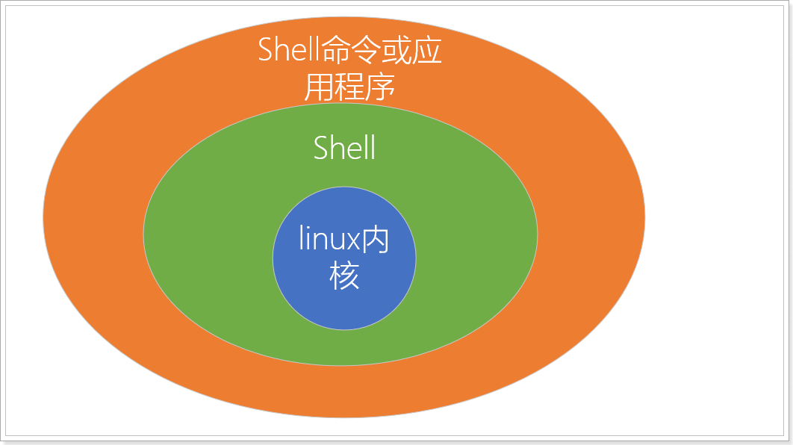

### Shell脚本

通过Shell命令或程序编程语言编写的Shell文本文件,  这就是Shell脚本 , 也叫Shell程序


### 为什么学习Shell脚本?

通过Shell命令与编程语言来提高linux系统的管理工作效率


## Shell的运行过程

当用户下达指令给该操作系统的时候，实际上是把指令告诉shell，经过shell解释，处理后让内核做出相应的动作。 系统的回应和输出的信息也由shell处理，然后显示在用户的屏幕上。

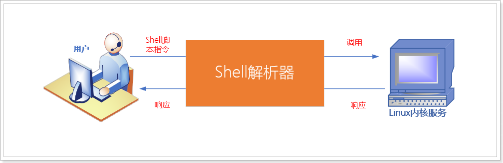

## Shell解析器

查看linux系统centos支持的shell解析器

```shell
cat /etc/shells
```

效果

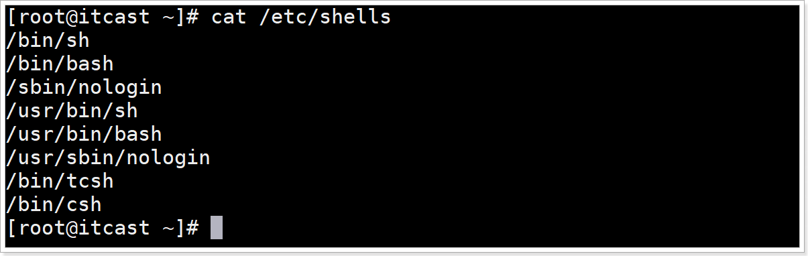

介绍解析器类型

| 解析器类型                       | 介绍                                                         |
| -------------------------------- | ------------------------------------------------------------ |
| /bin/sh                          | Bourne Shell,是UNIX最初使用的shell;                          |
| <font color=red>/bin/bash</font> | <font color=red>Bourne Again Shell它是Bourne Shell的扩展，简称bash，是LinuxOS默认shell,有灵活和强大的编辑接口，同时又很友好的用户界面，交互性很强；</font> |
| /sbin/nologin                    | 未登录解析器,  shell设置为/sbin/nologin 是用于控制用户禁止登陆系统的, 有时候有些服务，比如邮件服务，大部分都是用来接收主机的邮件而已，并不需要登陆 |
| /bin/dash                        | dash（Debian Almquist Shell），也是一种 Unix shell。它比 Bash 小，只需要较少的磁盘空间，但是它的对话性功能也较少，交互性较差。 |
| /bin/csh                         | C Shell是C语言风格Shell                                      |
| /bin/tcsh                        | 是C Shell的一个扩展版本。                                    |


### Centos默认的解析器是bash

语法

```shell
echo $SHELL
```

> 含义:  打印输出当前系统环境使用的Shell解析器类型
>
> echo  用于打印输出数据到终端
>
> `$SHELL`  是全局共享的读取解析器类型环境变量, 全局环境变量时所有的Shell程序都可以读取的变量,

效果

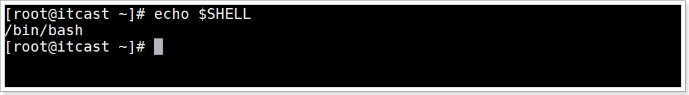


## Shell脚本文件编写规范

### 脚本文件后缀名规范

shell脚本文件就是一个文本文件,  后缀名建议使用 `.sh` 结尾

### 首行格式规范

首行需要设置Shell解析器的类型, 语法

```shell
#!/bin/bash
```

> 含义:  设置当前shell脚本文件采用bash解析器运行脚本代码

### 注释格式

单行注释, 语法

```shell
# 注释内容
```


多行注释, 语法

```shell
:<<!
# 注释内容1
# 注释内容2
!
```


## shell脚本HelloWord入门案例

#### 需求

创建一个Shell脚本文件helloworld.sh，输出hello world字符串

#### 效果

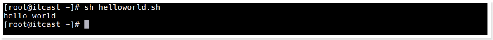

#### 实现步骤

1、创建shell脚本文件

```shell
touch helloworld.sh
```

2、编辑文件

```shell
vim helloworld.sh
```

3、增加shell脚本文件内容如下，并保存退出

```shell
#!/bin/bash
echo "hello world"
```

4、执行脚本

```shell
sh helloworld.sh
```

运行效果

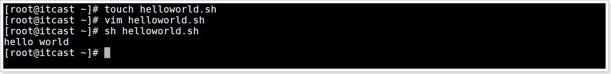


## 脚本文件的常用执行3种方式

#### 介绍

1. sh解析器执行方式

   语法: `sh 脚本文件`

   介绍: 就是利用sh命令执行脚本文件,  本质就是使用Shell解析器运行脚本文件

2. bash解析器执行方式

   语法: `bash 脚本文件`

   介绍: 就是利用bash命令执行脚本文件,  本质就是使用Shell解析器运行脚本文件

3. 仅路径执行方式

   语法: `./脚本文件`

   介绍:  执行当前目录下的脚本文件

   注意:  脚本文件自己执行需要具有可执行权限, 否则无法执行


#### 3种方式的区别

​		sh或bash执行脚本文件方式是直接使用Shell解析器运行脚本文件, 不需要可执行权限

​	     仅路径方式是执行脚本文件自己, 需要可执行权限

#### 执行脚本方式1-sh命令执行

相对路径效果

```shell
sh helloworld.sh
```

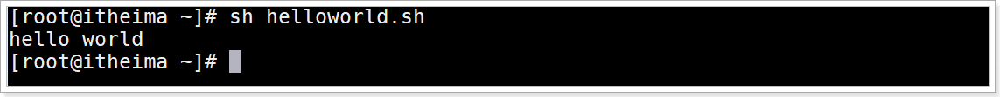

绝对路径效果

```shell
sh /root/helloworld.sh
```

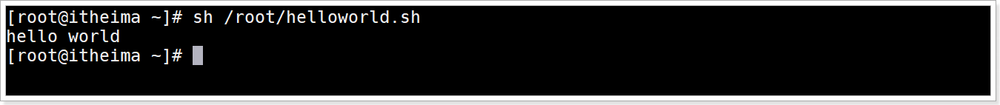


#### 执行脚本方式2-bash命令执行

相对路径效果

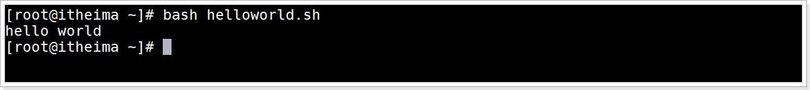

绝对路径效果

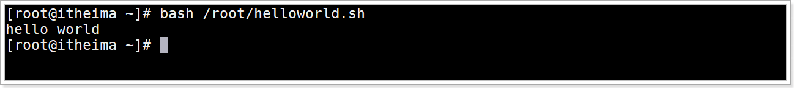


#### 执行脚本方式3-仅路径执行

##### 语法

步骤1：设置所有用户对此脚本文件增加可执行性权限

```shell
chmod a+x 脚本文件
```

步骤2：执行脚本语法

```shell
脚本文件的相对路径或绝对路径
```

##### 示例：使用仅路径方式执行helloworld.sh脚本文件

添加执行权限

```shell
chmod a+x helloworld.sh
```

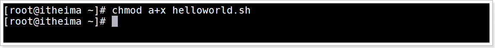

相对路径执行命令

```
./helloworld.sh
```

相对路径执行效果

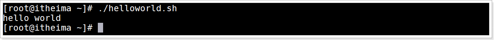

绝对路径执行命令

```shell
/root/helloworld.sh
```

绝对路径执行效果

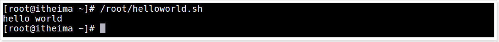


## 多命令处理介绍

就是在Shell脚本文件中编写多个Shell命令


## 案例需求

已知目录/root/itheima目录，执行batch.sh脚本，实现在/root/itheima/目录下创建一个one.txt,在one.txt文件中增加内容“Hello Shell”。

### 步骤分析

1. 使用mkdir创建/root/itheima目录

2. 创建脚本文件batch.sh

3. 编辑脚本文件

   3.1 命令1: touch创建文件, 文件名 `/root/itheima/one.txt`

   3.2 命令2: 输出数据"Hello Shell"到one.txt文件中

   > 输出数据到文件中的命令:
   >
   > `数据 >> 文件`

4. 执行脚本文件


### 实现步骤

1、进入root目录，执行创建/root/itheima目录命令

```shell
mkdir /root/itheima
```


2、创建/root/batch.sh文件

```shell
touch batch.sh
```

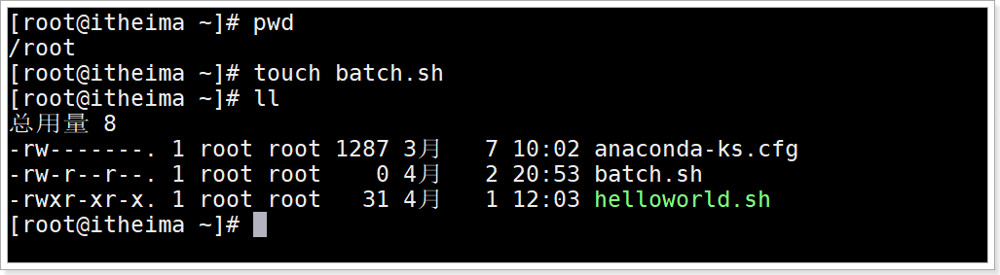


2、编辑batch.sh文件，编写shell命令

```shell
vim batch.sh
```


3、编写命令

命令1：创建/root/itheima/one.txt文件

命令2：输出“I love Shell”字符串数据到one.txt文件中

```shell
#!/bin/bash
cd itheima     # 切换到itheima目录
touch one.txt  # 创建文件one.txt
echo "Hello Shell">>/root/itheima/one.txt  #输出数据到one.txt文件中
```

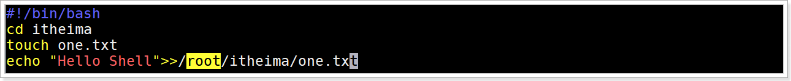

### 运行脚本效果

运行batch.sh脚本文件

```shell
sh batch.sh
```

查看one.txt文件内容

```shell
cat itheima/one.txt
```

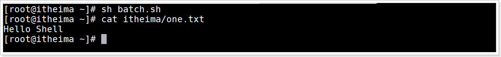


# Shell变量


## Shell变量的介绍

变量用于存储管理临时的数据,    这些数据都是在运行内存中的.


## 变量类型

1. 系统环境变量
2. 自定义变量
3. 特殊符号变量


## 系统环境变量

### 介绍

是系统提供的共享变量.是linux系统加载Shell的配置文件中定义的变量共享给所有的Shell程序使用


### Shell的配置文件分类

1.全局配置文件
/etc/profile
/etc/profile.d/*.sh
/etc/bashrc

2.个人配置文件
当前用户/.bash_profile
当前用户/.bashrc

一般情况下，我们都是直接针对全局配置进行操作。


### 环境变量分类

在Linux系统中，环境变量按照其作用范围不同大致可以分为系统级环境变量和用户级环境变量。

系统级环境变量：Shell环境加载全局配置文件中的变量共享给所有用户所有Shell程序使用, 全局共享
用户级环境变量：Shell环境加载个人配置文件中的变量共享给当前用户的Shell程序使用, 登录用户使用


### 查看当前Shell系统环境变量

查看命令

```shell
env
```

效果

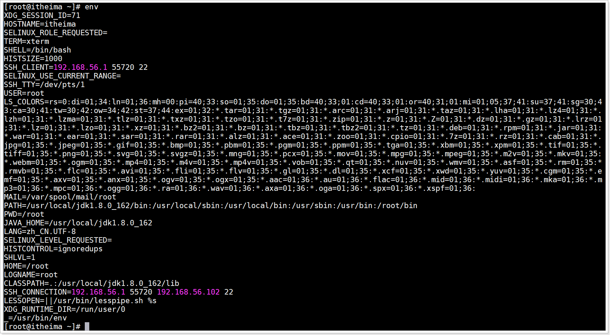


### 查看Shell变量(系统环境变量+自定义变量+函数)

命令

```shell
set
```


效果

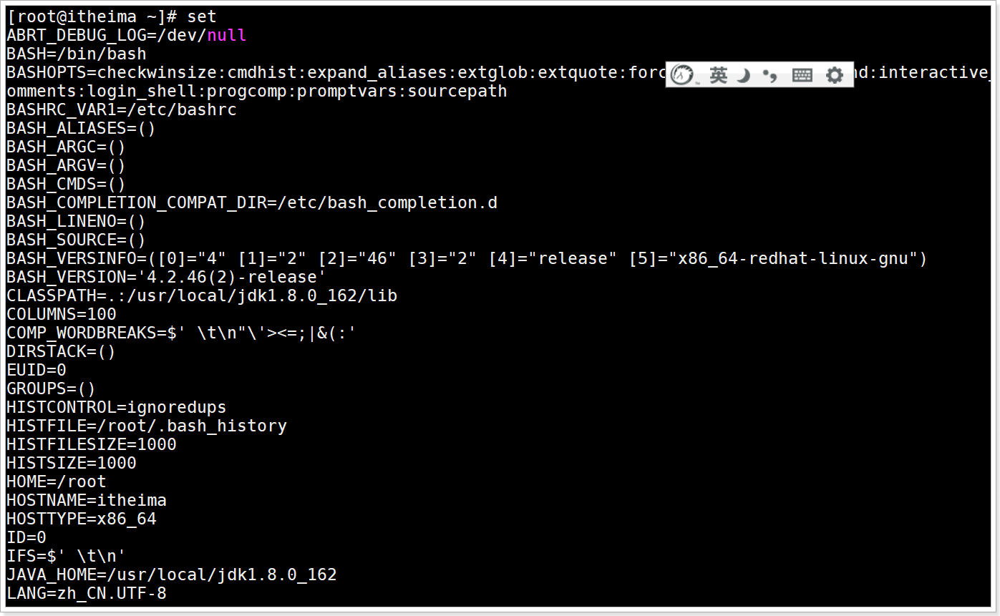

### 常用系统环境变量

| 变量名称     | 含义                                                         |
| ------------ | ------------------------------------------------------------ |
| ==PATH==     | 与windows环境变量PATH功能一样，设置命令的搜索路径，以冒号为分割 |
| HOME         | 当前用户主目录：/root                                        |
| SHELL        | 当前shell解析器类型：/bin/bash                               |
| ==HISTFILE== | 显示当前用户执行命令的历史列表文件：/root/.bash_history      |
| PWD          | 显示当前所在路径：/root                                      |
| OLDPWD       | 显示之前的路径                                               |
| HOSTNAME     | 显示当前主机名：itheima                                      |
| HOSTTYPE     | 显示主机的架构，是i386、i686、还是x86、x64等：x86_64         |
| ==LANG==     | 设置当前系统语言环境：zh_CN.UTF-8                            |

### 环境变量输出演示

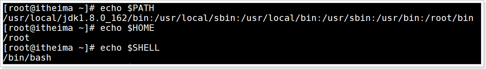

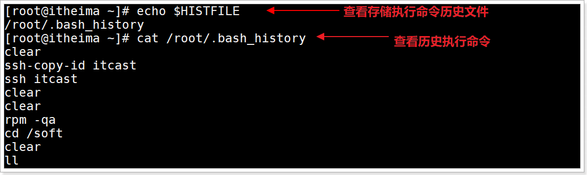

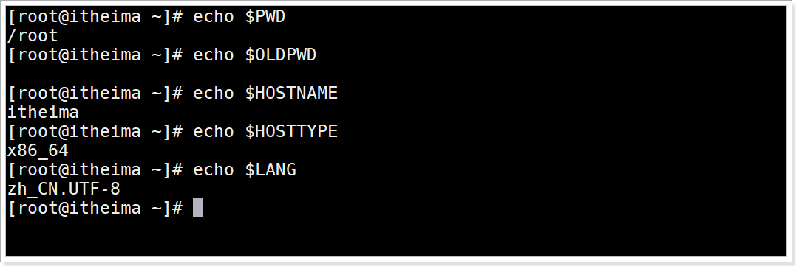


## 自定义变量

### 自定义变量介绍

就是自己定义的变量


### 分类

1. 自定义局部变量
2. 自定义常量
3. 自定义全局变量


### 自定义局部变量

#### 介绍

就是定义在一个脚本文件中的变量, 只能在这个脚本文件中使用的变量, 就是局部变量


#### 定义与使用

定义语法

```shell
var_name=value
```

变量定义规则

1. 变量名称可以有字母,数字和下划线组成, 但是不能以数字开头
2. 等号两侧不能有空格
3. 在bash环境中, 变量的默认类型都是字符串类型, 无法直接进行数值运算
4. 变量的值如果有空格, 必须使用双引号括起来
5. 不能使用Shell的关键字作为变量名称

演示

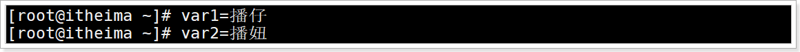

查询变量值语法

```Shell
# 语法1: 直接使用变量名查询
$var_name
# 语法2: 使用花括号
${var_name}
# 区别: 花括号方式适合拼接字符串
```

演示

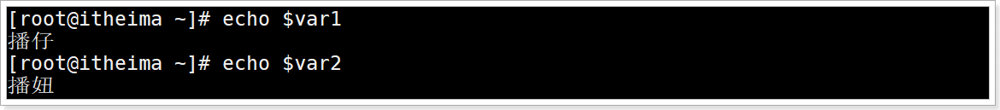

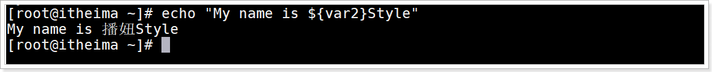

注意: 如果`"My name is ${var2}Style"` 中 `$var2` 不带花括号, 系统会认为获取`$var2Style` 变量数据, 这个变量不存在就获取不到数据,执行效果如下

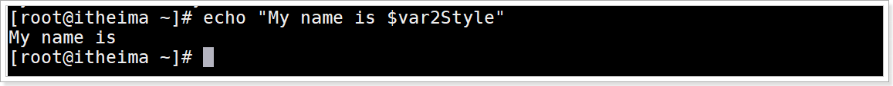

结论:  推荐大家使用花括号才是编程好习惯

#### 变量删除

语法

```shell
unset var_name
```

演示

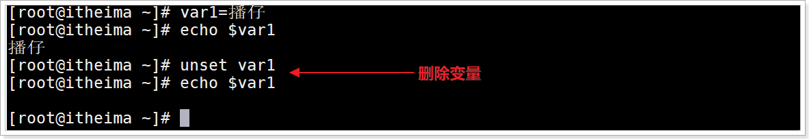


### 自定义常量

介绍

> 就是变量设置值以后不可以修改的变量叫常量, 也叫只读变量

语法

```shell
readonly var_name
```

演示

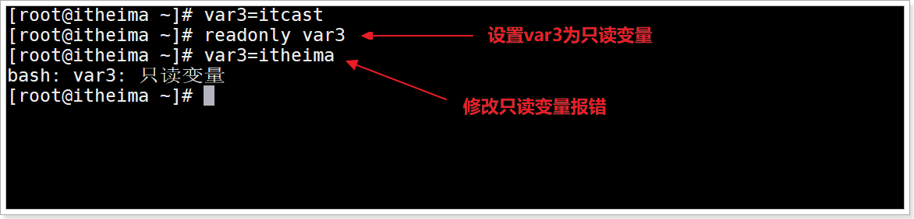

### 自定义全局变量

#### 父子Shell环境介绍

例如:  有2个Shell脚本文件 A.sh 和 B.sh

如果 在A.sh脚本文件中执行了B.sh脚本文件, 那么A.sh就是父Shell环境, B.sh就是子Shell环境

#### 自定义全局变量介绍

> 就是在当前脚本文件中定义全局变量, 这个全局变量可以在当前Shell环境与子Shell环境中都可以使用

#### 自定义全局变量语法

```Shell
export var_name1 var_name2
```

#### 案例需求

测试全局变量在子Shell中是否可用,  在父Shell中是否可用

#### 案例实现步骤

1. 创建2个脚本文件 demo2.sh 和 demo3.sh

2. 编辑demo2.sh 

   命令1:定义全局变量VAR4

   命令2: 执行demo3.sh脚本文件

3. 编辑demo3.sh

   输出全局变量VAR4

4. 执行demo2.sh脚本文件

#### 案例演示

1. 创建demo2.sh和demo3.sh文件

   

2. 编辑demo2.sh, 里面定义变量VAR4并设置为全局, 并里面执行demo3.sh脚本文件

   ```shell
   vim demo2.sh
   ```

   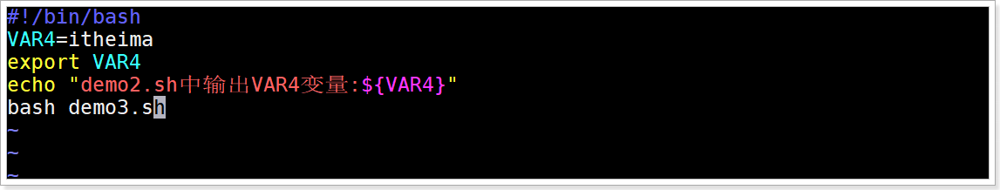

3. 编辑demo3.sh,  里面打印VAR4

   ```shell
   vim demo3.sh
   ```

   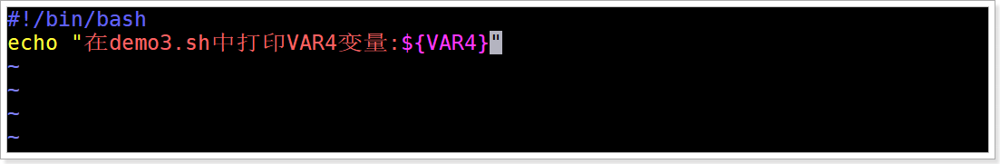

4. 执行脚本文件demo2.sh,  观察打印VAR4效果

   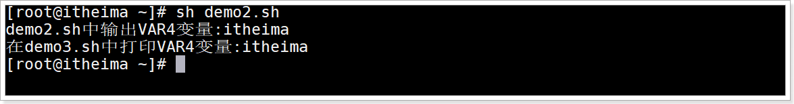

5. 执行脚本文件后, 在交互式Shell环境打印VAR4,  观察打印VAR4效果

   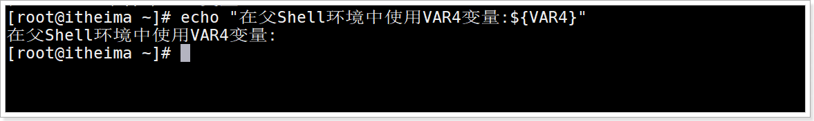

#### 结论

全局变量在当前Shell环境与子Shell环境中可用, 父Shell环境中不可用


## 特殊变量

### 特殊变量：$n

#### 语法

```shell
$n
```

#### 含义

```shell
用于接收脚本文件执行时传入的参数
$0 用于获取当前脚本文件名称的
$1~$9, 代表获取第一输入参数到第9个输入参数
第10个以上的输入参数获取参数的格式: ${数字}, 否则无法获取
```

#### 执行脚本文件传入参数语法

```shell
sh 脚本文件 输入参数1 输入参数2 ...
```


#### 案例需求

创建脚本文件demo4.sh文件, 并在脚本文件内部执行打印脚本文件名字, 第一个输入参数, 第二个输入参数

#### 实现步骤

1. 创建脚本文件demo4.sh

2. 编辑demo4.sh的文件内容

   ```shell
   # 命令1: 打印当前脚本文件名字
   # 命令2: 打印第1个输入参数
   # 命令3: 打印第2个输入参数
   # 命令4: 打印第10个输入参数
   ```

3. 执行脚本文件demo4.sh

#### 演示

1. 创建demo4.sh文件

   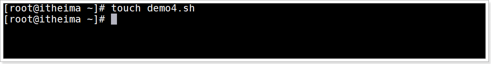

2. 编辑demo4.sh文件, 输出脚本文件名称\第一个输入参数\第二个输入参数

   

   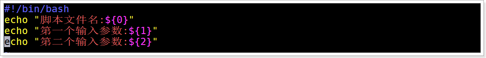

3. 执行demo4.sh文件,输入输出参数itcast  itheima的2个输入参数, 观察效果

   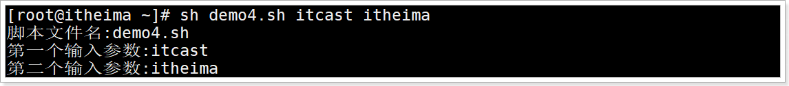


### 特殊变量：$#

#### 语法

 ```shell
$#
 ```

#### 含义

获取所有输入参数的个数


#### 案例需求

在demo4.sh中输出输入参数个数

#### 演示

编辑demo4.sh, 输出输入参数个数


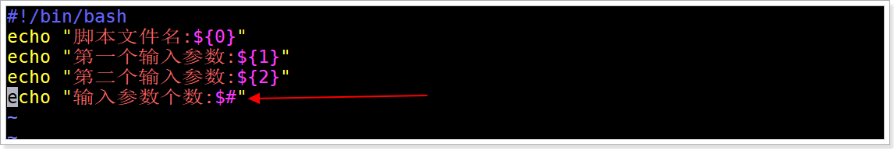

执行demo4.sh传入参数itcast, itheima, 播仔 看效果

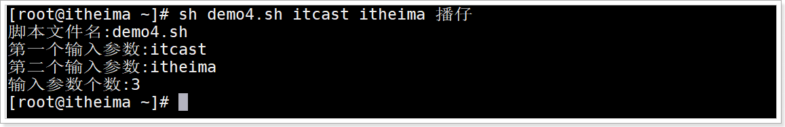


### 特殊变量：`$*`、`$@`

#### 语法

```shell
$*
$@
# 含义都是获取所有输入参数, 用于以后输出所有参数
```

`$*`与`$@`区别

```shell
1.不使用双引号括起来, 功能一样
  $*和$@获取所有输入参数,格式为: $1 $2 ... $n
2.使用双引号括起来
  "$*"获取的所有参数拼接为一个字符串, 格式为: "$1 $2 ... $n"
  "$@"获取一组参数列表对象, 格式为: "$1" "$2" ... "$n"
  使用循环打印所有输入参数可以看出区别
```

循环语法

```shell
for var in 列表变量
do		# 循环开始
   命令  # 循环体
done    # 循环结束
```


#### 案例需求

在demo4.sh中循环打印输出所有输入参数, 体验`$*`与`$@`的区别

#### 实现步骤

编辑demo4.sh脚本文件

```shell
# 增加命令: 实现直接输出所有输入后参数
# 增加命令: 使用循环打印输出所有输入参数
```


#### 演示

1. 编辑demo4.sh文件

   

2. 直接输出所有输入参数, 与循环方式输出所有输入参数(使用双引号包含 `$*` 与 `$@`  )

   ```shell
   #!/bin/bash
   # 命令1: 打印当前脚本文件名字
   echo "当前脚本文件名称:$0"
   
   # 命令2: 打印第1个输入参数
   echo "第一个输入参数:$1"
   
   # 命令3: 打印第2个输入参数
   echo "第二个输入参数:$2"
   
   # 命令4: 打印第10个输入参数
   echo "第十个输入参数不带花括号获取:$10"
   echo "第十个输入参数带花括号获取:${10}"
   
   # 命令5 打印所有输入参数的个数
   echo "所有输入参数个数:${#}"
   
   
   # 增加命令: 实现直接输出所有输入后参数
   echo '使用$*直接输出:'$*
   echo '使用$@直接输出:'$@
   
   # 增加命令: 使用循环打印输出所有输入参数
   echo '循环遍历输出$*所有参数'
   for item in "$*"
   do
      echo $item
   done
   echo '循环遍历输出$@所有参数'
   for item in "$@"
   do
      echo $item
   done
   ```

3. 运行观察区别

   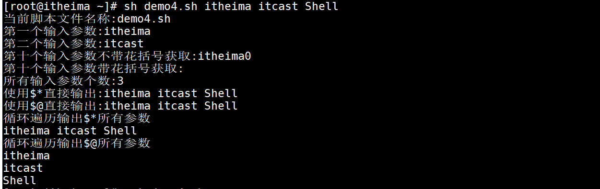

### 特殊变量：$？

#### 语法

```shell
$?
```

#### 含义

用于获取上一个Shell命令的退出状态码, 或者是函数的返回值

> 每个Shell命令的执行都有一个返回值, 这个返回值用于说明命令执行是否成功
>
> 一般来说, 返回0代表命令执行成功, 非0代表执行失败

#### 演示

输入一个正确命令, 再输出`$?`

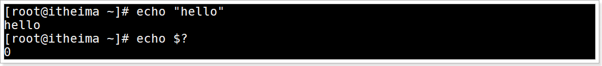

输入一个错误命令, 在输出`$?`

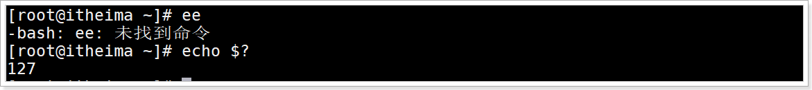


### 特殊变量：$$

#### 语法

```shell
$$
```

#### 含义

用于获取当前Shell环境的进程ID号

#### 演示

查看当前Shell环境进程编号

```Shell
ps -aux|grep bash
```

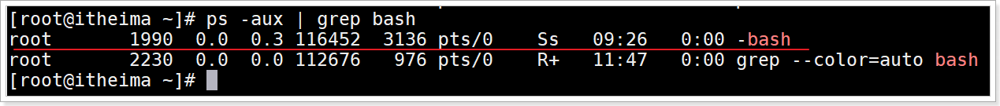

输出 $$  显示当前shell环境进程编号

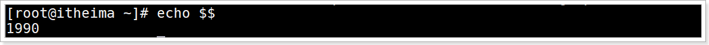


# Shell环境变量深入

## 自定义系统环境变量

### 全局配置文件/etc/profile应用场景

当前用户进入Shell环境初始化的时候会加载全局配置文件/etc/profile里面的环境变量, 供给所有Shell程序使用

以后只要是所有Shell程序或命令使用的变量, 就可以定义在这个文件中


### 案例演示

#### 需求

/etc/profile定义存储自定义系统级环境变量数据


#### 创建环境变量步骤

1. 编辑/etc/profile全局配置文件

   ```shell
   # 增加命令: 定义变量VAR1=VAR1 并导出为环境变量
   # 扩展: vim里面的命令模式使用G快速定位到文件末尾位置, 使用gg定位到文件首行位置
   ```

2. 重载配置文件/etc/profile, 因为配置文件修改后要立刻加载里面的数据就需要重载, 语法

   ```shell
   source /etc/profile
   ```

3. 在Shell环境中读取系统级环境变量VAR1


#### 创建环境变量演示

编辑/etc/profile文件

```shell
vim /etc/profile
```


添加设置变量VAR1=VAR1并导出成为环境变量, 在/etc/profile文件末尾添加如下命令

```shell
# 创建环境变量
VAR1=VAR1
export VAR1
```

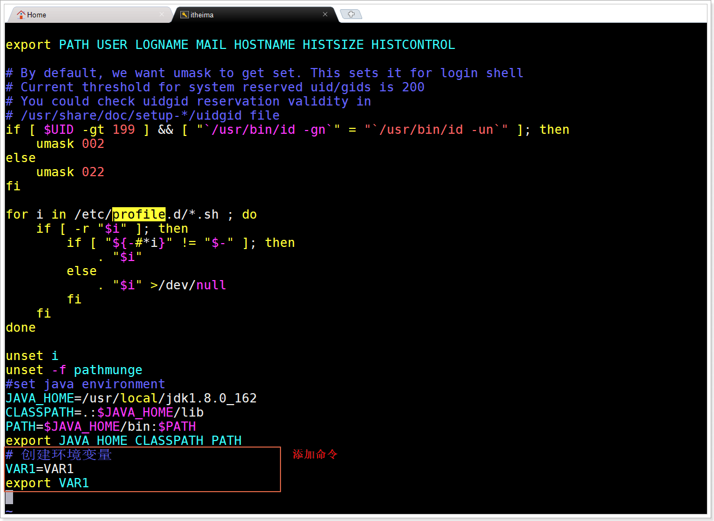

3、保存/etc/profile退出

4、重新加载/etc/profile文件数据更新系统环境变量

```shell
source /etc/profile
```

> 注意：如果这一步不执行，无法读取更新的环境变量

3、输出环境变量VAR1

```shell
echo $VAR1
```

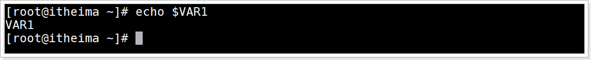


## 加载流程介绍与测试

### Shell工作环境介绍

用户登录系统时，Shell为用户定义了工作环境，工作环境提供了共享数据环境变量，比如shell解析器类型、主机名等，这些数据存储在环境变量中，便于shell脚本程序操作使用；


### shell工作环境分类

#### 交互式与非交互式shell

交互式Shell

> 是shell的一种运行模式，交互式shell等待你输入命令，并且立即执行，然后将结果反馈给你。这是每个CLI用户都非常熟悉的流程：登录、执行一些命令、登出。当你登出后，这个shell就终止了。

非交互式Shell

> 是shell的另一种运行模式，它专门被用来执行预先设定的命令。在这种模式下，shell不与用户进行交互，而是读取存放在脚本文件中的命令并执行它们。当它读到文件的结尾，这个shell就终止了。

#### 登录Shell与非登录Shell环境

| 类型名称        | 含义                                                         |
| --------------- | ------------------------------------------------------------ |
| shell登录环境   | 需要用户名、密码登录之后才能进入的shell                      |
| shell非登录环境 | 直接不用输入用户名和密码就可以打开的shell<br>或调用子Shell时使用的工作环境 |

> 注意：不同的工作环境加载环境变量流程不一样


### 环境变量初始化流程

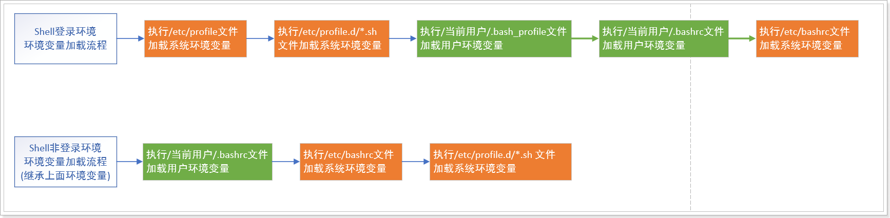


### 测试流程

#### 需求

在/etc/profile与/当前用户/.bashrc文件分别设置不同的环境变量，然后创建shell脚本文件输出设置的环境变量，最后切换不同环境执行shell脚本文件观察验证上面的流程运行

#### 命令

语法1

> 使用-l 或 --login 先加载Shell登录环境变量,再执行脚本文件

```shell
bash -l 脚本文件 或  bash --login 脚本文件 
sh -l 脚本文件  或 sh --login 脚本文件
# 先加载shell登录环境变量, 然后再执行脚本文件
```

语法2

```shell
bash  # 加载shell非登录环境变量
bash 脚本文件  / sh 脚本文件  #执行脚本
```

#### 分析

1、编辑/etc/profile文件，添加环境变量VAR1=VAR1

2、编辑/当前用户/.bashrc文件，添加环境变量VAR2=VAR2

3、创建demo1.sh脚本文件，并编辑文件输出VAR1、VAR2两个变量

4、直接执行demo1.sh脚本文件, 观察什么也没有输出

5、加载Shell非登录环境变量, 观察VAR2输出, VAR1没有输出

6、加载Shell登录环境变了, 观察VAR1,VAR2都有输出


#### 演示

编辑/etc/profile文件

```Shell
vim /etc/profile
```

编辑添加如下内容，保存退出

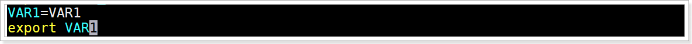

在root目录下,编辑.bashrc文件

```shell
vim .bashrc
```


编辑添加如下最后2行内容，保存退出

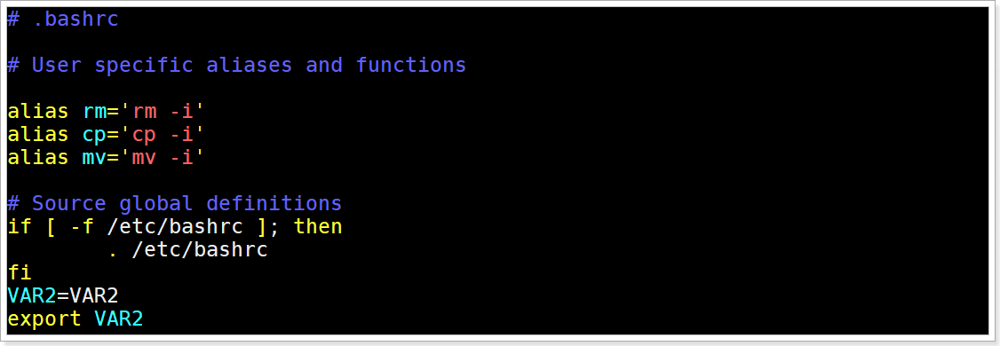

创建文件demo1.sh

```shell
touch demo1.sh
```

编辑文件demo1.sh，添加如下内容

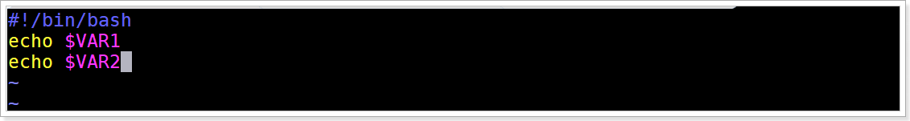

直接执行脚本文件

```shell
bash demo1.sh
```

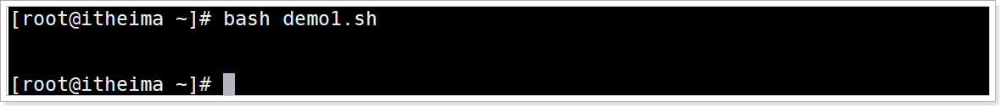

> 直接执行脚本文件, 即没有加载登录Shell环境变量, 也没有加载非登录Shell环境变量

先加载非登录Shell环境变量, 然后执行脚本文件

```shell
bash
bash demo1.sh
```

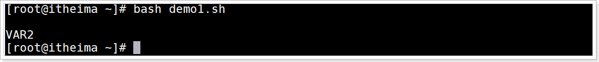

> Shell非登录环境会加载文件 `当前用户/.bashrc`  的环境变量数据
>
> 所以这里会输出VAR2的环境变量数据

先加载登录Shell环境变量, 然后执行脚本文件

```shell
bash -l demo1.sh
```

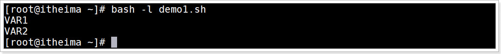

> Shell登录环境会加载文件 `etc/profile`和`当前用户/.bashrc`  的环境变量数据
>
> 所以这里会输出VAR1和VAR2的环境变量数据


## 识别Shell环境类型

### 识别shell环境的命令1

#### 命令

使用$0识别环境语法

```shell
echo $0
```

> 输出 `-bash` 代表：shell登录环境
>
> 输出 `bash` 代表：  shell非登录环境
>
> 注意：这个 `$0` 环境变量如果用在子shell中(shell脚本文件)输出Shell脚本本身的文件名 

bash命令语法

```shell
bash
```

> bash命令：用于切换为Shell非登录环境

#### 分析

1、直接登录系统为shell登录环境输出 $0 观察输出信息效果

2、使用 bash 命令切换为shell非登录环境输出 $0 观察输出信息效果

3、创建test.sh脚本文件，编辑添加输出 $0 ,编程保存完成后执行test.sh脚本文件观察输出信息效果

#### 演示

直接登录linux系统使用如下命令效果


> bash命令将当前环境转换为Shell非登录环境


#### 演示$0无效的情况

创建test.sh

```shell
touch test.sh
```


编辑test.sh

```shell
vim test.sh
```


添加内容

```shell
#!/bin/bash
echo $0
```


执行test.sh

```shell
sh test.sh
```

效果


### 识别shell环境的命令2

#### 命令

logout命令语法

```shell
logout
```

> logout命令： 用于退出Shell登录环境

exit命令语法

```shell
exit
```

> exit命令： 用于退出Shell登录或非登录环境

#### 区别

`logout` 只能退出Shell登录环境

`exit` 可以退出Shell登录与非登录环境

#### 分析

1、进入Shell登录环境，使用logout正常登出

2、使用bash进入Shell非登录环境，使用logout不能正常登录

3、使用exit正常退出Shell非登录环境

#### 演示


## 详细切换Shell环境

### 切换shell环境命令介绍

1. 直接登录加载shell登录环境

2. su切换用户加载Shell登录与Shell非登录环境
3. bash加载Shell登录与Shell非登录环境


### 切换Shell环境命令演示

#### 切换环境方式1：直接登录系统

##### 介绍

直接在虚拟机上使用用户名与密码登录linux系统或使用客户端直接连接远程linux系统

##### 演示

虚拟机本地直接登录演示


客户端远程采用SSH登录演示


#### 切换环境方式2：su切换用户登录

##### 命令

语法1

```shell
su 用户名 --login 
或
su 用户名 -l
 # 切换到指定用户, 加载Shell登录环境变量
```

语法2

```shell
su 用户名  
# 切换到指定用户,  加Shell非登录环境变量
```


##### 分析步骤

1、创建普通用户userA

2、切换到用户userA，使用-l加载Shell登录环境变量  ,  输出环境变量$0，观察输出-bash

4、使用exit退出userA

5、切换到用户userA，加载Shell非登录环境变量，输出环境变量$0，观察输出bash


##### 演示

创建普通用户userA

```shell
useradd -m userA
```


以Shell登录环境执行切换到用户userA，输出环境变量$0，输出 -bash 说明当前为Shell登录环境


使用exit退出userA


以Shell非登录环境执行切换到用户userA，输出环境变量$0，输出 bash  说明当前为Shell非登录环境


#### 切换环境方式3：bash切换

##### 命令

语法1:

```shell
bash  # 加载【Shell非登录环境】
```

语法2：

```shell
bash -l  Shell脚本文件 /  bash --login shell脚本文件
sh -l shell脚本文件 / sh --login shell脚本文件
# 先加载【Shell登录环境】然后运行指定Shell脚本文件
```

##### 分析

使用bash执行test.sh脚本文件，发生错误说明当前环境为Shell非登录环境

##### 演示


##### 

### Shell变量总结

#### 变量类型

1. 环境变量
2. 自定义变量
3. 特殊变量

#### 作用域

1. 环境变量

   系统Shell配置文件提供,  全局都可以使用

   | 分类                          | 初始化环境变量过程执行文件顺序                               |
   | ----------------------------- | ------------------------------------------------------------ |
   | shell登录环境变量初始化过程   | /etc/profile--》/etc/profile.d/*.sh--》~/.bash_profile--》~/.bashrc--》/etc/bashrc |
   | shell非登录环境变量初始化过程 | ~/.bashrc--》/etc/bashrc--》/etc/profile.d/*.sh              |

2. 自定义变量

   局部变量:  当前Shell可以使用

   全局变量:  当前Shell与子Shell可以使用

3. 特殊变量

   全局都可以使用

#### 常用系统环境变量

| 变量名称 | 含义 |
| -------- | ---- |
| PATH     |      |
| HOSTTYPE |      |
| LANG     |      |
| HISTFILE |      |
| PWD      |      |

#### 常用系统特殊符号变量

| 特殊变量     | 含义 |
| ------------ | ---- |
| `$n`         |      |
| `$#`         |      |
| `$*` 与 `$@` |      |
| `$?`         |      |
| `$$`         |      |

#### 切换shell环境命令

|           分类            | 命令介绍                                                     |
| :-----------------------: | ------------------------------------------------------------ |
|  切换为shell登录环境命令  | 方式1：直接使用用户名与密码登录系统<br>方式2：bash -l  shell脚本文件   或   bash --login  shell脚本文件<br>方式3：su 用户名  --login 或 -l |
| 切换为shell非登录环境命令 | 方式1：bash<br/>方式2：su 用户名                             |


