# Shell计算命令：expr命令详解

## 目标

理解expr命令的作用


## 介绍

expr (evaluate expressions 的缩写)，译为“表达式求值”。Shell expr 是一个功能强大，并且比较复杂的命令，它除了可以实现整数计算，还可以结合一些选项对字符串进行处理，例如计算字符串长度、字符串比较、字符串匹配、字符串提取等.


## 求值表达式(已讲)

计算语法

```shell
expr 算术运算符表达式
# 例如: expr 1 + 1  返回: 2
# 例如: expr \( 10 + 10 \) \* 2 + 100 返回:140
```

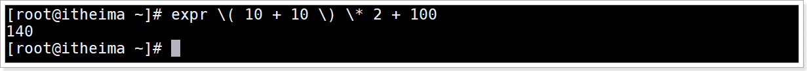

获取计算结果赋值给新变量语法

```shell
result=`expr 算术运算符表达式`
# 例如: result=`expr 1 + 1`  输出result得到结果: 2
```

### 

## 字符串语法

计算字符串的长度语法

```shell
expr length 字符串
# 例如: expr length "itheima"  返回: 7
```

截取字符串语法

```shell
expr substr 字符串 start end
# start 截取字符串的起始位置, 从1开始
# end 截取字符串的结束位置, 包含这个位置截取
# 例如 expr substr "itheima" 1 2  返回: it
```

获取第一个字符在字符串中出现的位置语法

```shell
expr index 被查找字符串  需要查找的字符
# 例如 expr index "itheima" t  会返回: 2 
```

正则表达式匹配1语法

```shell
expr match 字符串 正则表达式
# 正则表达式默认带有^ ,  代表以什么开头
# 返回值为符合匹配字符的长度, 否则返回为0
# 例如: expr match "itheima" ".*m"  会返回: 6
# 正则表达式通配符"."代表任意一个字符
# 正则表达式通配符"*"代表签名的字符可以出现0到多次
# ".*m" 含义为匹配字符串中m前面的字符串长度 
```

正则表表达式匹配2语法,  功能与语法1一样

```shell
expr 字符串 : 正则表达式
# 正则表达式默认带有^ ,  代表以什么开头
# 返回值为符合匹配字符的长度, 否则返回为0
# 例如: expr "itheima" : ".*m"  会返回: 6
```


## 演示

需求

```shell
# 四则运算: ( 10 + 10 ) * 2 + 100
# 计算"itheima"字符串的长度
# 获取"itheima"字符串中"t"第一个字符在字符串中出现的位置
# 正则表达式match匹配查找itheima字符串中m前面任意字符的总长度
```


cal1.sh脚本文件代码

```Shell
#!/bin/bash
# 四则运算
result=`expr \( 10 + 10 \) \* 2 + 100`
echo "(10+10)*2+100=${result}"

# 计算字符串的长度
echo "itheima字符串长度=`expr length "itheima"`"

# 获取第一个字符在字符串中出现的位置
echo "itheima字符串中第一个t的位置=`expr index "itheima" t`"

# 正则表达式匹配1
echo "正则表达式match匹配查找itheima字符串中m前面任意字符的总长度=`expr match "itheima" ".*m"`"

# 正则表达式匹配2
echo "正则表达式匹配查找itheima字符串中m前面任意字符的总长度=`expr "itheima" : ".*m"`"
```


运行效果

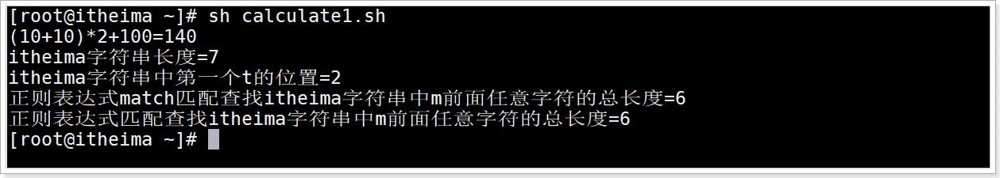

## 小结

expr命令的作用

> 1. 整数计算
>
>    `expr 整数运算表达式`
>
> 2. 字符串操作
>
>    `expr length 字符串`  获取字符串的长度
>
>    `expr substr 字符串 start end`  截取字符串
>
>    `expr index 字符串  查找的字符`  查找字符在字符串中第一次出现的位置,  位置从1开始的
>
>    `expr match 字符串  正则表达式`
>
>    `expr 字符串: 正则表达式`


# Shell计算命令：(())命令详解

## 目标

能够使用(())进行整数的数学运算


## 介绍

双小括号 (( )) , 用于进行数学运算表达式的执行 , 将数学运算表达式放在`((`和`))`之间。

可以使用`$`获取 (( )) 表达式命令的结果，这和使用`$`获得变量值是一样的。


## 语法

```shell
((表达式))
```


## 用法

| 运算操作符/运算命令                           | 说明                                                         |
| --------------------------------------------- | ------------------------------------------------------------ |
| ((a=1+6))<br> ((b=a-1)) <br>((c=a+b))         | 这种写法可以在计算完成后给变量赋值。以 ((b=a-1)) 为例，<br>即将 a-1 的运算结果赋值给变量 c。  注意，使用变量时不用加`$`前缀，<br>(( )) 会自动解析变量名。 |
| `a=$((1+6)`<br> `b=$((a-1))`<br> `c=$((a+b))` | 可以在 (( )) 前面加上`$`符号获取 (( )) 命令的执行结果，<br>也即获取整个表达式的值。以 `c=$((a+b))` 为例，即将 a+b 这个<br>表达式的运算结果赋值给变量 c。  注意，如果 c=((a+b)) 这样的写<br>法是错误的，不加`$`就不能取得表达式的结果。 |
| ((a>7 && b==c))                               | (( )) 也可以进行逻辑运算，在 if 语句中常会使用逻辑运算。     |
| echo $((a+10))                                | 需要立即输出表达式的运算结果时，可以在 (( )) 前面加`$`符号。 |
| ((a=3+5, b=a+10))                             | 对多个表达式同时进行计算, 多表表达式使用","号隔开            |

> 注意:  符号之间有无空格都可以 , (( a = 1 + 6 )) 等价于 ((a=1+6))

## 示例

需求

```shell
# 计算1+6赋值给变量a

# 计算变量a-1赋值给变量b

# 计算变量a+变量b赋值给变量c

# 打印变量a,变量b, 变量c的值

# $赋值写法

# (())多个表达式计算赋值

# echo输出直接使用(())

# (()) 用于逻辑表达式 在if中使用
```


calculatej2.sh脚本代码

```shell
#!/bin/bash
# 计算1+6赋值给变量a
((a=1+6))

# 计算变量a-1赋值给变量b
((b=a-1))

# 计算变量a+变量b赋值给变量c
((c=a+b))

# 打印变量a,变量b, 变量c的值
echo "a=${a},b=${b},c=${c}"

# $赋值写法
a=$((1+6)) b=$((a-1)) c=$((a+b))
echo "a=${a},b=${b},c=${c}"

# (())多个表达式计算赋值
((a=1+6,b=a-1,c=a+b))
echo "a=${a},b=${b},c=${c}"

# echo输出直接使用(())
echo "1+6=$((1+6))"

# (()) 用于逻辑表达式 在if中使用
if ((a>7 && b==c))
then
        echo "a>7 && b==c 成立"
else
        echo "a>7 && b==c 不成立"
fi
```


运行结果

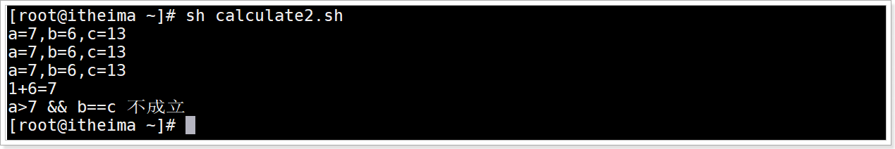


## 小结

(())的用法

> 括号内赋值:  ((变量名=整数表达式))
>
> 括号外赋值: 变量名=$((整数表达式))
>
> 多表达式赋值: ((变量名1=整数表达式1,变量名2=整数表达式2,...))
>
> 与if条件句配合使用:  if ((整数表达式))


# Shell计算命令：let命令详解

## 目标

能够使用let进行整数的数学运算赋值


## 介绍

let 命令和双小括号 (( )) 在数字计算方面功能一样.  但是没有(())功能强大,  let只能用于赋值计算, 不能直接输出, 不可以条件判断一起使用


## 语法

```shell
let 赋值表达式
```

> 注意
>
> 1. 语法功能等价于`((表达式))`
>
> 2. 多个表达式之间使用空格,  不是","号
>
> 3. 对于类似`let a+b`这样的写法，Shell 虽然计算了 a+b 的值，但却将结果丢弃, 如果 `echo let a+b` 会直接输出字符串 `a+b` ；若不想这样，可以使用`let sum=a+b`将 a+b 的结果保存在变量 sum 中。
>
>    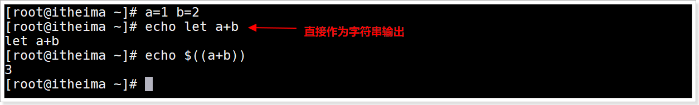
>
>    输出建议使用(())


## 示例

需求

```shell
# 计算变量a-1赋值给变量b
# 计算变量a+变量b赋值给变量c
# 打印变量a,变量b, 变量c的值
# let多个表达式计算赋值
```


calculate3.sh脚本代码

```shell
#!/bin/bash
# 计算1+6赋值给变量a
let a=1+6

# 计算变量a-1赋值给变量b
let b=a-1

# 计算变量a+变量b赋值给变量c
let c=a+b

# 打印变量a,变量b, 变量c的值
echo "a=${a},b=${b},c=${c}"

# let多个表达式计算赋值
let a=1+6 b=a-1 c=a+b
echo "a=${a},b=${b},c=${c}"
```


运行效果

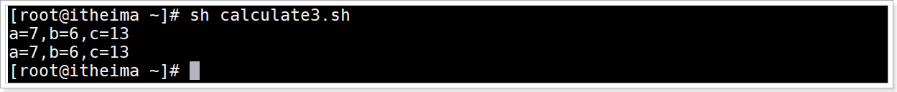


## 小结

let数字计算用法

作用: 用于赋值,是最简洁的整数运算赋值命令

> 计算赋值用法: let 变量名=整数运算表达式
>
> 多个表达式计算赋值用法:   let 变量名1=整数运算表达式1  变量名2=整数运算表达式2 ...


# Shell计算命令：$[\]命令详解

## 目标

能够使用$[]进行整数的数学运算


## 介绍

和 (())、let 命令类似，$[] 也只能进行整数运算。但是只能对单个表达式的计算求值与输出


## 语法

```shell
$[表达式]
```

> 1. $[] 会对`表达式`进行计算，并取得计算结果
>
> 2. 表达式内部不可以赋值给变量

## 示例

calculate4.sh脚本代码

```shell
#!/bin/bash
# 计算1+6赋值给变量a
a=$[1+6]

# 计算变量a-1赋值给变量b
b=$[a-1]

# 计算变量a+变量b赋值给变量c
c=$[a+b]

# 打印变量a,变量b, 变量c的值
echo "a=${a},b=${b},c=${c}"

# 直接输出
echo "$[1+6],$[7-1],$[7+6]"
```


运行结果

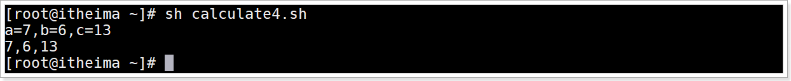

## 小结

执行整数表达式命令的总结, 推荐使用哪个

> expr
>
> ​	优点: 可以直接输出
>
> ​	缺点:  计算表达式里面引用变量使用$,  特殊字符需要转义  只能计算一个表达式
>
> (()) (直接求值输出推荐方式)
>
> ​     优点:  直接输出, 里面直接使用变量名, 特殊字符不需要转义, 多个表达式赋值
>
> ​     缺点: 需要获取值以后才可以输出
>
> let  (赋值推荐方式)
>
> ​     优点: 赋值简单,特殊字符不需要转义, 
>
> ​     缺点: 不能直接输出
>
> $[]
>
> ​    优点: ,特殊字符不需要转义, 
>
> ​    缺点: 不能多表达是计算,


# Shell计算命令：bc命令详解

## 目标

理解bc命令的作用

能够在bc中进行互动式的数学运算

能够在shell中进行非互动式的bc管道运算

能够在shell中非互动式的输入重定向bc运算


## 介绍

Bash shell内置了对整数运算的支持，但是并不支持浮点运算，而 linux bc (basic calculator)命令可以很方便的进行浮点运算. bc命令是Linux简单的计算器,能进行进制转换与计算。能转换的进制包括十六进制、十进制、八进制、二进制等。可以使用的运算符号包括(+)加法、(-)减法、(*)乘法、(/)除法、(^)指数、(%)余数等


## bc命令

### 语法

```shelll
bc [options] [参数]
```

### options

| 选项   | 说明                                                        |
| ------ | ----------------------------------------------------------- |
| -h     | help，帮助信息                                              |
| -v     | version，显示命令版本信息                                   |
| ==-l== | mathlib, 使用标准数学库, 例如使用内置函数就需要使用这个参数 |
| -i     | interactive, 强制交互                                       |
| -w     | warn, 显示 POSIX 的警告信息                                 |
| -s     | standard, 使用 POSIX 标准来处理                             |
| ==-q== | quiet, 不显示欢迎信息                                       |

> 默认使用bc命令后回车会有很多欢迎信息，  可以使用  `bc -q`  回车后不会有欢迎信息 

### 参数

文件： 指定包含计算任务的文件。


### 示例：bc执行计算任务的文件

创建task.txt文件, 编辑文件内容(一个计算表达式一行)

```shell
108*67+12345
58+2007*11
```

执行命令

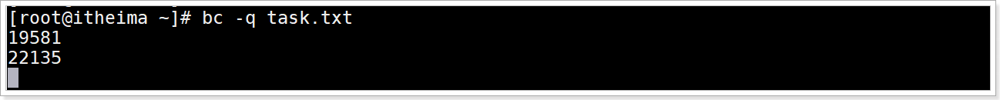

> 可以使用 `quit` 命令退出bc

## 内置变量

| 变量名      | 作 用                                                        |
| ----------- | ------------------------------------------------------------ |
| scale       | 指定精度，也即小数点后的位数, 对计算结果指定保留小数；默认为 0，也即不使用小数部分。 |
| ibase       | 指定输入的数字的进制，默认为十进制。                         |
| obase       | 指定输出的数字的进制，默认为十进制。                         |
| last 或者 . | 获取最近计算打印结果的数字                                   |


## 内置数学函数

| 函数名  | 作用                               |
| ------- | ---------------------------------- |
| s(x)    | 计算 x 的正弦值，x 是弧度值。      |
| c(x)    | 计算 x 的余弦值，x 是弧度值。      |
| a(x)    | 计算 x 的反正切值，返回弧度值。    |
| l(x)    | 计算 x 的自然对数。                |
| e(x)    | 求 e 的 x 次方。                   |
| j(n, x) | 贝塞尔函数，计算从 n 到 x 的阶数。 |


## 作用

通常在linux下bc当计算器用, 具体有3个用法

1. bc中互动式的数学运算
2. shell中非互动式的管道运算
3. shell中非互动式的输入重定向运算


## 示例：bc中互动式的数学运算

### 介绍

使用 `bc -q` 命令，回车即可,  直接进行计算器进行运算


### 演示

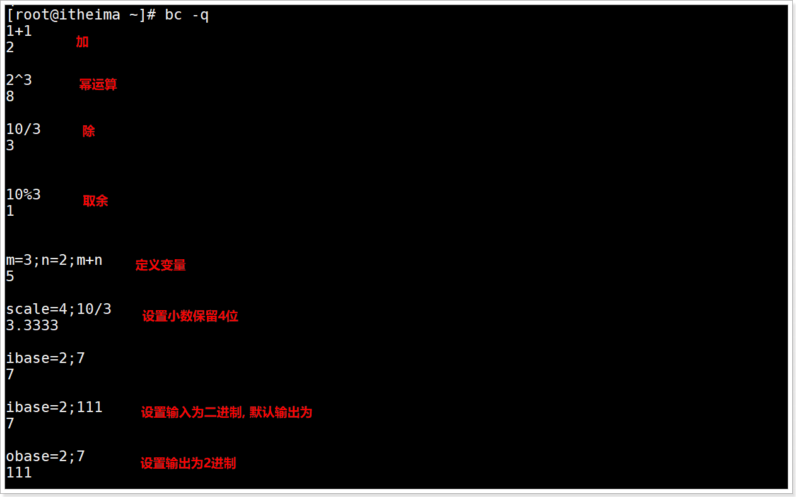

退出bc使用 `quit`

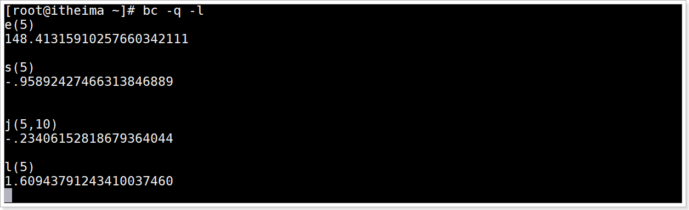


## 示例：shell中非互动式的管道运算

### 介绍

在 Shell 脚本中，我们可以借助管道使用 bc 计算器。


### 借助管道使用 bc 计算器语法

直接进行bc的表达式计算输出

```shell
echo "expression" | bc [options]
```

> "expression" 表达式必须复合bc命令要求的公式
>
> "expression"  表达式里面可以引用shell变量
>
> 例如:  Shell变量 `a=2`   在表达式里面引用的语法:  `$a`

将bc计算结果赋值给Shell变量

```shell
# 第一种方式
var_name=`echo "expression" | bc [options]`

# 第二种方式
var_name=$(echo "expression" | bc [options])
```

> $() 与 `` 功能一样, 都是执行里面的命令
>
> 区别
>
> ​	 `` 是所有linux系统支持的方式,  兼容性较好, 但是容易与引号产生混淆
>
> ​      $() 不是所有linux系统都支持的方式,  兼容性较差, 但是不容易产生混淆

### 演示

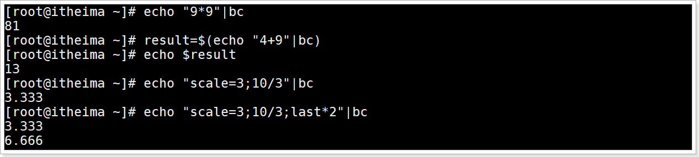

引用shell变量进行计算

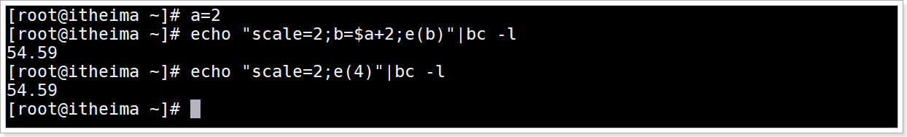

> 注意 b是bc中定义的新变量, 与shell变量没有任何关系,  所以不可以在shell中获取b变量

进制转换

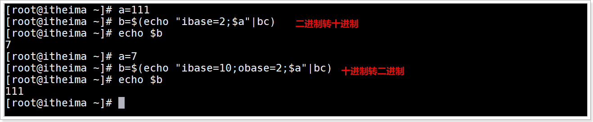


## 示例：shell中非互动式的输入重定向运算

### 介绍

将计算表达式输出给bc去执行, 特点类似于文件中输入,可以输入多行表达式, 更加清晰


### 语法

```shell
# 第一种方式
var_name=`bc [options] << EOF
第一行表达式1
第二行表达式2
...
EOF
`

# 第二种方式
var_name=$(bc [options] << EOF
第一行表达式1
第二行表达式2
...
EOF
)
```

> `var_name` 这是Shell变量的名字
>
> `bc` 执行bc的命令
>
> `EOF..EOF`  输入流的多行表达式
>
> 含义:  将EOF中间多行表达式输入给到bc去执行, j将bc执行的结果给到Shell变量var_name

### 演示

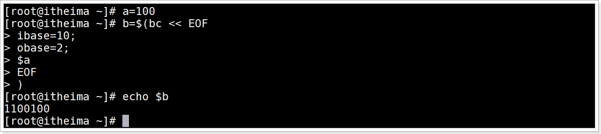

> 如果有大量的数学计算，那么使用输入重定向就比较方便，因为数学表达式可以换行，写起来更加清晰。

## 小结

bc命令的作用

> 是一个任意精度计算器

在bc中进行互动式的数学运算

> bc -q  进入bc环境  直接输入一个算术表达式后回车 bc就会计算出结果输出

在shell中进行非互动式的bc管道运算

> 直接输出结果:  echo "bc表达式" |bc [options]
> 赋值给变量:  变量名=$(echo "bc表达式" |bc [options])

在shell中非互动式的输入重定向bc运算

> 变量名=$(bc <<  EOF
>
> bc表达式
>
> EOF
>
> )
>
> 适合大量计算表达式


# 流程控制：if else语句

## 目标

能够使用if条件语句进行条件判断


## 介绍

if条件判断逻辑控制语句


## if语法

多行写法语法

```shell
if  条件
then
    命令
fi
```

> 可以将if语句放入一行语法
>
> ```shell
> if 条件; then 命令; fi
> ```

## if else 语法

```shell
if  条件
then
   命令
else
   命令
fi
```

## if elif else 语法

```shell
if  条件1
then
   命令1
elif 条件2
then
    命令2
elif 条件3
then
    命令3
……
else
   命令N
fi
```


## 演示

需求

```shell
提示"请输入你的考试成绩:" 接收用户输入一个成绩, 之后使用if else条件句判断
要求1: 小于 60 输出"不及格"
要求2: 大于等于70 并且 小于80 输出"中等"
要求3: 大于等于80 并且 小于90 输出"良好"
要求4: 大于等于90 并且 小于等于100 输出"优秀"
要求5: 以上不符合输出"成绩不合法"
```


control1.sh脚本代码

```shell
#!/bin/bash
read -p "请输入你的考试成绩:" score
if (( $score < 60 )); then
    echo "不及格"
elif (( $score >= 60 && $score < 70 )); then
    echo "及格"
elif (( $score >= 70 && $score < 80 )); then
    echo "中等"
elif (( $score >= 80 && $score < 90 )); then
    echo "良好"
elif (( $score >= 90 && $score <= 100 )); then
    echo "优秀"
else
    echo "成绩不合法"
fi
```

> `(())`是一种数学计算命令，它除了可以进行最基本的加减乘除运算，还可以进行大于、小于、等于等关系运算，以及与、或、非逻辑运算。当 a 和 b 相等时，`(( $a == $b ))`判断条件成立，进入 if，执行 then 后边的 echo 语句

运行效果

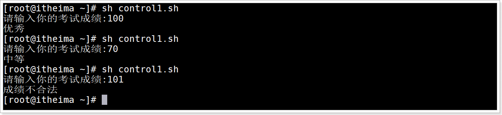

## 小结

使用if条件语句进行条件判断

```shell
if 条件1 
then
	命令1
elif 条件2 
then
	命令2
elif 条件3 
then
	命令3
...
else 
	命令n
fi
```


# if条件判断句的退出状态

## 目标

1. 理解什么是退出状态

2. 能够查询每个命令的退出状态


## 介绍

linux任何命令的的执行都会有一个退出状态,  无论是内置命令还是外部文件命令. 还是自定义的 Shell 函数，当它退出（运行结束）时，都会返回一个比较小的整数值给调用（使用）它的程序，这就是命令的**退出状态**

大多数命令状态0代表成功, 非0代表失败. 也有特殊的命令,比如 diff 命令用来比较两个文件的不同，对于“没有差别”的文件返回 0，对于“找到差别”的文件返回 1，对无效文件名返回 2

 Shell 中，有多种方式取得命令的退出状态，其中 `$?` 是最常见的一种.

## 演示

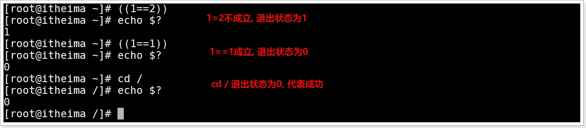


## 退出状态和逻辑运算符的组合

Shell if 语句使用逻辑运算符将多个退出状态组合起来，这样就可以一次判断多个条件了。

| 运算符     | 使用格式         | 说明                                                         |
| ---------- | ---------------- | ------------------------------------------------------------ |
| && 或 -a   | 条件1 && 条件2   | 逻辑与运算符，当 条件1 和 条件2 同时成立时，<br>整个表达式才成立。  如果检测到 条件1 的退出状态为 0，<br>就不会再检测 条件2 了，因为不管 条件2 的退出状态是什么，<br>整个表达式必然都是不成立的，检测了也是多此一举。 |
| \|\| 或 -o | 条件1 \|\| 条件2 | 逻辑或运算符，条件1 和 条件2 两个表<br>达式中只要有一个成立，整个表达式就成立。  如果检<br>测到 条件1 的退出状态为 1，就不会再检测 条件2 了，因为<br>不管 条件2 的退出状态是什么，整个表达式必然都是成立的，<br>检测了也是多此一举。 |
| !          | !条件            | 逻辑非运算符，相当于“取反”的效果。如果 条件 成立，那么整<br>个表达式就不成立；如果 条件 不成立，那么整个表达式就成立。 |

## 示例

### 需求

提示输入"请输入文件全名: "和"请输入数据:" 并接收文件名与数据

使用逻辑运算符判断满足2 条件 :  文件需要具有可写权限  和   输入的数据长度不为0

满足以上2个条件 将用户输入的 数据 写入到指定的文件中去


### 演示

创建itheima.txt

```shell
touch itheima.txt
```

control2.sh脚本文件代码

```shell
#!/bin/bash
read -p "请输入文件全名: " filename
read -p "请输入数据:" data
if [ -w $filename -a -n $data ]
then
        echo $data
        echo $data > $filename
        echo "成功"
else
        echo "失败"
fi
```

> test命令用于对文件或字符串进行检测,  `-w` 判断文件是否存在并且可写,  `-n` 用于检测字符串是否非空, 后续讲解.
>
> `$data > $filename`   其中 `>`  用于将内容输出到指定文件中去

运行结果

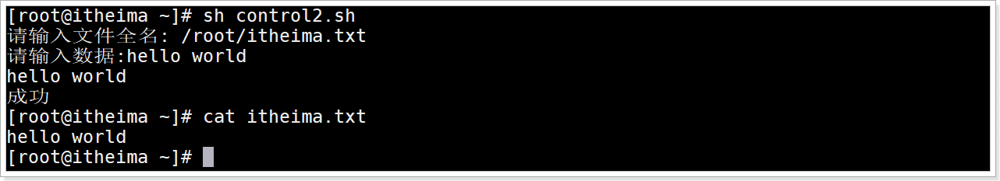

## 小结

1. 什么是退出状态

   > 每个命令运行后都会返回一个退出状态值,
   >
   > 大多数返回0代表成功,  非0 代表失败

2. 查询每个命令的退出状态

   > 常见命令 `$?`

   

# Shell内置命令：test

## 目标

1. 理解test命令对整数比较测试
2. 理解test命令对字符串
3. 能够使用test命令对文件测试


## 介绍

Shell中的 test 命令用于检查某个条件是否成立，它可以进行数值、字符和文件三个方面的测试。

功能与[]一样

## 整数比较测试

### 语法

```shell
if test 数字1 options 数字2 
then  
...
fi
```

options具体如下

| 参数 | 说明           |
| :--- | :------------- |
| -eq  | 等于则为真     |
| -ne  | 不等于则为真   |
| -gt  | 大于则为真     |
| -ge  | 大于等于则为真 |
| -lt  | 小于则为真     |
| -le  | 小于等于则为真 |

### 演示

control3.sh脚本代码

```shell
#!/bin/bash
num1=1 num2=1 num3=2
echo "num1=${num1},num2=${num2},num3=${num3}"

if test $num1 -eq $num2
then
    echo 'num1和num2两个数相等！'
else
    echo 'num1和num2两个数不相等！'
fi

if test $num2 -eq $num3
then
    echo 'num2和num3两个数相等！'
else
    echo 'num2和num3两个数不相等！'
fi
```

运行效果

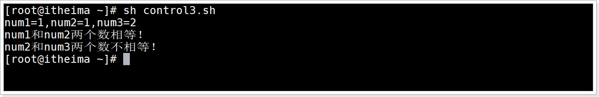


## 字符串比较测试

### 语法

| 参数      | 说明                                      |
| :-------- | :---------------------------------------- |
| = 或  ==  | 等于, 等于返回0代表成功,否则返回1代表失败 |
| !=        | 不等于                                    |
| `\<`      | 小于                                      |
| `\>`      | 大于                                      |
| -z 字符串 | 字符串的长度为零则为真                    |
| -n 字符串 | 字符串的长度不为零则为真                  |

### 演示

control4.sh脚本代码

```shell
#!/bin/bash

str1="itheima" str2="itcast" str3=""
echo "str1=${str1},str2=${str2},str3=${str3}"

if test $str1 = $str2
then
    echo 'str1和str2两个字符串相等'
else
    echo 'str1和str2两个字符串不相等'
fi

if test $str1 \> $str2
then
    echo 'str1大于str2'
else
    echo 'str1小于str2'
fi

if test -z $str2
then
	echo "str2字符串长度为0"
else
	echo "str2字符串长度不为0"
fi

if test -z $str3
then
	echo "str3字符串长度为0"
else
	echo "str3字符串长度不为0"
fi
```

运行效果

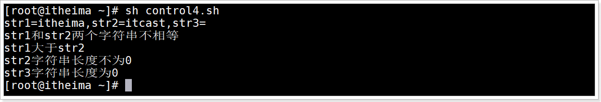


## 文件测试

### 语法

| 参数          | 说明                                           |
| :------------ | :--------------------------------------------- |
| ==-e 文件名== | exists, 如果文件存在则为真                     |
| ==-r 文件名== | read,如果文件存在且可读则为真                  |
| ==-w 文件名== | write,如果文件存在且可写则为真                 |
| ==-x 文件名== | execute,如果文件存在且可执行则为真             |
| ==-s 文件名== | string,如果文件存在且至少有一个字符则为真      |
| ==-d 文件名== | directory,如果文件存在且为目录则为真           |
| -f 文件名     | file,如果文件存在且为普通文件则为真            |
| -c 文件名     | character,如果文件存在且为字符型特殊文件则为真 |
| -b 文件名     | 如果文件存在且为块特殊文件则为真               |

### 演示

查询control1.sh与control2.sh文件

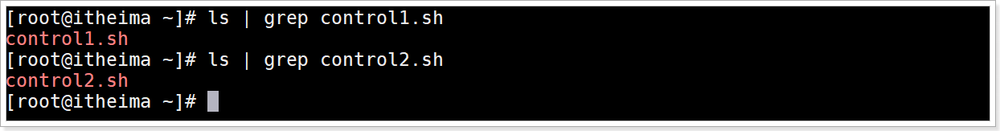

control5.sh脚本代码

```shell
#!/bin/bash

if test -w ./control1.sh
then
    echo '文件已存在并且可写!'
else
    echo '文件不存在或不可写!'
fi

if test -e ./control1.sh -a -e ./control2.sh
then
    echo '两个文件都存在!'
else
    echo '可能有一个或两个文件不存在'
fi
```

> Shell提供了与( -a )、或( -o )、非( ! )三个逻辑操作符用于将测试条件连接起来，其优先级为："!"最高，"-a"次之，"-o"最低,  语法
>
> ```shell
> test 条件1 -o 条件2 -a 条件3 ...
> ```

运行效果

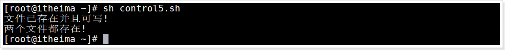


## 小结

1. test命令对整数比较测试

   > `test  整数1 options 整数2`
   >
   > options:  `lt le gt ge eq ne`

2. test命令对字符串比较测试

   > `test 变量1 options 变量2`
   >
   > options: `> < != = ==` 
   >
   > `< >` 需要转义

3. 使用test命令对文件测试

   > `test options 文件路径字符串`
   >
   > options: `-w -r -e -x -s -d`

​      注意: test命令与[] 功能一样

# 流程控制：case语句

## 目标

理解使用case多分支条件判断


## 介绍

Shell case语句为多选择语句。可以用case语句匹配一个值与一个模式，如果匹配成功，执行相匹配的命令;

当分支较多，并且判断条件比较简单时，使用 case in 语句就比较方便了。

## 语法

```shell
case 值 in
匹配模式1)
    命令1
    命令2
    ...
    ;;
匹配模式2）
    命令1
    命令2
    ...
    ;;
*)
    命令1
    命令2
    ...
    ;;
esac
```

每一匹配模式必须以右括号结束。取值可以为变量或常数。匹配发现取值符合某一模式后，其间所有命令开始执行直至 ;;(类似break, 不可以替代否则语法报错)。取值将检测匹配的每一个模式。一旦模式匹配，则执行完匹配模式相应命令后不再继续其他模式。如果无一匹配模式，使用星号 * 捕获该值，再执行后面的命令。

case、in 和 esac 都是 Shell 关键字,   esac就是case的反写在这里代表结束case

匹配模式:  可以是一个数字、一个字符串，甚至是一个简单正则表达式。

简单正则表达式支持如下通配符

| 格式  | 说明                                                         |
| ----- | ------------------------------------------------------------ |
| *     | 表示任意字符串。                                             |
| [abc] | 表示 a、b、c 三个字符中的任意一个。比如，[15ZH] 表示 1、5、Z、H 四个字符中的任意一个。 |
| [m-n] | 表示从 m 到 n 的任意一个字符。比如，[0-9] 表示任意一个数字，[0-9a-zA-Z] 表示字母或数字。 |
| \|    | 表示多重选择，类似逻辑运算中的或运算。比如，abc \| xyz 表示匹配字符串 "abc" 或者 "xyz"。 |

## 演示

control6.sh脚本代码

```shell
#!/bin/bash
read -p "请输入一个0~7的数字:" number
case $number in
1)
    echo "星期一"
	;;
2)
    echo "星期二"
    ;;
3)
    echo "星期三"
    ;;
4)
    echo "星期四"
    ;;
5)
    echo "星期五"
    ;;
6)
    echo "星期六"
    ;;
0|7)
    echo "星期日"
    ;;
*)
    echo "您输入的数字无效"
    ;; 
esac
```


运行效果

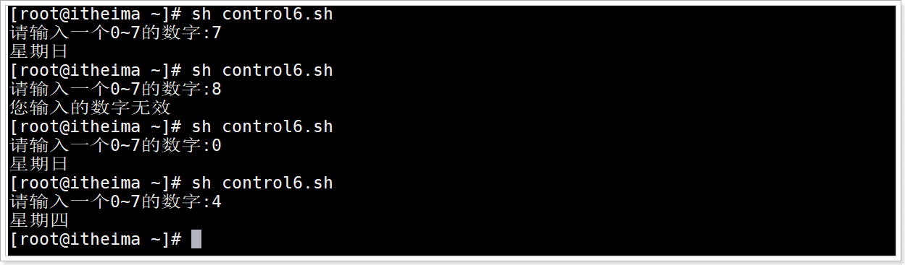


## 小结

使用case多分支条件判断语法

> ```shell
> case 表达式 in
> 模式1)
> 	命令
> 	...
> 	;;
> 模式2)
> 	命令
> 	...
> 	;;
> ...
> *)
> 	命令
> 	...
> 	;;
> 	
> ```
>
> 


# 流程控制：while语句

## 目标

理解whlie循环的使用


## 介绍

while用于循环执行一系列命令


## 语法

多行写法

```shell
while 条件
do
	命令1
	命令2
	...
	continue; # 结束当前这一次循环, 进入下一次循环
	break; # 结束当前循环
done
```

一行写法

```shell
while 条件; do 命令; done;
```

## 演示

control7.sh脚本文件代码: 输出指定多少次的hello world

```shell
#!/bin/bash
read -p "请输入一个数字:" number
i=0
while [[ $i < $number ]]
do
  echo "hello world"
  ((i++))
done
```

运行效果

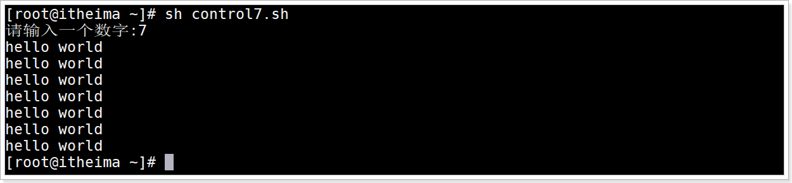

## 无限循环

```shell
while :
do
    command
done
```

或

```shell
while true
do
    command
done
```


## 小结

whlie循环的使用语法

> while 条件
>
> do
>
> ​	命令
>
> done


# 流程控制：until语句

## 目标

理解until循环结构的使用


## 介绍

until 也是循环结构语句,  until 循环与 while 循环在处理方式上刚好相反,  循环条件为false会一致循环, 条件为true停止循环.


## 语法

```shell
until 条件
do
    命令
done
```

条件如果返回值为1(代表false)，则继续执行循环体内的语句，否则跳出循环。


## 演示

control8.sh脚本代码

```shell
#!/bin/bash
read -p "请输入一个数字:" number
i=0
until [[ ! $i < $number ]]
do
  echo "hello world"
  ((i++))
done
```

运行效果


## 小结

until循环结构的使用语法

> until 条件
>
> do
>
> ​	命令
>
> done
>
> 条件为false继续循环, 为true停止循环


# 流程控制：for语句

## 目标

能够使用for进行循环操作


## 介绍

Shell支持for循环,  与其他编程语言类似.

## 循环方式1

### 语法

多行写法

```shell
for var in item1 item2 ... itemN
do
    命令1
    命令2
    ...
done
```

一行写法

```shell
for var in item1 item2 ... itemN; do 命令1; 命令2…; done;
```

> var是循环变量
>
> item1 item2 ... itemN 是循环的范围

### 演示

control9.sh脚本代码

```shell
#!/bin/bash
for i in 1 2 3 4 5
do
 echo "hello world"
done
```


运行效果

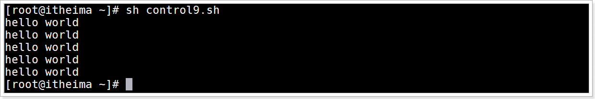


## 循环方式2

### 语法

多行写法

```shell
for var in {start..end}
do
	命令
done
```

> start:  循环范围的起始值,必须为整数
>
> end: 循环范围的结束值, 必须为整数

一行写法

```shell
for var in {start..end}; do 命令; done
```


### 演示

循环1到5并打印

```shell
for i in {1..5}; do echo $i; done
```

效果

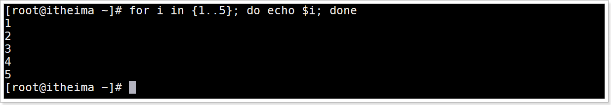


## 循环方式3

### 语法

多行写法

```shell
for((i=start;i<=end;i++))
do
	命令
done
```

一行写法

```shell
for((i=start;i<=end;i++)); do 命令; done
```

### 演示

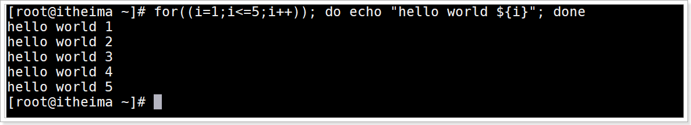


## 无限循环

```shell
for((;;)); do 命令; done
```


## 小结

使用for进行循环操作的3种方式

> 方式1:  `for i in item1 item2 ...; do 命令; done`
>
> 方式2:  `for i in {start..end}; do 命令; done`
>
> 方式3:  `for((i=start;i<=end;i++)); do 命令; done`


# 流程控制：select语句

## 目标

能够使用select语句进行菜单选择输入


## 介绍

select in 循环用来增强交互性，它可以显示出带编号的菜单，用户输入不同的编号就可以选择不同的菜单，并执行不同的功能.   select in 是 Shell 独有的一种循环，非常适合终端（Terminal）这样的交互场景, 其他语言没有;

## 语法

```shell
select var in menu1 menu2 ...
do
    命令
done
```

> 注意: select 是无限循环（死循环），输入空值，或者输入的值无效，都不会结束循环，只有遇到 break 语句，或者按下 Ctrl+D 组合键才能结束循环。
>
> 执行命令过程中: 终端会输出 `#?`  代表可以输入选择的菜单编号

## 演示1

脚本代码

```shell
#!/bin/bash
echo "你的爱好是什么?"
select hobby in "编程" "游戏" "篮球" "游泳"
do
	echo $hobby
    break
done
echo "你的爱好是:${hobby}"
```

运行效果

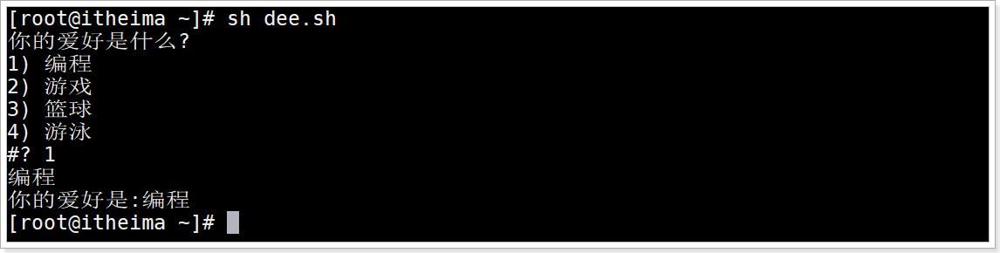

## 演示2

脚本文件代码

```shell
#!/bin/bash
echo "你的爱好是什么"
select hobby in "编程" "游戏" "篮球" "游泳"
do
    case $hobby in
        "编程")
            echo "编程,多敲代码"
            break
            ;;
        "游戏")
            echo "少玩游戏"
            break
            ;;
        "篮球"|"游泳")
            echo "运动有利健康"
            break
            ;;
        *)
            echo "输入错误，请重新输入"
    esac
done
```

运行效果

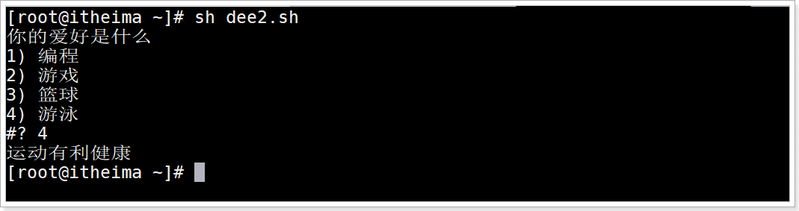

## 小结

select的作用

> 用于交互式循环输入选择菜单
>
> 常与 case in 一起配合使用


# Shell函数：系统函数

## 目标

1. 理解函数的分类
2. 理解常用的系统函数


## 函数介绍

Shell编程和其他编程语言一样, 有函数,  函数是由若干条shell命令组成的语句块，实现Shell脚本代码重用和模块化编程。


## 函数分类

1. 系统函数
2. 自定义函数


## 系统函数介绍

系统自带提供的函数, 可以直接使用.


## basename系统函数

### 介绍

basename函数用于获取文件名的函数,  根据给出的文件路径截取出文件名


### 语法

```shell
basename [string / pathname] [suffix]  
```

> 根据根据指定字符串或路径名进行截取文件名,  比如:  根据路径"/one/two/aa.txt",  可以截取出aa.txt
>
> suffix: 用于截取的时候去掉指定的后缀名.


### 演示

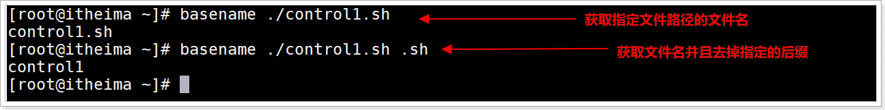


## dirname系统函数

### 介绍

从指定的文件绝对路径,  去除文件名，返回剩下的前缀目录路径


### 语法

```shell
dirname 文件绝对路径
```


### 演示

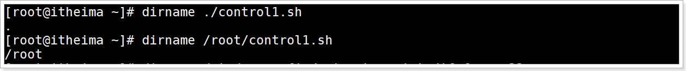


## 小结

1. 函数的分类

   > 系统函数
   >
   > 自定义函数

2. 常用的系统函数

   > basename 用于从指定路径中获取文件名
   >
   > dirname 用于从指定的路径中获取目录名, 去掉文件名


# Shell函数：自定义函数

## 目标

1. 能够使用Shell的自定义函数实现代码重用
2. 能够说出Shell程序命令与函数的区别


## 介绍

开发人员可以通过自定义开发函数,实现代码重用.


## 语法

```shell
# 函数的定义
[ function ] funname ()
{
    命令
    [return 返回值]

}

# 调用函数
funname 传递参数1 传递参数2 ...
```

> 1. 可以带function fun() 定义，也可以直接fun() 定义,不带任何参数。
>
> 2. 参数返回，可以显示加：return 返回，如果不加，将以最后一条命令运行结果，作为返回值。 return后跟数值n(0~255)

## 注意

必须在调用函数地方之前，先声明函数，shell脚本是逐行运行,  只要先运行了函数, 后面才可以时使用函数

  

## 示例：无参无返回值函数

文件脚本代码

```shell
#!/bin/bash
demo()
{
    echo "执行了函数"
}

# 调用函数
demo
```


运行效果

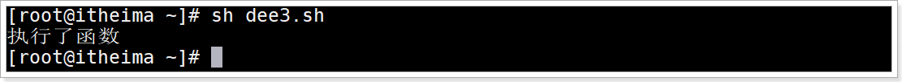

## 示例：无参有返回值函数

fun2.sh文件脚本代码

```shell
#!/bin/bash
sum()
{
    echo "求两个数的和..."
    read -p "输入第一个数字: " n1
    read -p "输入第二个数字: " n2
    echo "两个数字分别为 $n1 和 $n2 "
    return $(($n1+$n2))
}

# 调用函数
sum
echo "两个数字的和为: $? "  # 获取函数返回值
```

运行效果

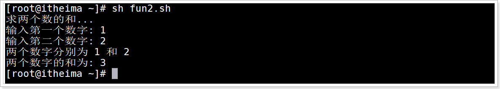


## 示例：有参函数

### 介绍

在Shell中，调用函数时可以向其传递参数。在函数体内部，通过 `$n` 的形式来获取参数的值，例如，`$1` 表示第一个参数，`$2` 表示第二个参数...

其他参数介绍

| 参数处理 | 说明                                                         |
| :------- | :----------------------------------------------------------- |
| $#       | 传递到脚本或函数的参数个数                                   |
| $*       | 以一个单字符串显示所有向脚本传递的参数                       |
| $$       | 脚本运行的当前进程ID号                                       |
| $!       | 后台运行的最后一个进程的ID号                                 |
| $@       | 与$*相同，但是使用时加引号，并在引号中返回每个参数。         |
| $?       | 显示最后命令的退出状态。0表示没有错误，其他任何值表明有错误。 |

### 演示

fun3.sh文件脚本代码

```shell
#!/bin/bash
funParam(){
    echo "第一个参数为 $1 !"
    echo "第二个参数为 $2 !"
    echo "第十个参数为 $10 !"
    echo "第十个参数为 ${10} !"
    echo "第十一个参数为 ${11} !"
    echo "参数总数有 $# 个!"
    echo "作为一个字符串输出所有参数 $* !"
}
# 调用函数
funParam 1 2 3 4 5 6 7 8 9 10 22
```

运行效果

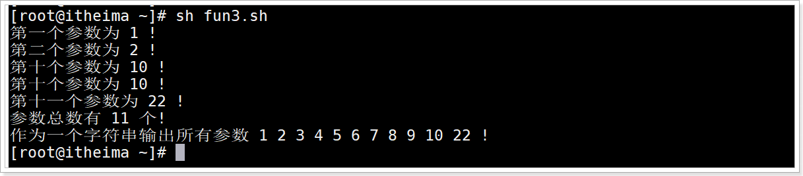


## Shell程序与函数的区别

### 区别

函数和shell程序比较相似，区别在于：
	Shell 程序(内置命令和外部脚本文件),  外部脚本文件是在子Shell中运行,  会开启独立的进程运行
	Shell函数在当前Shell的进程中运行

### 演示

fun4.sh脚本文件代码

```shell
#!/bin/bash
demo(){
        echo "函数中打印当前进程ID:$$"
}

echo "当前脚本文件(Shell程序)打印当前进程ID:$$"
# 调用函数
demo
```

运行效果

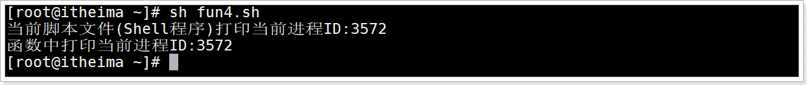


## 小结

1. 使用Shell的自定义函数实现代码重用

   ```shell
   函数名(){
   	命令
   	# 使用$n获取函数的参数
   	[return 返回值]
   }
   ```

   

2. 说出Shell程序命令与函数的区别

   > Shell程序命令:  运行命令时开启一个子进程运行命令
   >
   > 函数: 在当前Shell环境中运行, 没有开启进程

   

# Shell重定向输入输出

## 目标

1. 理解Shell重定向的含义
2. 能够使用重定向输出数据到文件中保存
3. 能够使用重定向从文件中读取输入数据


## 重定向介绍

### 标准输入介绍

从键盘读取用户输入的数据，然后再把数据拿到Shell程序中使用；


### 标准输出介绍

Shell程序产生的数据，这些数据一般都是呈现到显示器上供用户浏览查看;


### 默认输入输出文件

每个 Unix/Linux 命令运行时都会打开三个文件,  文件如下

| 文件名 | 类型                                  | 文件描述符(file description, fd) | 功能                     |
| ------ | ------------------------------------- | -------------------------------- | ------------------------ |
| stdin  | (standard input)<br>标准输入文件      | 0                                | 获取键盘的输入数据       |
| stdout | (standard output)<br/>标准输出文件    | 1                                | 将正确数据输出到显示器上 |
| stderr | (standard error)<br/>标准错误输出文件 | 2                                | 将错误信息输出到显示器上 |

> 每个文件都有一个唯一的 **文件描述符fd**,  后面会通过唯一 **文件描述符fd** 操作对应的信息

Shell程序操作输入输出时用到这3个文件

1. Shell程序默认会从stdin文件中读取输入数据
2. Shell程序默认会向stdout文件输出正确数据
3. Shell程序默认会项stderr文件中输出错误信息

这3个文件用于临时传输数据使用

### 重定向输入输出介绍

1. 标准输入是数据默认从键盘流向程序，如果改变了它的方向，数据就从其它地方流入，这就是输入重定向。

2. 标准输出是数据默认从程序流向显示器，如果改变了它的方向，数据就流向其它地方，这就是输出重定向。

   > Linux Shell 重定向分为两种，一种输入重定向，一种是输出重定向；


## 重定向的作用

输出重定向是指命令的结果不再输出到显示器上，而是输出到其它地方，一般是文件中。这样做的最大好处就是把命令的结果保存起来，当我们需要的时候可以随时查询。


## 重定向语法

| 命令                  | 说明                                                         |
| :-------------------- | :----------------------------------------------------------- |
| 命令 > file           | 将正确数据重定向输出到 file 文件中, 覆盖方式                 |
| 命令 < file           | 将输入重定向从 file 文件中读取数据                           |
| 命令 >> file          | 将正确数据重定向输出到 file 文件中, 追加方式                 |
| 命令 < file1 > file2  | 从file文件读取数据, 输出数据到file2文件中                    |
| 命令 fd> file         | 根据指定的文件描述符fd 将数据重定向输出到 file 文件中, 覆盖方式 |
| 命令 fd>> file        | 根据指定的文件描述符fd 将数据重定向输出到 file 文件中, 追加方式 |
| 命令 > file fd1>& fd2 | 将 fd1 和 fd2 文件描述符合并 输出到文件。                    |
| fd1<& fd2             | 将 fd1 和 fd2 文件描述符合并 从文件读取输入.                 |
| << tag                | 读取终端输入数据,  将开始标记 tag 和结束标记 tag 之间的内容作为输入。<br>标记名tag可以任意 |

> 在输出重定向中，`>`代表的是覆盖输出，`>>`代表的是追加输出。
>
> fd是文件描述符 
>
> ​		0 通常是标准输入（STDIN），
>
> ​		1 是标准输出（STDOUT），
>
> ​		2 是标准错误输出（STDERR）。
>
> fd>  或  fd>>  中间不可以有空格


## 输出示例：正确信息重定向输出

创建文件redirect1.txt

```shell
touch redirect1.txt
```

执行who命令重定向输出到redirect1.txt文件中

```shell
echo "itheima" >> redirect1.txt
```

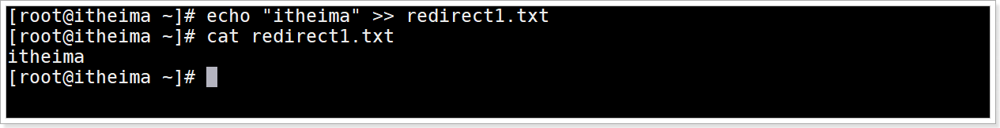


## 输出示例：错误信息重定向输出

预览错误消息

```shell
ls java
```

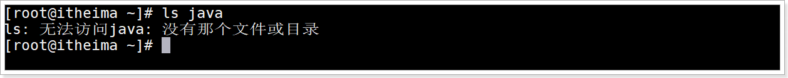

没有java目录所以报错

将错误消息输出到error.log文件中

```shell
ls java 2> redirect2.txt
```

> 2 是标准错误输出（STDERR）, 注意
>
> `>` 覆盖方式输出
>
> `2>` 注意fd与>符号之间不能有空格 

运行效果

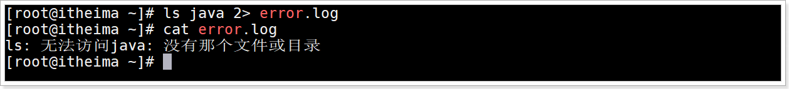


## 输出示例：正确和错误信息同时输出

将正确信息与错误信息都保存到一个文件中

```shell
echo "itcast" > redirect2.txt 2>&1
```

> 数字 1 代表正确输出的结果输出到文件中
> 数字 2 代表错误结果输出到文件中
>
> `2>& 1` 将正确和错误都输出到文件中.  `2>&` 中间不能有空格,  写法有2种
>
> ​		合并第一种写法:  `2>& 1`
>
> ​        合并第二种写法:  `2>&1`

运行效果

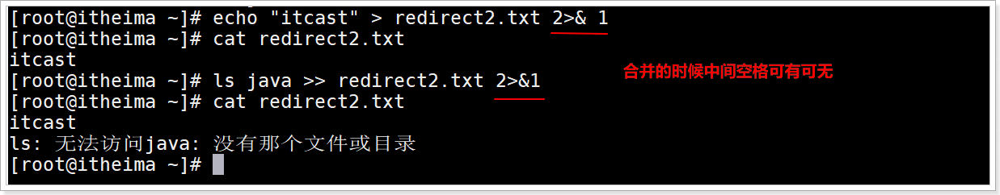

## 输入示例：统计文件数据行数

### wc命令介绍

Linux wc 命令可以用来对文本进行统计，包括单词个数、行数、字节数

### wc命令语法

```shell
wc  [options]  [文件名]
```

 options有如下:

| 选项 | 含义                  |
| ---- | --------------------- |
| `-c` | character, 统计字节数 |
| `-w` | word, 统计单词数      |
| `-l` | line, 统计行数        |

### 演示

统计文件redirect2.txt中数据行数

```shell
wc -l < redirect2.txt
```

运行效果

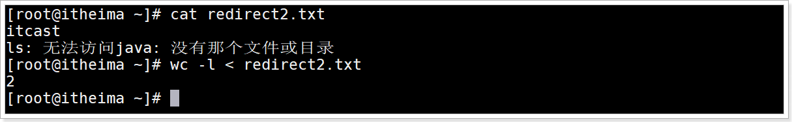


## 输入示例：逐行读取文件数据

循环读取文件每一行数据

```shell
while read str; do echo $str; done < redirect2.txt
```

运行效果

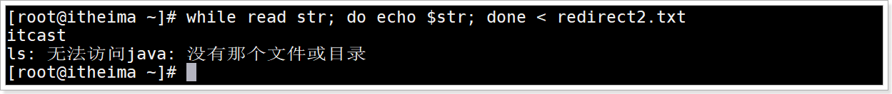


## 输入示例：读取终端输入数据的行数

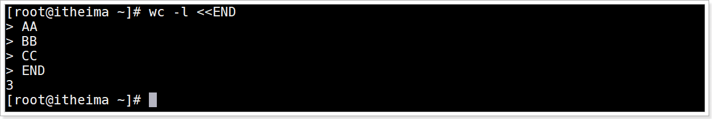


## 小结

1. Shell重定向的含义

   > 改变标准数据流动的方向,  
   >
   > a.可以将数据输出到文件中, 叫重定向输出
   >
   > b.可以读取文件中的数据作为输入, 叫重定向输入

2. 使用重定向输出数据到文件中保存

   > 命令 > file
   >
   > 命令 >> file
   >
   > 命令 2 >> file
   >
   > 命令 > file 2&>1

3. 使用重定向从文件中读取输入数据

   > 命令 < file
   >
   > 命令 < file1 > file2

   

