# 学习目标

## 目标

能够使用字符串的3种方式

掌握Shell字符串拼接

掌握shell字符串截取的常用格式

能够定义Shell索引数组和关联数组

能够使用内置命令alias,echo,read,exit,declare操作

掌握Shell的运算符操作


# Shell字符串变量

## 介绍

字符串（String）就是一系列字符的组合。字符串是 Shell 编程中最常用的数据类型之一（除了数字和字符串，也没有其他类型了）


## 字符串的3种格式

1. 单引号方式

2. 双引号方式, 推荐
3. 不用引号方式

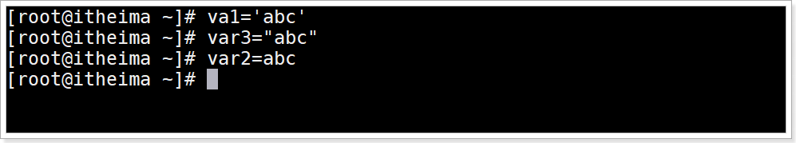 


## 字符串的3种格式区别

1. 使用单引号 `''`  的字符串：

   任何字符都会原样输出，在其中使用变量是无效的。

   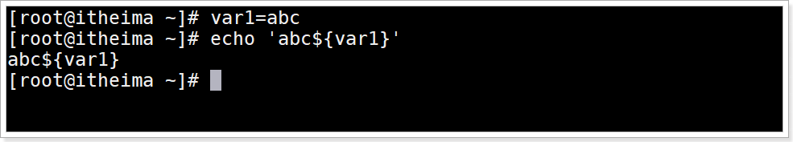

2. 由双引号`" "`包围的字符串：

   其中包含了变量，那么该变量会被解析得到值，而不是原样输出。

   字符串中还可以出现双引号的子字符串，但是需要转义。

   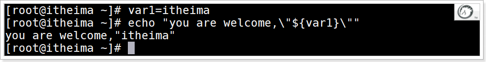

3. 不被引号包围的字符串

   不被引号包围的字符串中出现变量时也会被解析，这一点和双引号`" "`包围的字符串一样。

   字符串中不能出现空格，否则空格后边的字符串会作为其他变量或者命令解析。

   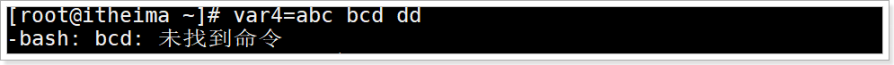

   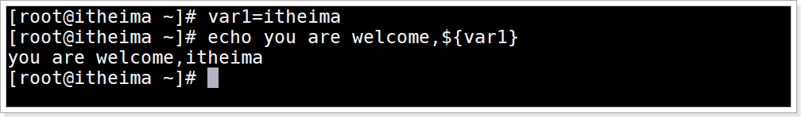


## 获取字符串的长度

### 语法

```shell
${#字符串变量名}
```

### 含义

获取字符串的字符长度

### 演示

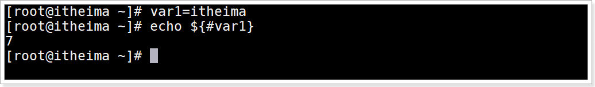


## 字符串拼接方式

1. 无符号拼接

2. 双引号拼接

3. 混合拼接

   

## 演示

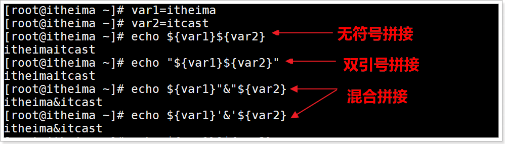


## 字符串截取语法

| 格式                       | 说明                                                         |
| -------------------------- | ------------------------------------------------------------ |
| `${变量名:start:length}`   | 从 string 字符串的左边第 start 个字符开始，<br>向右截取 length 个字符。 |
| `${变量名:start}`          | 从 string 字符串的左边第 start 个字符开始截取，直到最后。    |
| `${变量名:0-start:length}` | 从 string 字符串的右边第 start 个字符开始，<br>向右截取 length 个字符。 |
| `${变量名:0-start}`        | 从 string 字符串的右边第 start 个字符开始截取，直到最后。    |
| `${变量名#*chars}`         | 从 string 字符串第一次出现 *chars 的位置开始，<br>截取 *chars 右边的所有字符。 |
| `${变量名##*chars}`        | 从 string 字符串最后一次出现 *chars 的位置开始，<br>截取 *chars 右边的所有字符。 |
| `${变量名%chars*}`         | 从 string 字符串最后第一次出现 chars* 的位置开始，<br>截取 chars* 左边的所有字符。 |
| `${变量名%%chars*}`        | 从 string 字符串第一次出现 chars* 的位置开始，<br>截取 chars* 左边的所有字符 |


## 截取演示


# Shell索引数组变量：定义-获取-拼接-删除


## 介绍

Shell 支持数组（Array）,   数组是若干数据的集合，其中的每一份数据都称为数组的元素。

> 注意Bash Shell 只支持一维数组，不支持多维数组。


## 数组的定义

### 语法

在 Shell 中，用括号`( )`来表示数组，数组元素之间用空格来分隔. 语法为：

```shell
array_name=(item1  item2 ...)  # 方式1
array_name=([索引下标1]=item1  [索引下标2]=item2  ...)  # 方式2
```

> 注意，赋值号 `=` 两边不能有空格

### 演示

1.定义数字存储100,3,22,58,77,17,20

```shell
nums=(29 100 13 8 91 44)
```

2.Shell 是弱类型的，它并不要求所有数组元素的类型必须相同

```shell
arr=(20 56 "http://www.itcast.cn/")
```

Shell数组元素定义后不是固定的,  定义后还可以赋值

```shell
arr[6]=100
```

3.可以给指定元素赋值初始化

```shell
arr2=([0]=1 [2]=100 [4]=aa)
```

> 由于上面只赋值了3个元素, 所以数组的长度是3

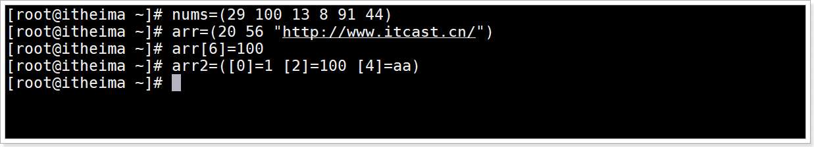


## 数组的获取

### 语法

1.通过下标获取元素值,index从0开始

```shell
${arr[index]}
```

> 注意使用`{ }`

2.获取值同时复制给其他变量

```shell
item=${arr[index]}
```

3.使用 `@` 或 `*` 可以获取数组中的所有元素

```shell
${arr[@]}
${arr[*]}
```

4.获取数组的长度或个数

```shell
${#arr[@]}
${#arr[*]}
```

5.获取数组指定元素的字符程度

```shell
${#arr[索引]}
```


### 演示

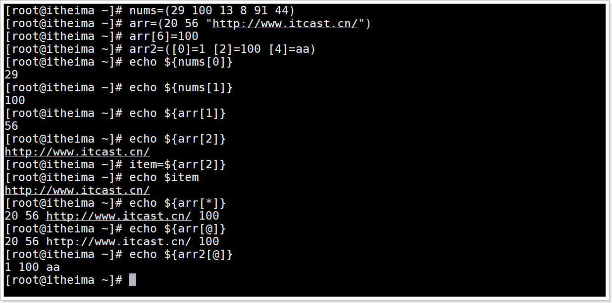

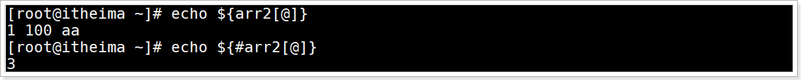

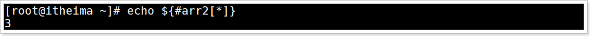

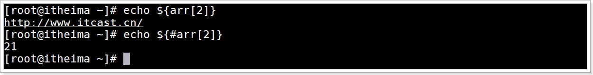


## 数组的拼接

### 介绍

所谓 Shell 数组拼接（数组合并），就是将两个数组连接成一个数组

### 语法

使用 `@` 和 `*` 获取数组所有元素之后进行拼接

```shell
array_new=(${array1[@]} ${array2[@]} ...)
array_new=(${array1[*]} ${array2[*]} ...)
```

### 演示

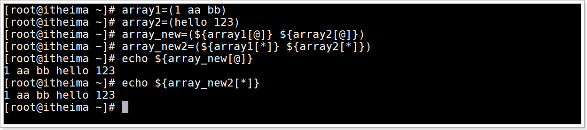


## 数组的删除

### 介绍

删除数组指定元素数据和删除整个数组数据


### 语法

删除数组指定元素数据

```shell
unset array_name[index]
```

删除整个数组

```shell
unset array_name
```


### 演示

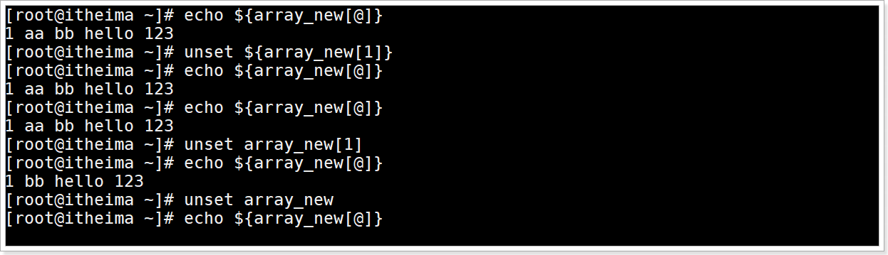


# Shell内置命令

## 内置命令介绍

Shell 内置命令，就是由 Bash Shell 自身提供的命令，而不是文件系统中的可执行文件。

使用type 来确定一个命令是否是内置命令：

```shell
type 命令
```

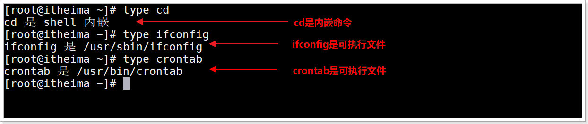

通常来说，内置命令会比外部命令执行得更快，执行外部命令时不但会触发磁盘 I/O，还需要 fork 出一个单独的进程来执行，执行完成后再退出。而执行内置命令相当于调用当前 Shell 进程的一个函数, 还是一个进程, 减少了上下文切换。

## 内置命令列表

| 命令        | 说明                                                  |
| ----------- | ----------------------------------------------------- |
| :           | 扩展参数列表，执行重定向操作                          |
| .           | 读取并执行指定文件中的命令（在当前 shell 环境中）     |
| ==alias==   | 为指定命令定义一个别名                                |
| bg          | 将作业以后台模式运行                                  |
| bind        | 将键盘序列绑定到一个 readline 函数或宏                |
| break       | 退出 for、while、select 或 until 循环                 |
| builtin     | 执行指定的 shell 内建命令                             |
| caller      | 返回活动子函数调用的上下文                            |
| cd          | 将当前目录切换为指定的目录                            |
| command     | 执行指定的命令，无需进行通常的 shell 查找             |
| compgen     | 为指定单词生成可能的补全匹配                          |
| complete    | 显示指定的单词是如何补全的                            |
| compopt     | 修改指定单词的补全选项                                |
| continue    | 继续执行 for、while、select 或 until 循环的下一次迭代 |
| ==declare== | 声明一个变量或变量类型。                              |
| dirs        | 显示当前存储目录的列表                                |
| disown      | 从进程作业表中刪除指定的作业                          |
| ==echo==    | 将指定字符串输出到 STDOUT                             |
| enable      | 启用或禁用指定的内建shell命令                         |
| eval        | 将指定的参数拼接成一个命令，然后执行该命令            |
| exec        | 用指定命令替换 shell 进程                             |
| ==exit==    | 强制 shell 以指定的退出状态码退出                     |
| export      | 设置子 shell 进程可用的变量                           |
| fc          | 从历史记录中选择命令列表                              |
| fg          | 将作业以前台模式运行                                  |
| getopts     | 分析指定的位置参数                                    |
| hash        | 查找并记住指定命令的全路径名                          |
| help        | 显示帮助文件                                          |
| history     | 显示命令历史记录                                      |
| jobs        | 列出活动作业                                          |
| kill        | 向指定的进程 ID(PID) 发送一个系统信号                 |
| let         | 计算一个数学表达式中的每个参数                        |
| local       | 在函数中创建一个作用域受限的变量                      |
| logout      | 退出登录 shell                                        |
| mapfile     | 从 STDIN 读取数据行，并将其加入索引数组               |
| popd        | 从目录栈中删除记录                                    |
| printf      | 使用格式化字符串显示文本                              |
| pushd       | 向目录栈添加一个目录                                  |
| pwd         | 显示当前工作目录的路径名                              |
| ==read==    | 从 STDIN 读取一行数据并将其赋给一个变量               |
| readarray   | 从 STDIN 读取数据行并将其放入索引数组                 |
| readonly    | 从 STDIN 读取一行数据并将其赋给一个不可修改的变量     |
| return      | 强制函数以某个值退出，这个值可以被调用脚本提取        |
| set         | 设置并显示环境变量的值和 shell 属性                   |
| shift       | 将位置参数依次向下降一个位置                          |
| shopt       | 打开/关闭控制 shell 可选行为的变量值                  |
| source      | 读取并执行指定文件中的命令（在当前 shell 环境中）     |
| suspend     | 暂停 Shell 的执行，直到收到一个 SIGCONT 信号          |
| test        | 基于指定条件返回退出状态码 0 或 1                     |
| times       | 显示累计的用户和系统时间                              |
| trap        | 如果收到了指定的系统信号，执行指定的命令              |
| type        | 显示指定的单词如果作为命令将会如何被解释              |
| typeset     | 声明一个变量或变量类型。                              |
| ulimit      | 为系统用户设置指定的资源的上限                        |
| umask       | 为新建的文件和目录设置默认权限                        |
| unalias     | 刪除指定的别名                                        |
| unset       | 刪除指定的环境变量或 shell 属性                       |
| wait        | 等待指定的进程完成，并返回退出状态码                  |

## alisa内置命令

### 介绍

alisa 用于给命令创建别名。若该命令且不带任何参数，则显示当前 Shell 进程中的所有别名列表。

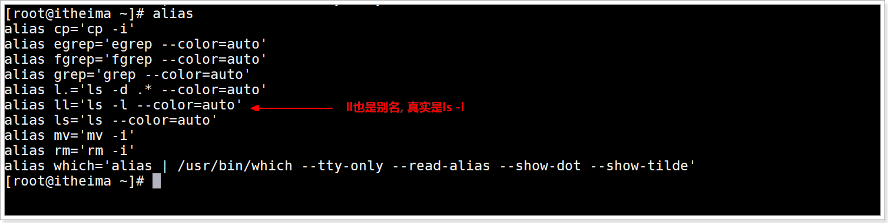

上面是系统为了方便命令操作默认将部分命令创建为别名  `ll` 的命令与`ls -l`的效果一样,   就是因为ll是别名


### alias别名定义语法

```shell
alias 别名='命令'
```


### unalias 别名删除语法

删除指定的别名

```shell
unalias 别名
```

删除当前Shell环境中所有的别名

```shell
unalias -a
```

> 注意:  以上2种方式删除都是临时删除当前Shell的别名,  如果想永久删除必须去配置文件中手动删除


### alias演示

输出所有进行信息

```shell
ps -aux
```

给上面的命令起别名为psList, 并使用psList输出

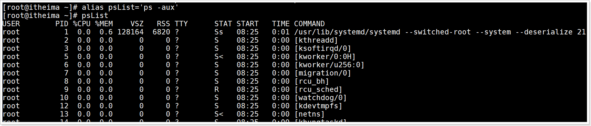

删除psList别名

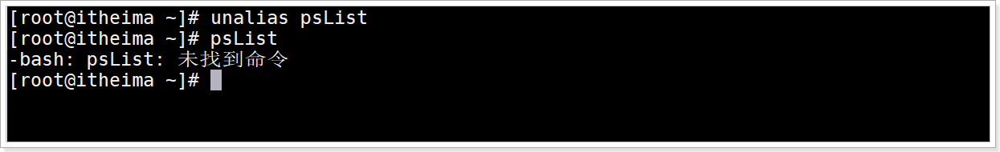


## echo内置命令

### echo命令介绍

echo 是一个 Shell 内置命令，用于在终端输出字符串，并在最后默认加上换行符


### echo输出语法

默认输出换行语法

```shell
echo 字符串
```


输出不换行语法

```shell
echo -n  字符串
```

### 输出演示

1.创建echo1.sh

```shell
touch echo1.sh
```


2.编辑文件内容并保存

```shell
vim echo1.sh
```

文件内容

```shell
#!/bin/bash
echo "hello"
echo "world"
echo -n "itheima "
echo -n "shell "
```

3.运行echo1.sh文件观察效果

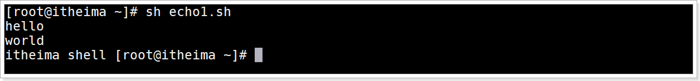

itheima shell输出为一行

### echo输出转义字符

#### `/n` 转义字符

用于echo输出字符串非结尾处的换行,  但是默认echo无法解析`/n` 转义字符

演示

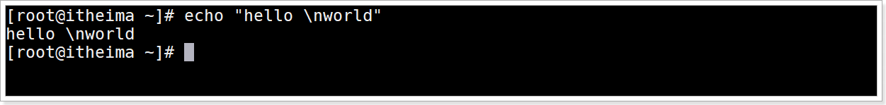


#### `-e` 参数

`-e` 参数用于解析转义字符

```shell
echo -e '字符串中含有转义字符'
```

演示

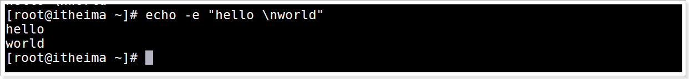


#### `/c` 转义字符

`/c` 用于强制清除echo的结尾换行输出

演示

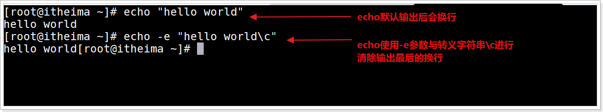


## read内置命令

### 介绍

read 是 Shell 内置命令，用于从标准输入中读取数据并赋值给变量。如果没有进行重定向，默认就是从终端控制台读取用户输入的数据；如果进行了重定向，那么可以从文件中读取数据。

> 后续Shell重定向讲解


### 语法

```shell
read [-options] [var1 var2 ...]
```

> `options`表示选项，如下表所示；`var`表示用来存储数据的变量，可以有一个，也可以有多个。
>
> `options`和`var`都是可选的，如果没有提供变量名，那么读取的数据将存放到环境变量 REPLY 中。

options支持的参数

| 选项           | 说明                                                         |
| -------------- | ------------------------------------------------------------ |
| -a array       | 把读取的数据赋值给数组 array，从下标 0 开始。                |
| -d delimiter   | 用字符串 delimiter 指定读取结束的位置，而不是一个换行符（读取到的数据不包括 delimiter）。 |
| -e             | 在获取用户输入的时候，对功能键进行编码转换，不会直接显式功能键对应的字符。 |
| ==-n num==     | 读取 num 个字符，而不是整行字符。                            |
| ==-p  prompt== | 显示提示信息，提示内容为 prompt。                            |
| -r             | 原样读取（Raw mode），不把反斜杠字符解释为转义字符。         |
| ==-s==         | 静默模式（Silent mode），不会在屏幕上显示输入的字符。当输入密码和其它确认信息的时候，这是很有必要的。 |
| ==-t seconds== | 设置超时时间，单位为秒。如果用户没有在指定时间内输入完成，那么 read 将会返回一个非 0 的退出状态，表示读取失败。 |
| -u fd          | 使用文件描述符 fd 作为输入源，而不是标准输入，类似于重定向。 |


### 示例1：多个变量赋值

#### 需求

使用 read 命令给多个变量赋值

#### 步骤

1.创建文件read1.sh

2.编辑文件, 编写read命令提示用户输入多个信息个多个变量赋值,  保存文件

3.执行read1.sh文件

#### 演示

创建文件

```shell
touch read1.sh
```

编辑文件

```shell
vim read1.sh
```


read1.sh文件内容

```shell
#!/bin/bash
read -p "请输入姓名,年龄,爱好: " name age hobby
echo "姓名：$name"
echo "年龄：$age"
echo "爱好：$hobby"
```


运行效果

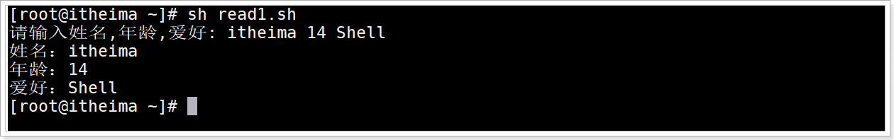


### 示例2：读取一个字符

#### 需求

从终端控制台只读取一个字符

#### 步骤

1.创建文件read2.sh文件

2.编辑文件,编写read命令, 使用`-n 1` 参数读取一个字符

3.执行文件

#### 演示

创建文件

```shell
touch read2.sh
```

编辑文件

```shell
vim read2.sh
```

read2.sh文件内容

```shell
#!/bin/bash
read -n 1 -p '请输入一个字符: ' char
printf '\n'
echo '你输入的字符为:'$char
```

> 注意
>
> `-n 1`只读取一个字符。运行脚本后，只要输入的一个字符，立即读取结束，不用等待用户按下回车键。
>
> `printf '\n'`语句用于换行，否则 echo 的输出结果会和用户输入的内容位于同一行，不容易区分

运行效果
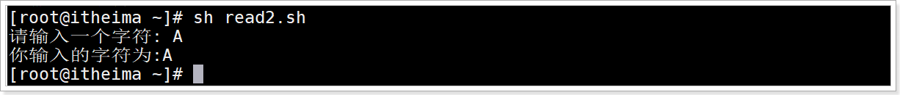


### 示例3：限制时间输入

#### 需求

在终端控制台输入时, 设置指定时间内输入密码


#### 步骤

1. 创建文件read3.sh
2. 编辑文件内容编写, 使用read命令`-t seconds  ` 限制输入时间,  使用`-s` 静默模式输入密码
3. 执行文件

#### 演示

创建文件

```shell
touch read3.sh
```

编辑文件

```shell
vim read3.sh
```

read3.sh文件内容

```shell
#!/bin/bash
read -t 20 -sp '请输入密码(20秒内):' pwd1
printf '\n'
read -t 20 -sp '请再次输入密码(20秒内):' pwd2
printf '\n'
if
        [ $pwd1 == $pwd2 ]
then
        echo '密码与确认密码一致, 验证通过'
else
        echo '密码与确认密码不一致,验证失败'
fi
```

执行文件运行效果

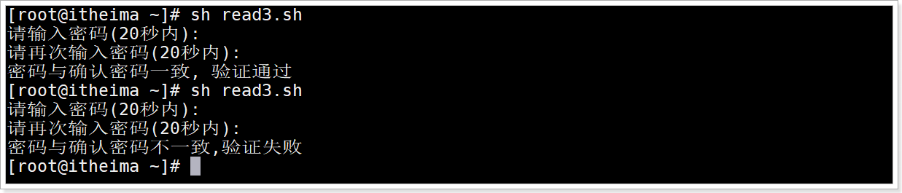


## exit内置命令

### 介绍

`exit` 用于退出当前 Shell 进程结束运行，并返回一个退出状态；使用`$?`可以接收这个退出状态.

exit 命令可以接受一个整数值作为参数，代表退出状态。如果不指定，默认状态值是 0。

一般情况下，退出状态为 0 表示成功，退出状态为非 0 表示执行失败（出错）了。 


### 语法

正确退出语法

```shell
exit
```


错误退出语法

```shell
exit 非0数字  # 介于 0~255 之间的整数，其中只有 0 表示成功，其它值都表示失败
```


### exit应用场景

1.结束当前Shell进程

2.当Shell 进程执行出错退出时，可以返回不同的状态值代表不同的错误

> 比如打开一个文件时，可以返回1 表示文件不存在，2 表示文件没有读取权限，3 表示文件类型不对。


### 示例：Shell脚本文件中使用exit退出

#### 需求

编写Shell脚本使用exit 退出,  退出时返回一个非0数字状态值,  执行脚本文件并打印返回状态值


#### 步骤

1.创建exit.sh文件

2.编辑exit.sh文件, 使用`exit 数字` 退出结束当前Shell

3.执行文件,打印返回状态值


#### 演示

创建文件

```shell
touch exit.sh
```

编辑文件

```shell
vim exit.sh
```

exit.sh文件内容: 使用`exit 数字` 退出结束当前Shell

```shell
#!/bin/bash
echo 'one'
exit 6
echo 'two'
```

运行效果

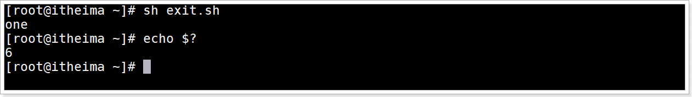


## declare内置命令

### 介绍

declare命令用于声明 shell 变量。可用来声明变量并设置变量的属性，也可用来显示shell函数。若不加上任何参数，则会显示全部的shell变量与函数(与执行set指令的效果相同)。


### declare命令作用

1.declare设置变量的属性

2.查看全部Shell变量与函数

3.实现关联数组变量

> 不同于普通数组,  关联数组的下标是字符串, 通过字符串下标操作数据


### 语法

1.declare设置变量的属性语法

```shell
declare [+/-][aArxif][变量名称＝设置值]
```

> +/- 　"-"可用来指定变量的属性，"+"则是取消变量所设的属性。
>
> a    设置为普通索引数组
>
> A    设置为key-value关联数组
>
> r 　将变量设置为只读,  也可以使用readonly
>
> x 　设置变量成为环境变量，也可以使用export
>
> i 　设置为整型变量。
>
> f     设置为一个函数变量

2.查看全部Shell变量与函数定义语法

```shell
declare [-fF]
```

> declare 后无参数, 查询全部Shell变量与函数定义
>
> -f 　仅查询显示函数定义。
>
> -F    仅查询显示函数名字

3.实现key-value关联数组变量语法

关联数组也称为“键值对（key-value）”数组，键（key）也即字符串形式的数组下标，值（value）也即元素值。

```shell
declare -A 关联数组变量名=([字符串key1]=值1 [字符串key2]=值2 ...)
```

> declare也可以用于定义普通数组,  `-a` 参数创建普通或索引数组   `-A` 创建关联数组
>
> `declare -a 关联数组变量名=(值1 值2 ...)`  
>
> `declare -a 关联数组变量名=([0]=值1 [1]=值2 ...)`  

获取指定key的值

```shell
${关联数组变量名[key]}
```

获取所有值

```shell
${关联数组变量名[*]} # 方式1
${关联数组变量名[@]} # 方式2
```


### 示例1：设置变量属性

#### 需求

操作一个变量属性,  设置为整型\ 取消整型\设置为只读等操作

#### 步骤

1. 使用declare设置一个整型变量并赋值
2. 取消变量的整型类型, 尝试设置其他类型值尝试
3. 设置变量只读, 尝试赋值测试

#### 演示

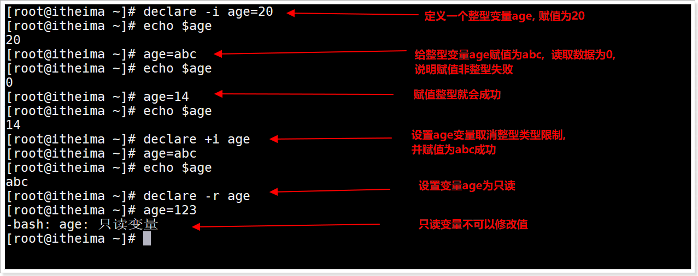

### 示例2：查看当前Shell所有函数名

查看所有变量与所有函数 

```shell
declare
```

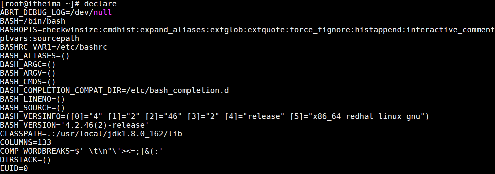

查看所有函数与定义

```shell
declare -f
```

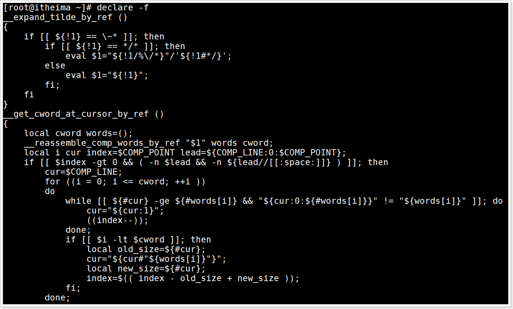

查询所有函数名列表

```shell
declare -F
```

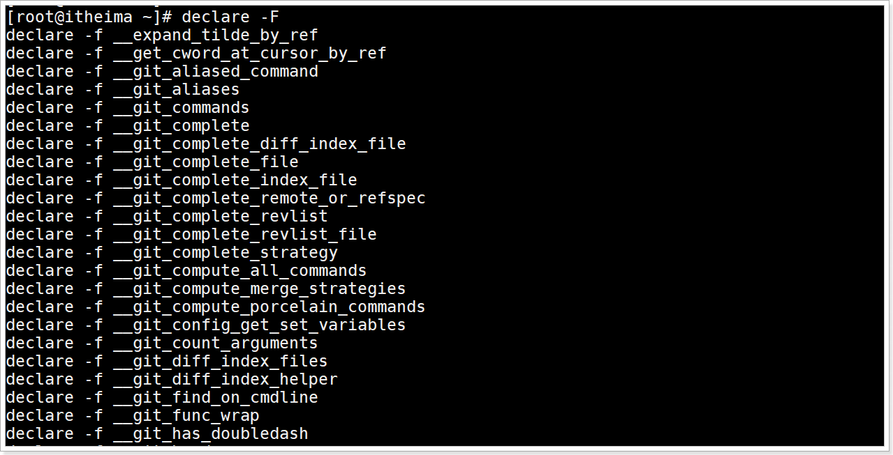


### 示例3：实现普通索引数组

#### 需求

使用declare定义一普通数组,并获取打印元素数据的值

#### 步骤

1.创建declare1.sh文件

2.编辑declare1.sh文件内容,  使用declare定义普通数组数据与打印

2.执行文件

#### 演示

创建文件

```shell
touch declare1.sh
```

编辑文件

```shell
vim declare1.sh
```

declare1.sh文件内容

```shell
#!/bin/bash
declare -a arr1=(1 2 3 aa)
echo ${arr1[1]}
echo ${arr1[*]}

declare -a arr2=([0]=1 [1]=2  [2]=3  [4]=aa)
echo ${arr2[1]}
echo ${arr2[*]}

declare -a arr2[3]=4
echo ${arr2[*]}
```

运行结果

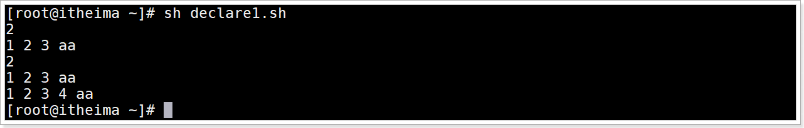

### 示例4：实现key-value关联数组

#### 需求

使用declare定义关联数组并打印输出

#### 演示

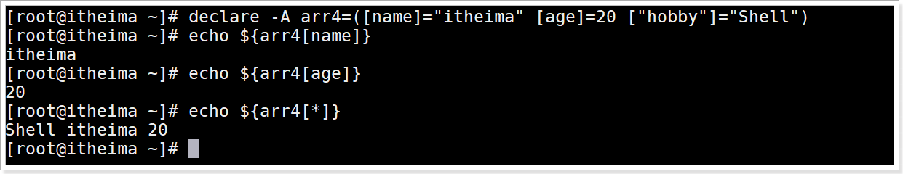

> 注意: 使用参数`-A`  才是关联数组  , 关联数组无法使用索引获取


# Shell运算符

## expr命令

### 介绍

expr 是 evaluate expressions 的缩写，译为“表达式求值”。Shell expr 是一个功能强大，并且比较复杂的命令，它除了可以实现整数计算，还可以结合一些选项对字符串进行处理，例如计算字符串长度、字符串比较、字符串匹配、字符串提取等, 后续讲解。

### 语法

计算语法

```shell
expr 算术运算符表达式
```

> 注意: 运算表达式

获取计算结果赋值给新变量语法

```shell
result=`expr 算术运算符表达式`
```

### 演示

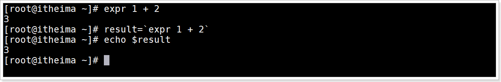

> 注意:  运算符表达式中每个数字与符号之间要有空格

## 算术运算符

### 算术运算符介绍

下表列出了常用的算术运算符，假定变量 a 为 1，变量 b 为 2：

| 运算符 | 说明 | 举例                       |
| :----- | :--- | :------------------------- |
| +      | 加法 | `expr $a + $b` 结果为 3    |
| -      | 减法 | `expr $a - $b` 结果为 -1   |
| *      | 乘法 | `expr $a \* $b` 结果为  2  |
| /      | 除法 | `expr $b / $a` 结果为 2    |
| %      | 取余 | `expr $b % $a` 结果为 0    |
| =      | 赋值 | a=$b 将把变量 b 的值赋给 a |

> 四则运算中如果使用了(), 也需要转义 `\( 1 + 1 \)`

### 算术运算符演示

operation1.sh脚本代码

```shell
#!/bin/bash
a=1 b=2          # 声明变量a=1和b=2
echo "a=${a} b=${b}"
echo "a + b = `expr $a + $b`"
echo "a * b = `expr $a \* $b`"
echo "a - b = `expr $a - $b`"
echo "a * b = `expr $a \* $b`"
echo "b / a = `expr $b / $a`"
echo "b % a = `expr $b % $a`"

echo -n "a == b 结果为 "
if [ $a == $b ]       # 注意变量与符号之间都要有空格
then
        echo true
else
        echo false
fi

echo -n "a != b 结果为 "
if [ $a != $b ]        # 注意变量与符号之间都要有空格
then
        echo true
else
        echo false
fi
```

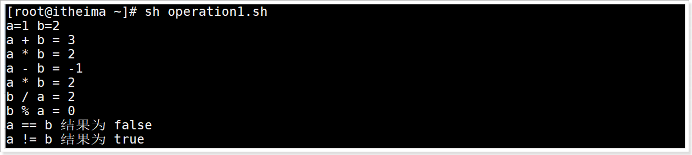


> 


## 比较运算符

### 整数比较运算符

#### 语法

下表列出了常用的比较运算符，假定变量 a 为 1，变量 b 为 2：

| 运算符 | 说明                                                         | 举例                     |
| :----- | :----------------------------------------------------------- | :----------------------- |
| `-eq`  | equals 检测两个数是否相等，相等返回 0, 否则返回1。           | `[ $a -eq $b ]` 返回 1。 |
| `-ne`  | not equals检测两个数是否不相等，不相等返回 true。            | `[ $a -ne $b ]` 返回 0。 |
| `-gt`  | greater than检测左边的数是否大于右边的,<br>是返回0, 否则1    | `[ $a -gt $b ]` 返回 1。 |
| `-lt`  | lower than检测左边的数是否小于右边的,<br>是返回0, 否则1      | `[ $a -lt $b ]` 返回 0。 |
| `-ge`  | greater equals检测左边的数是否大于等于右边的,<br>是返回0, 否则1 | `[ $a -ge $b ] `返回 1。 |
| `-le`  | lower equals检测左边的数是否小于等于右边的,<br>是返回0, 否则1 | `[ $a -le $b ] `返回 0。 |
| `<`    | 检测左边的数是否小于右边的,<br/>是返回0, 否则1               | `(($a<$b))` 返回0        |
| `<=`   | 检测左边的数是否小于等于右边的,<br/>是返回0, 否则1           | `(($a<=$b))` 返回0       |
| `>`    | 检测左边的数是否大于右边的,<br/>是返回0, 否则1               | `(($a>$b))` 返回1        |
| `>=`   | 检测左边的数是否大于等于右边的,<br/>是返回0, 否则1           | `(($a>=$b))` 返回1       |

> 注意: 整数比较运算符只支持整数，不支持小数与字符串(字符串比较后续讲解)，除非字符串的值是整数数字。
>
> 每个命令都有返回值,  这个后面我们会讲解退出状态再具体说明,  返回0代表成功, 返回1代表失败

#### 演示

operation2.sh脚本代码

```shell
#!/bin/bash
a=1 b=2
echo "a=${a} b=${b}"
if [ $a -eq $b ]
then
   echo "$a -eq $b : a 等于 b"
else
   echo "$a -eq $b: a 不等于 b"
fi
if [ $a -ne $b ]
then
   echo "$a -ne $b: a 不等于 b"
else
   echo "$a -ne $b : a 等于 b"
fi
if [ $a -gt $b ]
then
   echo "$a -gt $b: a 大于 b"
else
   echo "$a -gt $b: a 不大于 b"
fi
if [ $a -lt $b ]
then
   echo "$a -lt $b: a 小于 b"
else
   echo "$a -lt $b: a 不小于 b"
fi
if [ $a -ge $b ]
then
   echo "$a -ge $b: a 大于或等于 b"
else
   echo "$a -ge $b: a 小于 b"
fi
if [ $a -le $b ]
then
   echo "$a -le $b: a 小于或等于 b"
else
   echo "$a -le $b: a 大于 b"
fi

if (($a > $b))
then
   echo "$a > $b: a 大于 b"
else
   echo "$a > $b: a 不大于 b"
fi
if (($a < $b))
then
   echo "$a < $b: a 小于 b"
else
   echo "$a < $b: a 不小于 b"
fi
if (($a >= $b))
then
   echo "$a >= $b: a 大于或等于 b"
else
   echo "$a >= $b: a 小于 b"
fi
if (($a <= $b))
then
   echo "$a <= $b: a 小于或等于 b"
else
   echo "$a <= $b: a 大于 b"
fi
```

运行效果

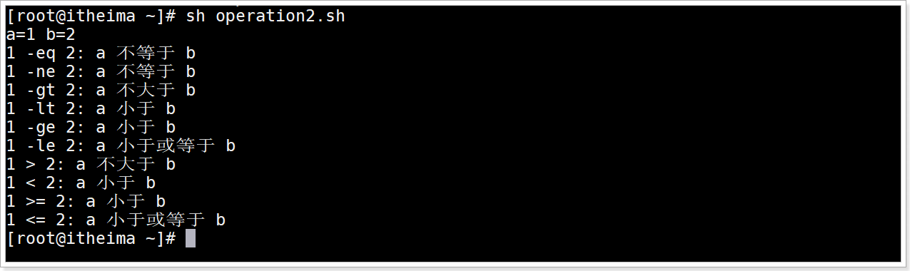


### 字符串比较运算符

#### 介绍

可以比较2个变量, 变量的类型可以为数字（整数，小数）与字符串

#### 语法

下表列出了常用的字符串运算符，假定变量 a 为 "abc"，变量 b 为 "efg"：

字符串比较可以使用 `[[]]` 和 `[]` 2种方式

| 运算符  | 说明                                                      | 举例                                                         |
| :------ | :-------------------------------------------------------- | :----------------------------------------------------------- |
| == 或 = | 相等。用于比较两个字符串或数字，相同则返回 0。可以使用`=` | `[ $a == $b ] `返回1 <br>`[  $a = $b ]` 返回 1<br>`[[ $a == $b ]]` 返回1<br>`[[ $a = $b ]]` 返回1 |
| !=      | 不相等。用于比较两个字符串或数字，不相同则返回 0。        | `[ $a != $b ]` 返回 0<br>`[[ $a != $b ]]` 返回 0             |
| <       | 小于, 用于比较两个字符串或数字， 小于返回0， 否则返回1    | `[ $a \< $b ]` 返回 0<br/>`[[ $a < $b ]]` 返回 0             |
| >       | 大于, 用于比较两个字符串或数字， 大于返回0， 否则返回1    | `[ $a \> $b ]` 返回 1<br/>`[[ $a > $b ]]` 返回 1             |
| -z      | 检测字符串长度是否为0，为0返回 true。                     | [ -z $a ] 返回 1。                                           |
| -n      | 检测字符串长度是否不为 0，不为 0 返回 true。              | [ -n "$a" ] 返回 0。                                         |
| $       | 检测字符串是否不为空，不为空返回 0 ,否则返回1。           | [ $a ] 返回 0。                                              |

> 字符串比较没有 `<=`  可以通过 `[[ "a" < "b" && "a" = "b" ]]`

#### 演示

operation6.sh脚本代码

```shell
#!/bin/bash

a="itheima" b="itcast" c=1 d=2
echo "a=${a},b=${b},c=${c},d=${d}"

if [ $a = $b ]
then
   echo "$a = $b : a 等于 b"
else
   echo "$a = $b: a 不等于 b"
fi

if [ $a != $b ]
then
   echo "$a != $b : a 不等于 b"
else
   echo "$a != $b: a 等于 b"
fi

if [[ $a > $b ]]
then
   echo "$a > $b : a 大于 b"
else
   echo "$a > $b: a 不大于 b"
fi

if [ $a \> $b ]
then
   echo "$a > $b : a 大于 b"
else
   echo "$a > $b: a 不大于 b"
fi

if [[ $c > $d ]]
then
   echo "$c > $d : c 大于 d"
else
   echo "$c > $d: c 不大于 d"
fi

if [ -z $a ]
then
   echo "-z $a : 字符串长度为 0"
else
   echo "-z $a : 字符串长度不为 0"
fi

if [ -n "$a" ]
then
   echo "-n $a : 字符串长度不为 0"
else
   echo "-n $a : 字符串长度为 0"
fi

if [ $a ]
then
   echo "$a : 字符串不为空"
else
   echo "$a : 字符串为空"
fi
```

运行效果

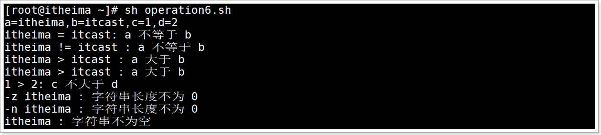


### `[[]]`  和 `[]` 的区别

#### 区别1: word splitting的发生

##### 区别说明

`[[]]` 不会有word splitting发生

`[]` 会有word splitting发生

##### word splitting介绍

会将含有空格字符串进行分拆分割后比较

##### 示例

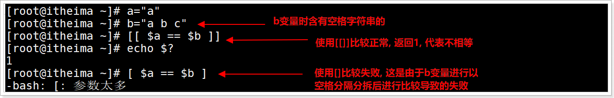

> 通过 `$?`  获取上一个命令的退出状态, 0代表成功, 1代表失败

#### 区别2: 转义字符

##### 区别说明

`[[]]`  对 `<` 不需要转义, 格式为 ` [[ 字符串1 < 字符串2 ]]`	

`[]` 需要对 `<,>等` 转义 ,  格式为 ` [ 字符串1 \< 字符串2 ]`	

##### 示例

`[]` 执行效果

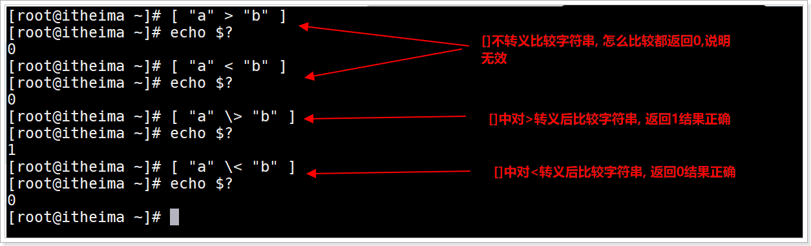

`[[]]` 执行效果, 不需要转义执行结果正确

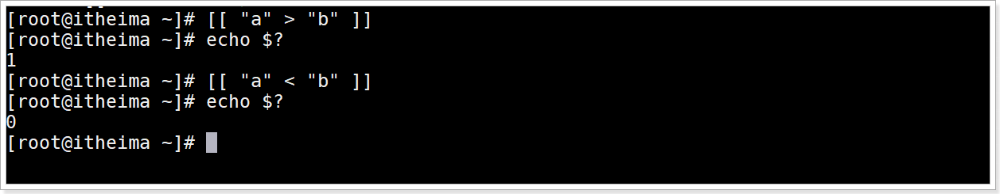

### 小结

1. 了解有哪些比较运算符

   整数比较运算符

   > 比较方式: `[]` 和 `(())`

   > 方式1: `[  整数1 options 整数2 ]`
   >
   > `options:  -eq  -gt -ge -lt -le -ne`
   >
   > 方式2: `((整数1 options 整数2))`
   >
   > `options: < <= > >=`

   字符串,数字比较运算符

   > 介绍: 可以比较2个变量, 变量的类型可以为字符串, 数字(整数,小数)
   >
   > 比较方式: `[]` 和 `[[]]`

   > 方式1:  `[  变量1 options 整数2 ]`
   >
   > ​	`options:  <,>,==,=,!=` 
   >
   > ​	`<,>` 需要转义
   >
   > ​     比较含有空格的字符串, 需要使用""号括起来, 否则会分割拆分
   >
   > 方式2: `[[ 变量1 options 变量2]]`
   >
   > ​	`options:  <,>,==,=,!=` 
   >
   > ​	`<,>` 不需要转义

3. 推荐使用哪个比较运算符?

   `[[ 表达式 ]]`  即可以实现数字和字符串比较,  并且不需要转义, 不会分割


## 布尔运算符

### 介绍

| 运算符 | 说明                                                         | 举例                                  |
| :----- | :----------------------------------------------------------- | :------------------------------------ |
| !      | 非运算，取反, 表达式为 true 则返回 false，<br>否则返回 true。 | `[ ! false ]` 返回 true。             |
| -o     | or 或运算，有一个表达式为 true 则返回 true。                 | `[ 表达式1 -o 表达式2 ]` 返回 true。  |
| -a     | and 与运算，两个表达式都为 true 才返回 true。                | `[ 表达式1 -a 表达式2 ]` 返回 false。 |

> 注意布尔运算符只能放在`[]`  才有效  
>
> 以后常使用布尔运算符与test命令进行连接条件测试, 后续讲解

### 演示

operation4.sh脚本代码脚本代码

```shell
#!/bin/bash
a=1 b=2

if [ $a -lt 2 -a $b -gt 10 ]
then
   echo "$a 小于 2 且 $b 大于 10 : 返回 true"   
else
   echo "$a 小于 2 且 $b 大于 10 : 返回 false"  # $b -gt 10不成立, 输出这个表达式
fi

if [ $a -lt 10 -o $b -gt 10 ]
then
   echo "$a 小于 10 或 $b 大于 10 : 返回 true"  # $a -lt 10 成立, 输出这个表达式
else
   echo "$a 小于 10 或 $b 大于 10 : 返回 false"
fi

if [ ! $a -gt $b ]
then
   echo "$a 大于 $b 取反 : 返回 true"
else
   echo "$a 大于 $b 取反 : 返回 false"   # $a -gt $b 为true , 取反为false, 输出这个表达式
fi
```


运行效果

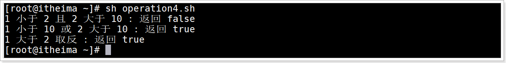


## 逻辑运算符

### 介绍

| 运算符 | 说明       | 举例                                  |
| :----- | :--------- | :------------------------------------ |
| &&     | 逻辑的 AND | `[[ 表达式1 && 表达式2 ]]` 返回 false |
| \|\|   | 逻辑的 OR  | `[[ 表达式1 || 表达式2 ]]` 返回 true  |

> 注意:  使用`&&`  和  `||`  的运算符必须放在 `[[]]`  或 `(())`中才有效, 否则报错
>
>  `-a` 和 `-o` 的运算符必须放在 `[]` 在才有效 或 test命令中
>
> !可以用在`[]`,`[[]]`中, 不可以在(())

### 演示

operation5.sh脚本代码

```shell
#!/bin/bash

a=1 b=2

if [[ $a -lt 10 && $b -gt 10 ]]
then
   echo "返回 true" 
else
   echo "返回 false"  # $b -gt 10 不成立, 输出false
fi

if [[ $a -lt 10 || $b -gt 10 ]]
then
   echo "返回 true"   # $a -lt 10 成立,  输出true
else
   echo "返回 false"  
fi
```

运行效果

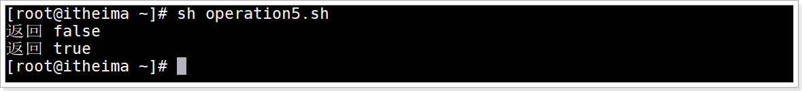


## 文件测试运算符

### 介绍

文件测试运算符用于检测文件的各种属性。

属性检测描述如下：

| 操作符          | 说明                                                         | 举例                      |
| :-------------- | :----------------------------------------------------------- | :------------------------ |
| -b file         | 检测文件是否是块设备文件，如果是，则返回 true。              | [ -b $file ] 返回 false。 |
| -c file         | 检测文件是否是字符设备文件，如果是，则返回 true。            | [ -c $file ] 返回 false。 |
| ==-d file==     | directory, 检测文件是否是目录，如果是，则返回 true。         | [ -d $file ] 返回 false。 |
| ==-f file==     | file, 检测文件是否是普通文件（既不是目录，也不是设备文件）<br>，如果是，则返回 true。 | [ -f $file ] 返回 true。  |
| -g file         | 检测文件是否设置了 SGID 位，如果是，则返回 true。            | [ -g $file ] 返回 false。 |
| -k file         | 检测文件是否设置了粘着位(Sticky Bit)，如果是，<br>则返回 true。 | [ -k $file ] 返回 false。 |
| -p file         | 检测文件是否是有名管道，如果是，则返回 true。                | [ -p $file ] 返回 false。 |
| -u file         | 检测文件是否设置了 SUID 位，如果是，则返回 true。            | [ -u $file ] 返回 false。 |
| ==-r file==     | read,检测文件是否可读，如果是，则返回 true。                 | [ -r $file ] 返回 true。  |
| ==-w file==     | write,检测文件是否可写，如果是，则返回 true。                | [ -w $file ] 返回 true。  |
| ==-x file==     | execute, 检测文件是否可执行，如果是，则返回 true。           | [ -x $file ] 返回 true。  |
| ==-s file==     | size, 检测文件是否为空（文件大小是否大于0）<br>，不为空返回 true。 | [ -s $file ] 返回 true。  |
| ==-e file==     | exists, 检测文件（包括目录）是否存在，如果是，<br>则返回 true。 | [ -e $file ] 返回 true。  |
| file1 -nt file2 | new than(nt),  file1是否比file2新                            | [ file1 -nt file2 ]       |
| file1 -ot file2 | old than(ot), file1是否比file2旧                             | [ file1 -ot file2 ]       |

其他检查符：

- -S: 判断某文件是否 socket。
- -L: link, 检测文件是否存在并且是一个符号链接。

语法

```shell
[ options 文件路径字符串]
或
[[ options 文件路径字符串 ]]
```

### 演示

operation6.sh脚本代码

```shell
#!/bin/bash

file="/root/operation1.sh"
if [ -w $file ]
then
   echo "文件可写"
else
   echo "文件不可写"
fi
if [ -r $file ]
then
   echo "文件可读"
else
   echo "文件不可读"
fi
if [ -x $file ]
then
   echo "文件可执行"
else
   echo "文件不可执行"
fi
if [ -f $file ]
then
   echo "文件是普通文件"
else
   echo "文件是特殊文件"
fi
if [ -s $file ]
then
   echo "文件不是空"
else
   echo "文件是空"
fi
if [ -e $file ]
then
   echo "文件存在"
else
   echo "文件不存在"
fi
if [ -d $file ]
then
   echo "文件是目录"
else
   echo "文件不是目录"
fi

file2="/root/operation2.sh"
if [ file -nt file2 ]
then
   echo "operation1.sh文件比operation2.sh文件新"
else
   echo "operation1.sh文件不比operation2.sh文件新"
fi
```


运行效果

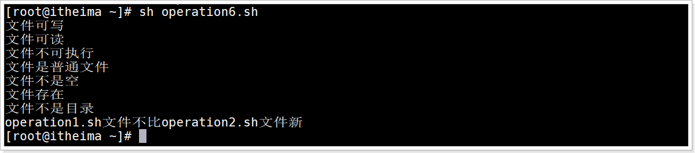

> operation1.sh文件不可执行, 因为没有可执行权限

查看operation1.sh文件权限

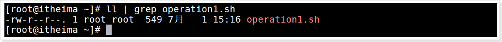

给operation1.sh添加执行权限

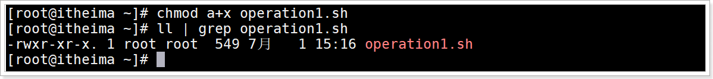

重新执行operation6.sh

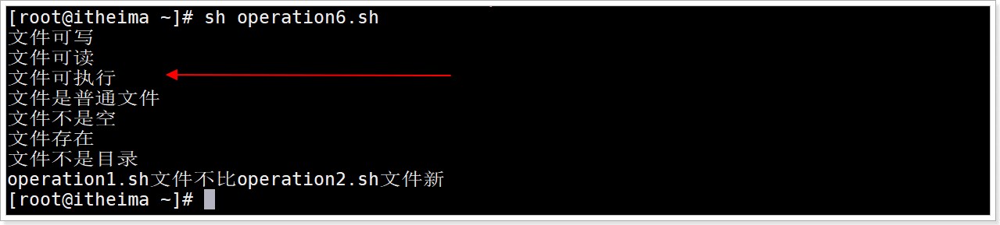


