#  Shell好用的工具： cut

## 目标

使用cut可以切割提取指定列\字符\字节的数据


## 介绍

`cut`  译为“剪切, 切割”  ,  是一个强大文本处理工具，它可以将文本按列进行划分的文本处理。cut命令逐行读入文本，然后按列划分字段并进行提取、输出等操作。


## 语法

```shell
cut [options]  filename
```

options参数说明

| 选项参数        | 功能                                                         |
| --------------- | ------------------------------------------------------------ |
| -f 提取范围     | 列号，获取第几列                                             |
| -d 自定义分隔符 | 自定义分隔符，默认为制表符。                                 |
| -c 提取范围     | 以字符为单位进行分割                                         |
| -b 提取范围     | 以字节为单位进行分割。这些字节位置将忽略多字节字符边界，除非也指定了 -n 标志。 |
| -n              | 与“-b”选项连用，不分割多字节字符；                           |

提取范围说明

| 提取范围  | 说明                                                       |
| --------- | ---------------------------------------------------------- |
| n-        | 提取指定第n列或字符或字节后面所有数据                      |
| n-m       | 提取指定第n列或字符或字节到第m列或字符或字节中间的所有数据 |
| -m        | 提取指定第m列或字符或字节前面所有数据                      |
| n1,n2,... | 提前指定枚举列的所有数据                                   |


## 示例：切割提取指定列数据

cut1.txt文件数据准备

```shell
touch cut1.txt
```

编辑文件添加内容

```shell
AA  itheima 11 XX
BB  itcast 22 XXX
CC  Shell 33 XXXX
DD  it 44 XXXXXXX
```

提取文件中第一列数据

```shell
cut cut1.txt -d " " -f 1
```


提取文件中第一列,第三列, 枚举查找

```shell
cut cut1.txt -d " " -f 1,3
```


提取文件中第二列,第三列,第四列, 范围查找


提取文件中第一列后面所有列的数据

```shell
 cut cut1.txt -d " "  -f 2- 
```


提起文件中结束列前面所有列的数据

```shell
cut -d " " -f -2 cut1.txt
# -2 提取指定列前面所有列数据
```

运行效果


## 示例: 切割提取指定字符数据

提取每行前3个字符

```shell
cut cut1.txt -c1-3
```

运行效果


提取每行第4个字符以后的数据

```shell
cut cut1.txt -c 4-
```

运行效果


提取每行第3个字符前面所有字符

```shell
cut cut1.txt -c -3
```

运行效果

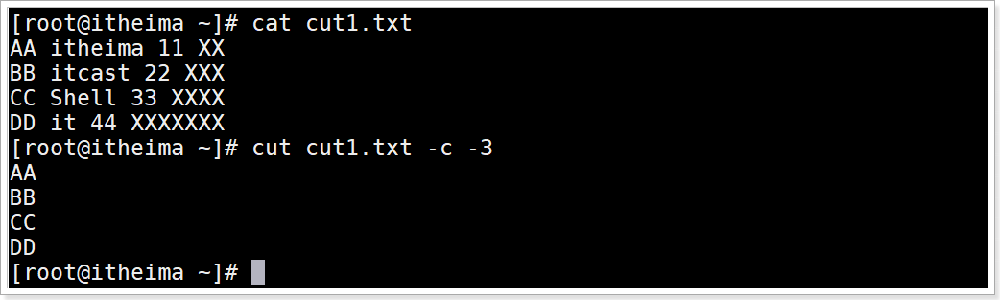

## 示例：切割提取指定字节数据

提取字符串"abc传智播客" 前3个字节

```shell
echo "abc传智播客" | cut -b -3
```

运行效果

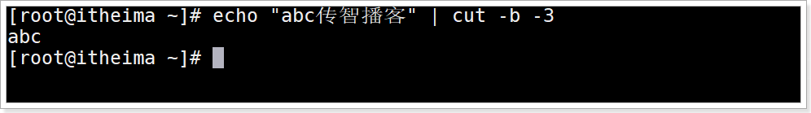

提取字符串"abc传智播客" 前4个字节

```shell
echo "abc传智播客" | cut -b -4
```

运行效果


提取字符串"abc传智播客" 前6个字节

```shell
echo "abc传智播客" | cut -b -6
# 由于linux系统默认utf-8码表, 所以一个汉字占3个字节
```

运行效果


提取字符串"abc传智播客" 前4个字节, 就可以将汉字 "传"输出,

```shell
echo "abc传智播客" | cut -nb -4
#  -n 取消多字节字符分割直接输出
```

运行效果

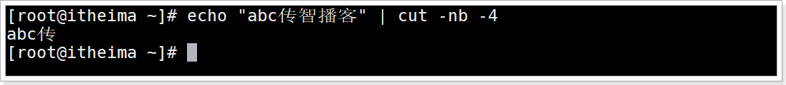

## 示例：切割提取指定单词数据

在cut1.txt文件中切割出"itheima"

```shell
cat cut1.txt | grep itheima | cut -d " " -f 2
```

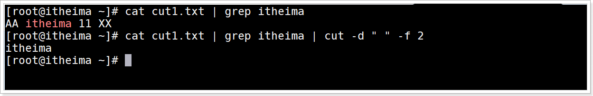


## 示例：切割提取bash进程的PID号

命令

```shell
ps -aux | grep 'bash' | head -n 1 | cut -d " " -f 8
```

运行效果

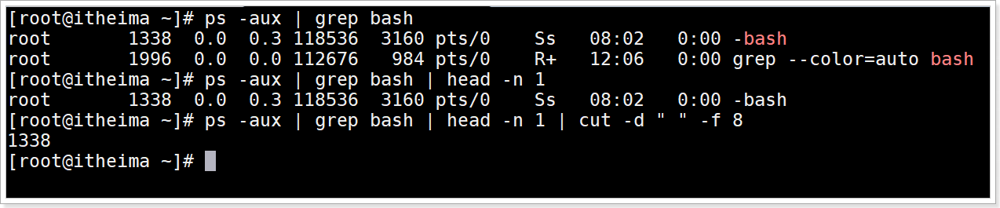


## 示例：切割提取IP地址

```shell
ifconfig | grep broadcast | cut -d " " -f 10
```

运行效果


## 小结

cut的作用

> 一个强大文本处理工具，它可以将文本按列进行划分的文本处理。cut命令逐行读入文本，然后按列划分字段并进行提取、输出等操作。

cut切割提取列

> `cut  文件或数据 -d 分隔符切割 -f 提取第X列 `

cut切割提取字符

> `cut  文件或数据 -c 提取字符范围 `

cut切割提取字节

> `cut  文件或数据 -nb 提取直接范围 `

# Shell好用的工具：sed

## 目标

使用sed编辑文件替换文件中的单词

编写在文件中插入或修改行的sed程序

使用sed作为过滤器来过滤管道数据命令


## 介绍

sed （stream editor, 流编辑器） 是Linux下一款功能强大的非交互流式文本编辑器(vim是交互式文本编辑器)，可以对文本文件的每一行数据匹配查询之后进行增、删、改、查等操作，支持按行、按字段、按正则匹配文本内容，灵活方便，特别适合于大文件的编辑.

sed是一种流编辑器，它一次处理一行内容,  将这行放入缓存(存区空间称为：模式空间)，然后才对这行进行处理，处理完后，将缓存区的内容发送到终端。

## sed处理数据原理


## 语法

```sehll
sed [选项参数] [模式匹配/sed程序命令] [文件名]

# 模式匹配,sed会读取每一行数据到模式空间中, 之后判断当前行是否符合模式匹配要求,符合要求就会
#     执行sed程序命令, 否则不会执行sed程序命令;如果不写匹配模式,那么每一行都会执行sex程序命令
```

选项参数说明

| 选项参数                   | 功能                                                         |
| -------------------------- | ------------------------------------------------------------ |
| `-e`                       | 直接在指令列模式上进行sed的动作编辑。它告诉sed将下一个参数解释为一个sed指令，只有当命令行上给出多个sed指令时才需要使用-e选项;一行命令语句可以执行多条sed命令 |
| `-i`                       | 直接对内容进行修改，不加-i时默认只是预览，不会对文件做实际修改 |
| `-f`                       | 后跟保存了sed指令的文件                                      |
| `-n`                       | 取消默认输出，sed默认会输出所有文本内容，使用-n参数后只显示处理过的行 |
| `-r ruguler              ` | 使用扩展正则表达式，默认情况sed只识别基本正则表达式 *        |


sed程序命令功能描述

| 命令 | 功能描述                                      |
| ---- | --------------------------------------------- |
| `a`  | add新增，a的后面可以接字串，在下一行出现      |
| `c`  | change更改, 更改匹配行的内容                  |
| `d`  | delete删除, 删除匹配的内容                    |
| `i`  | insert插入, 向匹配行前插入内容                |
| `p`  | print打印, 打印出匹配的内容，通常与-n选项和用 |
| `s`  | substitute替换, 替换掉匹配的内容              |
| `=`  | 用来打印被匹配的行的行号                      |
| `n`  | 读取下一行，遇到n时会自动跳入下一行           |

特殊符号

| 命令                | 功能描述                                                     |
| ------------------- | ------------------------------------------------------------ |
| `!`                 | 就像一个sed命令，放在限制条件后面, 对指定行以外的所有行应用命令(取反) |
| {sed命令1;sed命令2} | 多个命令操作同一个的行                                       |


## 数据准备

sed.txt文件内容

```shell
ABC
itheima itheima
itcast
123
itheima
```


## 示例：向文件中添加数据

### 演示1: 指定行号的前或后面添加数据

向第三行后面添加hello

```shell
 sed '3ahello' sed.txt
```

> 3 , 代表第三行
>
> a,  代表在后面添加, 出现在下一行
>
> 注意这里没有修改源文件

运行效果

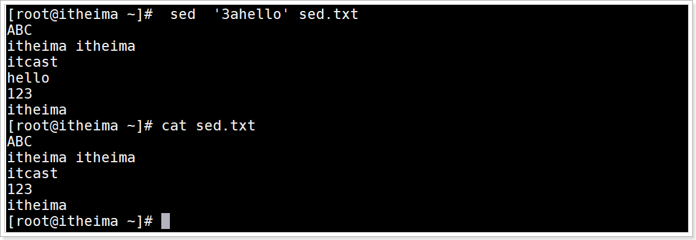

向第三行前面添加hello

```shell
 sed '3ihello' sed.txt
```

> 3 , 代表第三行
>
> i,  代表在前面添加, 出现在上一行
>
> 注意这里没有修改源文件

运行效果


### 演示2: 指定内容前或后面添加数据

向内容 `itheima` 后面添加 `hello` ，如果文件中有多行包括 ``itheima` `，则每一行后面都会添加

```shell
sed '/itheima/ahello' sed.txt
```

运行效果


向内容 `itheima` 前面添加 `hello` ，如果文件中有多行包括 ``itheima` `，则每一行前面都会添加

```shell
sed '/itheima/ihello' sed.txt
```

运行效果


### 演示3: 在最后一行前或后添加hello

在最后一行后面添加hello

```shell
sed '$ahello' sed.txt
```

> $a:  最后一行后面添加

运行效果

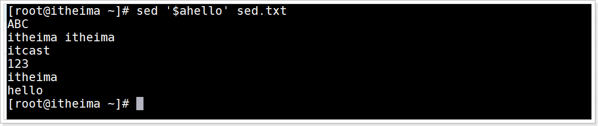

在最后一行前面添加hello

```shell
sed '$ihello' sed.txt
```

> $i:  最后一行前面添加

运行效果

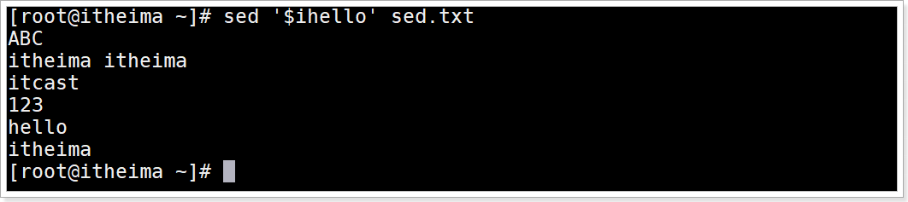


## 示例: 删除文件中的数据

### 演示1: 删除第2行

命令

```shell
sed  '2d' sed.txt
# d 用于删除
# 2d 删除第2行
```

运行效果

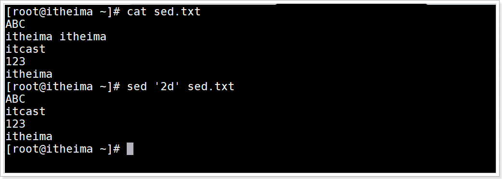

命令: 删除第1行,第4行数据

```shell
sed '1d;4d' sed.txt
```

运行效果


### 演示2: 删除奇数行

从第一行开始删除，每隔2行就删掉一行

```shell
sed '1~2d' sed.txt
# 1~2 从第1行开始, 每隔2行
```

运行效果


### 演示3:  删除指定范围的多行数据

删除从第1行到第3行的数据

```shell
sed '1,3d' sed.txt
# 1,3  从指定第1行开始到第3行结束
```

运行效果


### 演示3:  删除指定范围取反的多行数据

删除从第1行到第3行取反的数据

```shell
sed '1,3!d' sed.txt
# 1,3! 从指定第1行开始到第3行结束取反, 就是不在这个范围的行
```

运行效果


### 演示4: 删除最后一行

命令

```shell
sed  '$d'   sed.txt
```

运行效果


### 演示5: 删除匹配itheima的行

命令

```shell
sed '/itheima/d' sed.txt
```

运行效果


### 演示6: 删除匹配行到最后一行

删除匹配itheima行到最后一行 , 命令

```shell
sed '/itheima/,$d' sed.txt
# , 代表范围匹配
```

运行效果


### 演示7: 删除匹配行及其后面一行

删除匹配itheima行及其后面一行

```shell
sed '/itheima/,+1d' sed.txt
```

运行效果


### 演示9: 删除不匹配的行

删除不匹配 `itheima` 或 `itcast` 的行

```shell
sed '/itheima\|itcast/!d' sed.txt

# \| 是正则表达式的或者 这里|需要转义, 所以为\|
# ! 取反
```


运行效果

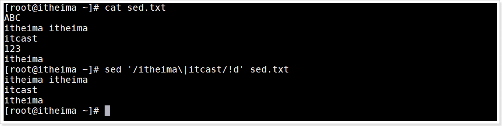

## 示例：更改文件中的数据

### 演示1:将文件的第一行修改为hello

命令

```shell
sed  '1chello'  sed.txt
```

运行效果


### 演示2: 将包含itheima的行修改为hello

命令

```shell
sed  '/itheima/chello' sed.txt
```

运行效果

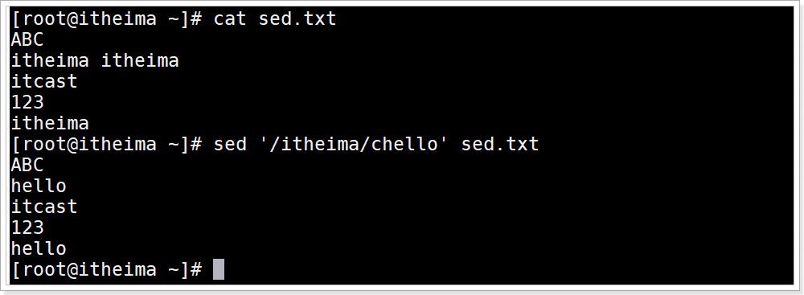

### 演示3: 将最后一行修改为hello

命令

```shell
sed '$chello' sed.txt
```

运行效果


### 演示4: 将文件中的itheima替换为hello

将文件中的itheima替换为hello,默认只替换每行第一个itheima

```shell
sed 's/itheima/hello/'  sed.txt
```

运行效果

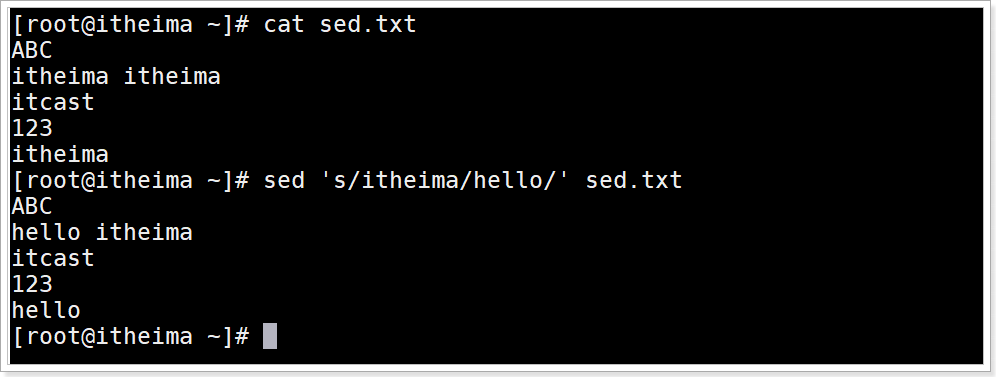

> 注意 `'s/itheima/hello/'`  最后一个`/` 不可少

将文本中所有的itheima都替换为hello, 全局替换

```shell
sed 's/itheima/hello/g'  sed.txt
# g 代表匹配全局所有符合的字符
```


### 演示5: 将每行中第二个匹配替换

将每行中第二个匹配的itheima替换为hello 命令

```shell
sed 's/itheima/hello/2'   sex.txt
```

运行效果


### 演示6: 替换后的内容写入文件

将每行中第二个匹配的itheima替换为hello ,  将替换后的内容写入到sed2.txt文件中

```shell
# 第一种方式
sed -n 's/itheima/hello/2pw sed2.txt' sed.txt
# w写入
# p打印, -n只是获取

# 第二种方式
sed -n 's/itheima/hello/2p ' sed.txt > sed2.txt
```

运行效果


### 演示7: 正则表达式匹配替换

匹配有 `i` 的行，替换匹配行中 `t` 后的所有内容为空 

```shell
sed '/i/s/t.*//g' sed.txt
# /t.*/ 表示逗号后的所有内容
```

运行效果


### 演示8: 每行末尾拼接test

```shell
sed 's/$/& test' sed.txt
# & 用于拼接
```

运行效果

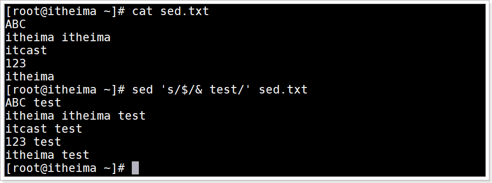

### 演示9: 每行行首添加注释 `#`

命令

```shell
sed 's/^/#/' sed.txt
```

运行效果

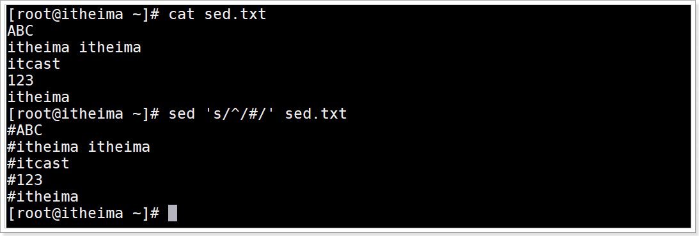


## 示例: 查询文件或管道中的数据

### 需求1: 查询含有  `itcast`  的行数据

命令

```shell
sed -n '/itcast/p' sed.txt
```

运行效果


### 需求2: 管道过滤查询

管道查询所有进程中含有sshd的进程信息命令

```shell
 ps -aux | sed -n '/sshd/p'
```

运行效果


## 示例: 多个sed程序命令执行

将sed.txt文件中的第1行删除并将 `itheima` 替换为 `itcast`

```shell
# 第一种方式, 多个sed程序命令 在每个命令之前使用 -e 参数
sed -e '1d' -e 's/itheima/itcast/g' sed.txt 

# 第二种方式
sed  '1d;s/itheima/itcast/g' sed.txt
```

运行效果


## sed高级用法: 缓存区数据交换

### 模式空间与暂存空间介绍

1. 首先需要明白, sed处理文件是逐行处理的, 即**读取一行处理一行,输出一行**;

2. sed把文件读出来每一行存放的空间叫模式空间, 会在该空间中对读到的内容做相应处理;

3. 此外sed还有一个额外的空间即暂存空间, 暂存空间刚开始里边只有个空行, 记住这一点;

4. sed可使用相应的命令从模式空间往暂存空间放入内容或从暂存空间取内容放入模式空间;

   > 2个缓存空间传输数据的目的是为了更好的处理数据, 一会参考案例学习  

### 关于缓存区sed程度命令

| 命令 | 含义                                                       |
| ---- | ---------------------------------------------------------- |
| h    | 将**模式空间**里面的内容复制到**暂存空间**缓存区(覆盖方式) |
| H    | 将**模式空间**里面的内容复制到**暂存空间**缓存区(追加方式) |
| g    | 将**暂存空间**里面的内容复制到**模式空间**缓存区(覆盖方式) |
| G    | 将**暂存空间**里面的内容复制到**模式空间**缓存区(追加方式) |
| x    | 交换2个空间的内容                                          |


## 示例: 缓存空间数据交换

### 演示1: 第一行粘贴到最后1行

将模式空间第一行复制到暂存空间(覆盖方式),并将暂存空间的内容复制到模式空间中的最后一行(追加方式)

```shell
sed '1h;$G' sed.txt
# 1h 从模式空间中将第一行数据复制到暂存空间(覆盖方式)
# $G 将暂存空间中的内容复制到模式空间中最后一行(追加方式)
```

运行效果

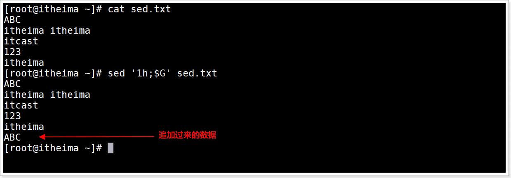

### 演示2: 第一行删除后粘贴到最后1行

将模式空间第一行复制到暂存空间(覆盖方式)并删除, 最后将暂存空间的内容复制到模式空间中的最后一行(追加方式)

```shell
sed '1{h;d};$G' sed.txt
# 1{h;d}对模式空间中的第一行数据同时进行复制到暂存空间(覆盖方式)和删除模式空间中的第一行数据
```

运行效果


### 演示3: 第一行数据复制粘贴替换其他行数据

将模式空间第一行复制到暂存空间(覆盖方式), 最后将暂存空间的内容复制到模式空间中替换从第2行开始到最后一行的每一行数据(覆盖方式)

```shell
sed '1h;2,$g' sed.txt
```

运行命令


### 演示4: 将前3行数据数据复制粘贴到最后一行

将前3行数据复制到暂存空间(追加方式), 之后将暂存空间的所有内容复制粘贴到模式空间最后一行(追加方式)

```shell
sed '1,3H;$G' sed.txt
```


运行效果


## 示例: 给每一行添加空行

插入空行

```shell
sed G -i sed.txt
# G 每行后面添加一个空行
# -i 修改源文件
```

运行效果


## 示例: 删除所有的空行

命令

```shell
sed -i '/^$/d' sed.txt
```

运行效果


# Shell好用的工具：awk

## 介绍

awk是一个强大的文本分析工具，相对于grep的查找，sed的编辑，awk在其对数据分析并生成报告时,显得尤为强大简单来说awk就是把文件逐行的读入，以空格为默认分隔符将每行切片，切开的部分再进行各种分析处理, 因为切开的部分使用awk可以定义变量,运算符, 使用流程控制语句进行深度加工与分析。

> 创始人 Alfred V. **A**ho、Peter J. **W**einberger和Brian W. **K**ernighan  awk由来是姓氏的首字母

## 语法

```shell
awk [options] 'pattern{action}' {filenames}
```

> pattern：表示AWK在数据中查找的内容，就是匹配模式
>
> action：在找到匹配内容时所执行的一系列命令

选项参数说明

| 选项参数 | 功能                   |
| -------- | ---------------------- |
| -F       | 指定输入文件拆分分隔符 |
| -v       | 赋值一个用户定义变量   |

## awk内置变量

| 内置变量 | 含义                                                         |
| -------- | ------------------------------------------------------------ |
| ARGC     | 命令行参数个数                                               |
| ARGV     | 命令行参数排列                                               |
| ENVIRON  | 支持队列中系统环境变量的使用                                 |
| FILENAME | awk浏览的文件名                                              |
| FNR      | 浏览文件的记录数                                             |
| FS       | 设置输入域分隔符，等价于命令行 -F选项                        |
| NF       | 浏览记录的域的个数, 根据分隔符分割后的列数                   |
| NR       | 已读的记录数, 也是行号                                       |
| OFS      | 输出域分隔符                                                 |
| ORS      | 输出记录分隔符                                               |
| RS       | 控制记录分隔符                                               |
| `$n`     | `$0`变量是指整条记录。`$1`表示当前行的第一个域,`$2`表示当前行的第二个域,......以此类推。 |
| $NF      | $NF是number finally,表示最后一列的信息，跟变量NF是有区别的，变量NF统计的是每行列的总数 |


## 数据准备

```shell
cp /etc/passwd ./
```


## 示例 : 默认每行空格切割数据

命令

```shell
 echo "abc 123 456" | awk '{print $1"&"$2"&"$3}'
```


运行效果


## 示例: 打印含有匹配信息的行

搜索passwd文件有root关键字的所有行

```shell
awk '/root/' passwd
# '/root/' 是查找匹配模式, 没有action命令, 默认输出所有符合的行数据
```

运行效果

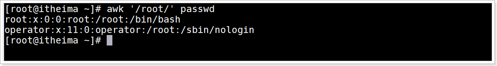

## 示例: 打印匹配行中第7列数据

搜索passwd文件有root关键字的所有行, 然后以":"拆分并打印输出第7列

```shell
awk -F: '/root/{print $7}' passwd
# -F: 以':'分隔符拆分每一个列(域)数据
```

运行效果


## 示例: 打印文件每行属性信息

统计passwd:  文件名，每行的行号，每行的列数，对应的完整行内容:

```shell
awk -F ':' '{print "文件名:" FILENAME ",行号:" NR ",列数:" NF ",内容:" $0}' passwd
# "文件名:" 用于拼接字符串
```


运行效果


使用printf替代print,可以让代码阅读型更好

```shell
awk -F ':' '{printf("文件名:%5s,行号:%2s, 列数:%1s, 内容:%2s\n",FILENAME,NR,NF,$O)}' passwd
# printf(格式字符串,变量1,变量2,...)
# 格式字符串: %ns 输出字符串,n 是数字，指代输出几个字符, n不指定自动占长度
# 格式字符串: %ni 输出整数,n 是数字，指代输出几个数字
# 格式字符串: %m.nf 输出浮点数,m 和 n 是数字，指代输出的整数位数和小数位数。如 %8.2f 代表共输出 8 位数，其中 2 位是小数，6 位是整数；
```

运行效果


## 示例: 打印第二行信息

打印/etc/passwd/的第二行信息

```shell
awk -F ':' 'NR==2{printf("filename:%s,%s\n",FILENAME,$0)}' passwd
```

运行效果


## 示例: 查找以c开头的资源

awk过滤的使用,  查找当前目录下文件名以c开头的文件列表

```shell
ls -a | awk '/^c/'
```

运行效果


## 示例: 打印第一列

按照":" 分割查询第一列打印输出

```shell
awk -F ':' '{print $1}' passwd
```

运行效果

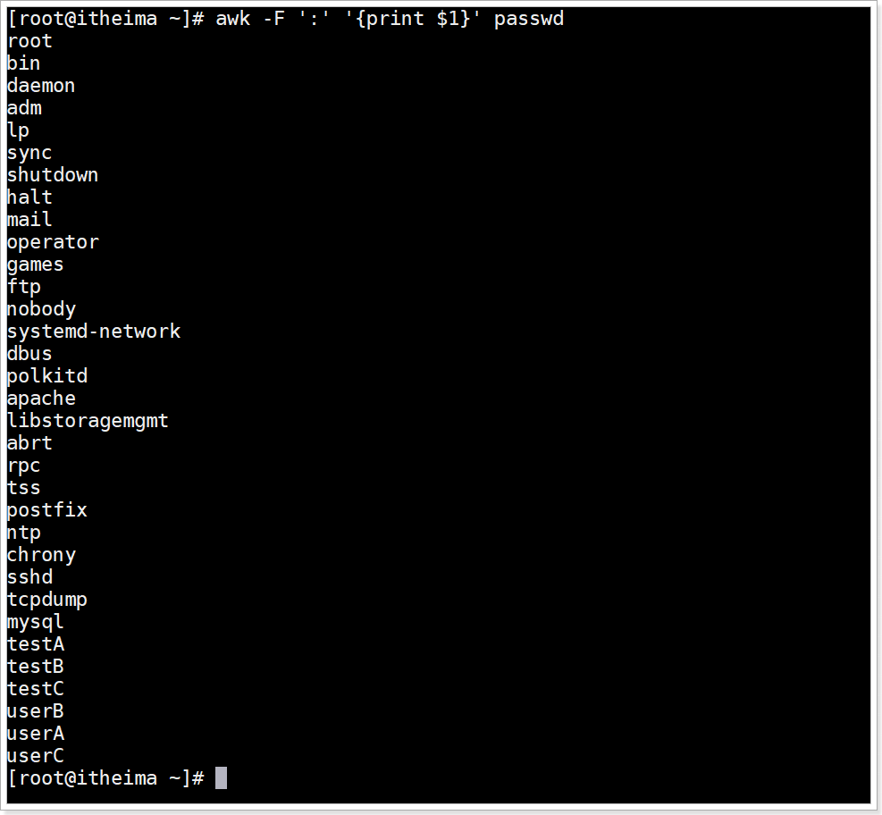


## 示例: 打印最后1列

按照":" 分割查询最后一列打印输出

```shell
awk -F: '{print $NF}' passwd
```

运行效果


## 示例: 打印倒数第二列

按照":" 分割查询倒数第二列打印输出

```shell
 awk -F: '{print $(NF-1)}' passwd
 # $(NF-N) N是几, 就是倒数第几列
```

运行效果

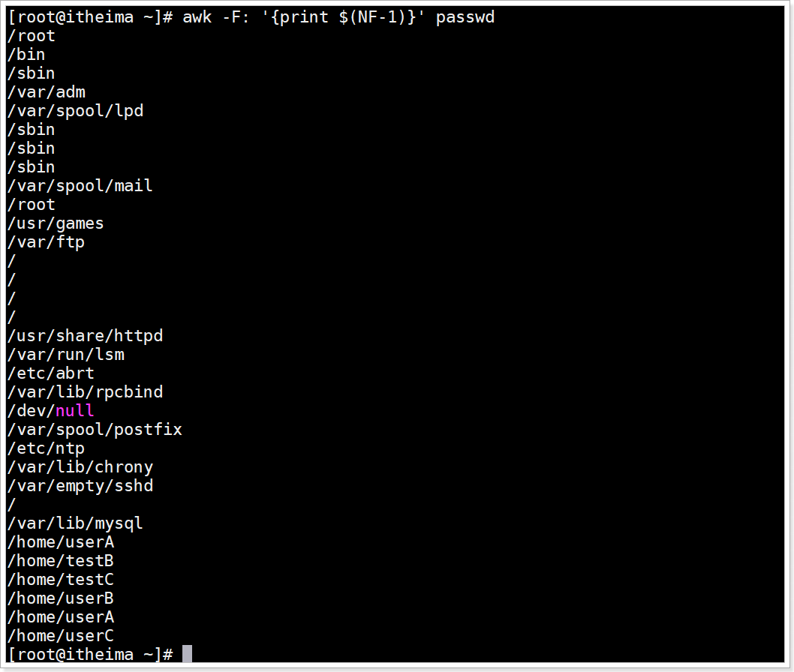

## 示例: 打印10到20行的第一列

获取第10到20行的第一列的信息

```shell
awk -F: '{if(NR>=10 && NR<=20) print $1}' passwd
```

运行效果


## 示例: 多分隔符使用

"one:two/three"字符串按照多个分隔符":"或者"/" 分割, 并打印分割后每个列数据

```shell
echo "one:two/three" | awk -F '[:/]' '{printf("%s\n%s\n%s\n%s\n",$0,$1,$2,$3)}'
```

运行效果


## 示例: 添加开始与结束内容

给数据添加开始与结束

```shell
echo -e  "abc\nabc" | awk 'BEGIN{print "开始..."} {print $0} END{print "结束..."}'

# BEGIN 在所有数据读取行之前执行；END 在所有数据执行之后执行。
```

运行效果

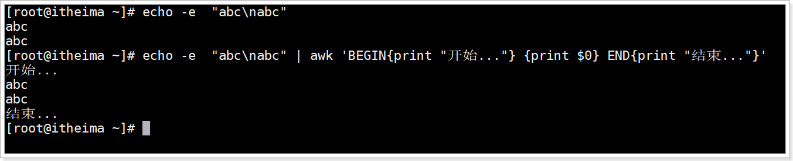


## 示例 : 使用循环拼接分割后的字符串

"abc itheima     itcast   21" 使用空格分割后, 通过循环拼接在一起

```shell
 echo "abc itheima     itcast   21" | awk -v str="" -F '[ ]+' '{for(n=1;n<=NF;n++){ str=str$n} print str }'
 
 # -v 定义变量
```

运行效果

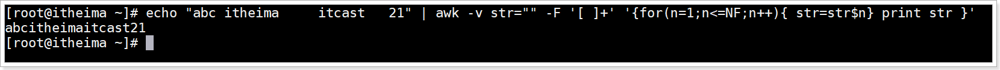


## 示例: 操作指定数字运算

将passwd文件中的用户id增加数值1并输出

```shell
 echo "2.1" | awk -v i=1 '{print $0+i}'
```

运行效果


## 示例: 切割ip

切割IP

```shell
ifconfig | awk '/broadcast/{print}' | awk -F " " '{print $2}'
```

运行效果

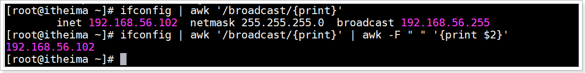

## 示例: 显示空行行号

查询sed.txt中空行所在的行号

```shell
sed 'G' sed.txt | awk '/^$/{print NR}'
```

运行效果


## 小结

grep , sed ,awk , cut 文本字符串操作四剑客的区别

> grep：用于查找匹配的行
>
> cut：  截取数据. 截取某个文件中的列, 重点是按照列分割,  这个命令不适合截取文件中有多个空白字符的字段
>
> sed： 增删改查数据. sed用于在文件中以行来截取数据进行增\删\改\查
>
> awk：截取分析数据.  可以在某个文件中是以竖列来截取分析数据,  如果字段之间含有很多空白字符也可以获取需要的数据, awk是一种语言,可以深入分析文件数据


# Shell好用的工具：sort

## 目标

能够使用sort对字符串升序或降序排序

能够使用sort 对数字升序或降序

能够使用sort 对多列进行排序


## 介绍

sort命令是在Linux里非常有用，它将文件进行排序，并将排序结果标准输出或重定向输出到指定文件。

## 语法

```shell
sort (options) 参数
```

| 选项            | 说明                                                     |
| --------------- | -------------------------------------------------------- |
| ==-n==          | number,依照数值的大小排序                                |
| ==-r==          | reverse, 以相反的顺序来排序                              |
| ==-t 分隔字符== | 设置排序时所用的分隔字符, 默认空格是分隔符               |
| ==-k==          | 指定需要排序的列                                         |
| -d              | 排序时，处理英文字母、数字及空格字符外，忽略其他的字符。 |
| -f              | 排序时，将小写字母视为大写字母                           |
| -b              | 忽略每行前面开始出的空格字符                             |
| ==-o 输出文件== | 将排序后的结果存入指定的文件                             |
| -u              | 意味着是唯一的(unique)，输出的结果是去完重了的           |
| -m              | 将几个排序好的文件进行合并                               |

参数：指定待排序的文件列表

## 数据准备

sort.txt文本文件代码

```shell
张三 30  
李四 95  
播仔 85 
播仔 85
播仔 86
AA 85
播妞 100
```

## 示例1: 数字升序

按照“ ”空格分割后的第2列数字升序排序。

```shell
sort -t " " -k2n,2 sort.txt
# -t " " 代表使用空格分隔符拆分列
# -k 2n,2 代表根据从第2列开始到第2列结束进行数字升序, 仅对第2列排序
```

运行效果


## 示例2: 数字升序去重

先按照“ ”空格分割后的,  然后,按照第2列数字升序排序,  最后对所有列去重

```shell
 sort -t " " -k2n,2 -uk1,2 sort.txt
```

运行效果


> 注意: 先排序再去重

## 示例3: 数字升序去重结果保存到文件

命令

```shell
sort -t " " -k2n,2 -uk1,2 -o sort2.txt sort.txt
```

运行效果


## 示例4: 数字降序去重

先按照“ ”空格分割后的,  然后,按照第2列数字降序排序,  最后对所有列去重

```shell
sort -t " " -k2nr,2 -uk1,2 sort.txt
```

运行效果

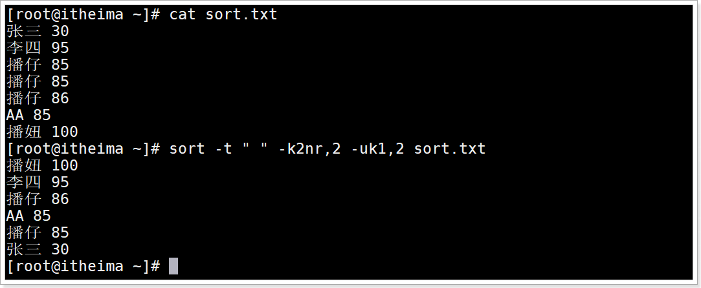

## 示例5: 多列排序

数据准备sort3.txt

```shell
公司A,部门A,3
公司A,部门B,0
公司A,部门C,10
公司A,部门D,9
公司B,部门A,30
公司B,部门B,40
公司B,部门C,43
公司B,部门D,1
公司C,部门A,30
公司C,部门B,9
公司C,部门C,100
公司C,部门D,80
公司C,部门E,60
```

要求:  以","分割先对第一列字符串升序,  再对第3列数字降序

```shell
sort -t "," -k1,1 -k3nr,3 sort3.txt
```

运行效果

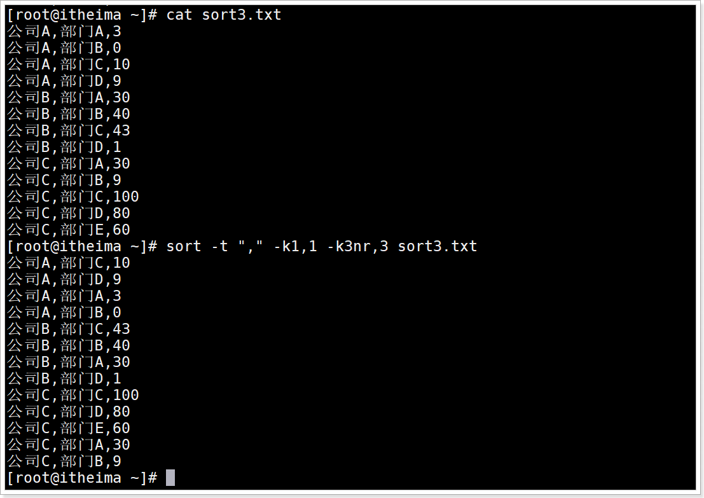

## 小结

能够使用sort对字符串升序或降序排序

> 字符串升序: `sort -kstart,end 文件`
>
> 字符串降序: `sort -kstartr,end 文件`

能够使用sort 对数字升序或降序

> 数字升序: `sort -kstartn,end 文件`
>
> 数字降序: `sort -kstartnr,end 文件`

能够使用sort 对多列进行排序

> `sort -kstart[nr],end  -kstart[nr],end ... 文件`


# 面试题：查空行

问题：使用Linux命令查询file.txt中空行所在的行号

file1.txt数据准备

```shell
itheima itheima

itcast
123

itheima
```


答案：

```shell
awk '/^$/{print NR}' file1.txt
```

运行效果


# 面试题：求一列的和

问题：有文件file2.txt内容如下:

```shell
张三 40
李四 50
王五 60
```


使用Linux命令计算第二列的和并输出

```shell
awk '{sum+=$2} END{print "求和: "sum}' file2.txt
```


运行效果


# 面试题：检查文件是否存在

问题：Shell脚本里如何检查一个文件是否存在？如果不存在该如何处理？

答: 

```shell
if [ -e /root/file1.txt ]; then  echo "文件存在"; else echo "文件不存在"; fi
```

运行效果


# 面试题：数字排序

问题：用shell写一个脚本，对文本中无序的一列数字排序

cat file3.txt文件内容

```shell
9
8
7
6
5
4
3
2
10
1
```

答

```shell
sort -n file3.txt | awk '{sum+=$1; print $1} END{print "求和: "sum}'
```

运行效果


# 面试题：搜索指定目录下文件内容

问题：请用shell脚本写出查找当前文件夹（/root）下所有的文本文件内容中包含有字符”123”的文件名称?

答:

```shell
grep -r "123" /root | cut -d ":" -f 1| sort -u
```

运行效果


# 面试题：批量生成文件名

问题: 批量生产指定数目的文件,文件名采用"纳秒"命名

答: file4.sh

```shell
#!/bin/bash
read -t 30 -p "请输入创建文件的数目:" n
test=$(echo $n | sed 's/[0-9]//g') #检测非数字输入
if [ -n "$n" -a -z "$test" ] #检测空输入
then
        for ((i=0;i<$n;i=i+1 ))
        do
                name=$(date +%N)
                [ ! -d ./temp ] &&  mkdir -p ./temp
                touch "./temp/$name"
                echo "创建 $name 成功!"
        done
        else
                echo "创建失败"
                exit 1
fi
```

运行效果


# 面试题：批量改名

问题: 将/root/temp目录下所有文件名重命名为"旧文件名-递增数字"?

重命名命令

```shell
rename 旧文件名 新文件名 旧文件所在位置
```

脚本代码file5.sh

```shell
#!/bin/bash
filenames=$(ls /root/temp)
number=1
for name in $filenames
do
        printf "命令前:%s" ${name}
        newname=${name}"-"${number}
        rename $name ${newname} /root/temp/*
        let number++ #每个改名后的文件名后缀数字加1
        printf "重命名后:%s \n" ${newname}
done
```

运行效果


# 面试题：批量创建用户

问题: 根据users.txt中提供的用户列表,一个名一行, 批量添加用户到linux系统中

已知users.txt数据准备

```shell
user1
user2
```


知识点分析1: 添加用户命令

```shell
useradd 用户名
```

知识点分析2: 设置每个用户密码默认密码

```shell
echo "123456" | passwd --stdin 用户名
```

运行效果

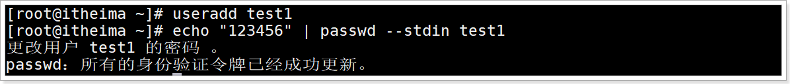


面试题答案: 脚本代码file6.sh

```shell
#!/bin/bash
ULIST=$(cat /root/users.txt)  ##/root/users.txt  里面存放的是用户名，一个名一行
for UNAME in $ULIST
do
        useradd $UNAME
        echo "123456" | passwd --stdin $UNAME &>/dev/null
        [ $? -eq 0 ] && echo "$UNAME用户名与密码添加初始化成功!"
done
```

运行效果


# 面试题：筛选单词

问题: 根据给出的数据输出里面单词长度大于3的单词

数据准备

```shell
I may not be able to change the past, but I can learn from it.
```

shell脚本file7.sh

```shell
 echo "I may not be able to change the past, but I can learn from it." | awk -F "[ ,.]" '{for(i=1;i<NF;i++){ if(length($i)>3){print $i}}}'
```

运行效果


# 面试题：单词及字母去重排序

问题

```dart
1、按单词出现频率降序排序！
2、按字母出现频率降序排序！
```

file8.txt 文件内容

```shell
  No. The Bible says Jesus had compassion2 on them for He saw them as sheep without a shepherd. They were like lost sheep, lost in their sin. How the Lord Jesus loved them! He knew they were helpless and needed a shepherd. And the Good Shepherd knew He had come to help them. But not just the people way back then. For the Lord Jesus knows all about you, and loves you too, and wants to help you.
```

按照单词出现频率降序

```shell
awk -F "[,. ]+" '{for(i=1;i<=NF;i++)S[$i]++}END{for(key in S)print S[key],key}' file8.txt |sort -rn|head
```

运行效果

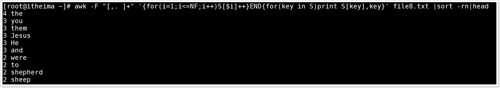

按照字符出现频率降序前10个

```shell
awk -F "" '{for(i=1;i<=NF;i++)S[$i]++}END{for(key in S)print S[key],key}' file8.txt |sort -rn|head
```

运行效果


# 面试题：扫描网络内存活主机

问题:  扫描192.168.56.1到192.168.56.254之间ip的是否存活, 并输出是否在线?


服务器ip存活分析

```shell
ping ip地址 -c 2
# 如果ip地址存活发送2个数据包会至少接收返回1个数据包
```

效果如图


完整脚本代码

```shell
#!/bin/bash
count=0
for i  in 192.168.56.{1..254}
do
    # 使用ping命令发送2个包测试, 并获取返回接收到包的个数
    receive=$(ping $i -c 2|awk 'NR==6{print $4}')
    # 接收返回包大于0 说明主机在线
    if [ ${receive} -gt 0 ]
    then
        echo "${i} 在线"
        ((count+=1))
    else
        echo "${i} 不在线"
    fi

done
echo "在线服务器有:"$count"个"
```

运行效果


# 面试题：MySQL分库备份

```shell
#!/bin/sh
user=root      #用户名
pass=root      #密码
backfile=/root/mysql/backup #备份路径
[ ! -d $backfile ] && mkdir -p $backfile #判断是否有备份路径
cmd="mysql -u$user -p$pass"  #登录数据库
dump="mysqldump -u$user -p$pass " #mysqldump备份参数
dblist=`$cmd -e "show databases;" 2>/dev/null |sed 1d|egrep -v "_schema|mysql"` #获取库名列表
echo "需要备份的数据列表:"
echo $dblist
echo "开始备份:"
for db_name in $dblist #for循环备份库列表
do
 printf '正在备份数据库:%s' ${db_name}
 $dump $db_name 2>/dev/null |gzip >${backfile}/${db_name}_$(date +%m%d).sql.gz #库名+时间备份打包至指定路径下
 printf ',备份完成\n'
done
echo "全部备份完成!!!"
```

运行效果


# 面试题：MySQL数据库分库分表备份

```shell
#!/bin/sh
user=root      #用户名
pass=root      #密码
backfile=/root/mysql/backup #备份路径
[ ! -d $backfile ] && mkdir -p $backfile #判断是否有备份路径
cmd="mysql -u$user -p$pass"  #登录数据库
dump="mysqldump -u$user -p$pass " #mysqldump备份参数
dblist=`$cmd -e "show databases;" 2>/dev/null |sed 1d|egrep -v "_schema|mysql"` #获取库名列表
echo "需要备份的数据列表:"
echo $dblist
echo "开始备份:"
for db_name in $dblist #for循环备份库列表
do
 printf '正在备份数据库:%s\n' ${db_name}
 tables=`mysql -u$user -p"$pass" -e "use $db_name;show tables;" 2>/dev/null|sed 1d`
 for j in $tables
  do
    printf '正在备份数据库 %s 表 %s ' ${db_name} ${j}
    $dump -B --databases $db_name --tables $j 2>/dev/null > ${backfile}/${db_name}-${j}-`date +%m%d`.sql
    printf ',备份完成\n'
  done


 printf '数据库 %s 备份完成\n' ${db_name}
done
echo "全部备份完成!!!"
```

运行效果


 